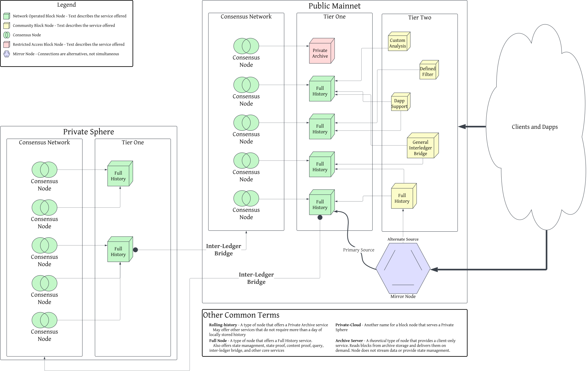

# Block Node Types

## Overview

[Block Nodes](./block-node/glossary.md#block-node) can offer many services and features. The core system encompasses a
wide array of flexible options made possible by composing relatively small and
focused "plug-ins" within a framework designed to support very low latency
processing of high volume [block stream](./block-node/glossary.md#block-stream) data. There are many "types" of block
nodes discussed in various places, each of which is actually the same core block
node, with different combinations of "plug-ins" deployed. This demonstrates the
flexibility of the block node system to meet a specific set of needs, but the
many names and terms also leads to much confusion. This document seeks to better
define the various terms and names, as well as provide a visual representation
of where different block node instances might fit into an example network.

This document is intended for a general audience, and does not describe the
technical details of operation, access, internal "plug-ins" deployed, facilities
or any other internal detail. This document, instead, focuses on services
offered and operating intent.

## Block Node Types and Tiers Visualized

## Definitions

<dl>
<dt>Block Node Services</dt>
<dd>
    <dl>
    <dt>Full History</dt>
    <dd>A service provided by some block nodes that choose to make available
    the entire history of the associated Hiero network, from genesis (or
    general availability in the case of the Hedera network).</dd>
    <dt>Partial History</dt>
    <dd>A service provided by some block nodes that choose to make available
    a subset of the history of the associated Hiero network, starting from
    a particular block, or for a particular duration, or based on other
    criteria.</dd>
    <dt>Private Archive</dt>
    <dd>A service provided by some block nodes that receive the block stream and
    store the data in an archive for the benefit of a particular entity, rather
    than the network as a whole. Examples include cloud buckets, long-term
    tape, or replicated local disks. Private archives are often intended for
    disaster recovery or offline analysis.</dd>
    <dt>Future extensions <em>(planned)</em></dt>
    <dd>The plugin system is designed to support additional services in future
    releases, such as custom analytics, interledger bridges, dApp-specific
    stream processing, and filtered block streams. None of these are provided
    by a standard Block Node deployment today.</dd>
    </dl>
</dd>
<dt>Block Node Types</dt>
<dd>
    <dl>
    <dt>Rolling-History</dt>
    <dd>A type of node that chooses to manage only "recent" history. 
    May offer other services that do not require more than a day (or other
    limited duration) of locally stored history. Most Tier 2 nodes are expected
    to be this type of node. A "Private Archive" service could be provided
    by this type of node. Rolling-History provides a particular type of
    "Partial History" service.</dd>
    <dt>Full Node</dt>
    <dd>A type of node that retains the complete block history of the network
    on local storage, from genesis. State management and state proof services
    are planned for a future release and are not yet available.</dd>
    <dt>Light Node</dt>
    <dd>Another type of "Rolling-History" or other "Partial History"
    node. A Light Node is a good option for developing and testing new
    block stream based services, or providing services that do not require
    the full history of the network.</dd>
    <dt>Private-Cloud</dt>
    <dd>Another name for a block node that serves a Private Sphere. This type
    of node could provide almost any service, or only very few.</dd>
    <dt>Archive Server</dt>
    <dd>A theoretical type of node that provides a client-only service. 
    Reads blocks from an archival source and delivers them on demand. This type
    of Node does not stream data or provide state management.</dd>
    <dt>Community Node</dt>
    <dd>A Block Node operated by any entity other than a network council member
    or an entity contracted by the network council to operate block nodes.</dd>
    </dl>
</dd>
<dt>Block Node Tiers</dt>
<dd>
    <dl>
    <dt>Tier 1</dt>
    <dd>A Block Node that receives its Block Stream data directly from Consensus
    Nodes. Tier 1 Block Nodes are critical to the operation of the Consensus
    Network, and it is expected that, eventually, each Consensus Node operator
    will need to run their own Tier 1 Block Node in
    a "Full Node" configuration.</dd>
    <dt>Tier 2</dt>
    <dd>A Block Node that receives its Block Stream data from another Block
    Node (typically a Tier 1 Block Node) via the block stream subscribe API.
    Tier 2 Block Nodes are still required to <i>verify the Block Stream</i>
    received, but are not required to store the full history of the network
    or provide a Full Node configuration. Some Tier 2 nodes may, nonetheless,
    _choose_ to operate a Full Node configuration and offer Full History
    services.</dd>
    </dl>
</dd>
</dl>
