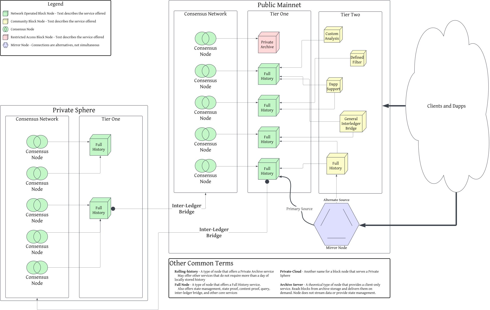

# Block Node Types

## Overview

[Block Nodes](./block-node/glossary.md#block-node) are built from the same core software
with different combinations of plugins enabled. This flexibility supports many deployment
shapes - each suited to a different set of operational needs - but the many names used
for these configurations have led to significant confusion.

This document is intended for Block Node operators and general readers. It defines the
Block Node type and tier taxonomy, explains how the two dimensions relate to each other,
and provides starting guidance for choosing a deployment configuration. It does not describe
deployment steps, plugin configuration, or hardware specifications - those are covered in
the linked documents.

This document is the canonical reference for two independent dimensions that describe any
Block Node:

- **Tier** - where a Block Node gets its [block stream](./block-node/glossary.md#block-stream)
  from (Tier 1 directly from Consensus Nodes; Tier 2 from another Block Node).
- **Type** - what the node stores and which services it exposes (Full Node,
  Rolling-History, and so on).

For step-by-step deployment guidance, Helm plugin profiles, and hardware sizing, see
[Block Node Overview](./block-node/block-node-overview.md).

## Block Node Types and Tiers Visualized

## Choosing Your Deployment

Use these questions to identify which type fits your situation, then see
[Block Node Overview - Choose Your Deployment Profile](./block-node/block-node-overview.md#choose-your-deployment-profile)
for the corresponding Helm plugin profile and hardware sizing.

1. **Do you receive blocks directly from Consensus Nodes?** Yes → Tier 1. No → Tier 2.
2. **Do you need to retain the complete block history from genesis?** Yes → Full Node.
   No → Rolling-History (or Light Node for development and testing).
3. **Do you need to stream blocks to downstream clients** (Mirror Nodes, other Block Nodes)?
   Not all profiles include downstream streaming - check the profile table in Block Node
   Overview before choosing.
4. **Are you building or testing a new service on previewnet or testnet?** → Light Node
   (`plugin-profile-minimal`).

> **Note:** If you are a new community operator, Rolling-History is the most common
> starting point for a Tier 2 node. It covers the typical use case of serving recent
> blocks without committing to full genesis-to-present storage. See
> [Block Node Overview - Choose Your Deployment Profile](./block-node/block-node-overview.md#choose-your-deployment-profile)
> for the corresponding Helm profiles.

## Block Node Services

These service categories are referenced in the Block Node Types definitions below. They
describe the role a node plays in the broader network based on the history it retains and
serves.

- **Full History** - A service provided by some block nodes that choose to make available
  the entire history of the associated Hiero network, from genesis (or general availability
  in the case of the Hedera network).
- **Partial History** - A service provided by some block nodes that choose to make available
  a subset of the history of the associated Hiero network, starting from a particular block,
  or for a particular duration, or based on other criteria.
- **Private Archive** - A service provided by some block nodes that receive the block stream
  and store the data in an archive for the benefit of a particular entity, rather than the
  network as a whole. Examples include cloud buckets, long-term tape, or replicated local
  disks. Private archives are often intended for disaster recovery or offline analysis.
- **Future extensions *(planned)*** - The plugin system is designed to support additional
  services in future releases, such as custom analytics, interledger bridges, dApp-specific
  stream processing, and filtered block streams. None of these are provided by a standard
  Block Node deployment today.

## Block Node Types

- **Rolling-History** - A type of node that manages only recent block history.
  - **Retention:** Typically one day, or another operator-configured duration.
  - **Storage:** Recent blocks on local storage; optionally archives older blocks to S3-compatible cloud storage.
  - **Common use:** Most Tier 2 nodes are expected to be this type.
  - **Services:** Partial History for the retained window; optionally Private Archive.
- **Full Node** - A type of node that retains the complete block history of the network on local storage, from genesis.
  - **Storage:** Local NVMe for recent blocks; local bulk disk (HDD) for the long-term compressed block archive. See [Block Node Hardware Specifications](./block-node/operations/block-node-hardware-specifications.md) for sizing requirements.
  - **Planned:** State management and state proof services are planned for a future release and are not yet available.
- **Light Node** - A minimal Rolling-History deployment for developing and testing new block stream based services, or for providing lightweight services that do not require extended history.
  - **Plugins:** Runs health, status, and block-access plugins without production-scale block storage or block verification.
  - **Environments:** A practical option for testnet, previewnet, or local development. See [Block Node Hardware Specifications](./block-node/operations/block-node-hardware-specifications.md) for sizing guidance.
- **Private-Cloud** - A Block Node that ingests and stores the block stream within a private organizational boundary, serving an entity's internal needs rather than the public network.
  - **Tier:** Can be Tier 1 (receiving blocks directly from Consensus Nodes) or Tier 2 (subscribing to an upstream Block Node).
  - **Services:** Can provide almost any service, or only a few, depending on the organization's requirements.
  - **Typical use cases:** Disaster recovery archives and offline analysis pipelines.
- **Archive Server** - **Not currently deployable as a standard profile.** A theoretical type of node that provides cold storage.
  - **Status:** No plugin profile for this configuration exists in the current release.
- **Community Node** - A Block Node operated by any entity other than a network council member or an entity contracted by the network council to operate Block Nodes.
  - **Designation:** An operator-class label, not a technical deployment shape - a Community Node can be a Full Node, Rolling-History, Light Node, or any other type.

## Block Node Tiers

- **Tier 1** - A Block Node that receives its block stream data directly from Consensus Nodes.
  - **Role:** Critical to the operation of the Consensus Network.
  - **Operators:** It is expected that, eventually, each Consensus Node operator will need to run their own Tier 1 Block Node, typically in a Full Node configuration.
  - **Verification:** All Tier 1 nodes verify blocks before storing them.
- **Tier 2** - A Block Node that receives its block stream data from another Block Node (typically a Tier 1 Block Node) via the block stream subscribe API.
  - **Access:** Permissionless - any operator can deploy one without approval or registration by configuring the node to subscribe to one or more existing Block Nodes.
  - **Verification:** Still required to verify the block stream they receive.
  - **Options:** Some Tier 2 nodes may choose to operate a Full Node configuration and offer Full History services.

## Relationship Between Type and Tier

Tier and Type are independent dimensions - knowing a node's Tier does not determine its
Type, and vice versa. Any combination is valid, with the following notes:

- **Full Node** is the expected Tier 1 configuration, but a Tier 2 operator may also
  choose to retain full history.
- **Rolling-History** is the most common Tier 2 deployment, but a Tier 1 operator may
  also choose to retain only recent blocks locally while archiving older ones to cloud
  storage.
- **Light Node** is suited for Tier 2 development and testing deployments; Tier 1
  operators are expected to retain block history.
- **Private-Cloud** can be Tier 1 (receiving blocks directly from Consensus Nodes) or
  Tier 2 (subscribing to an upstream Block Node), depending on the organization's network
  position.
- **Community Node** describes who operates the node, not what it does technically - it
  applies to any Type at any Tier.

## Related documentation

- [Block Node Overview](./block-node/block-node-overview.md) - tier selection, Helm
  deployment profiles, and hardware sizing.
- [Block Node Hardware Specifications](./block-node/operations/block-node-hardware-specifications.md) -
  storage, CPU, and NIC requirements per deployment profile.
- [Configuration Reference](./block-node/configuration.md) - full `plugins.names`
  reference and all configuration options.
- [Deploy with Solo Provisioner](./block-node/operations/solo-weaver-single-node-k8s-deployment.md) -
  step-by-step deployment on a cloud VM.
- [Deploy on Bare Metal (Kubernetes)](./block-node/operations/single-node-k8s-deployment.md) -
  manual Helm chart deployment.
