# Architecture Overview

This document describes the internal architecture of the Block Node — how it is structured
internally, which modules it is composed of, and how data flows through the plugin system.
It is useful for operators who want to understand what happens inside the node, and for
contributors developing or customising plugins.

For a higher-level view of how Block Nodes fit in the Hiero network — how they receive block
streams from Consensus Nodes and serve them to Mirror Nodes — see the
[Block Node Overview](../block-node-overview.md).

---

The Block Node is primarily designed to process gRPC streams of Block Items and distribute
them efficiently across system components and to clients using a plugin-based architecture
for additional service processing.

## How The Block Node Works

1. **Startup:** `BlockNodeApp` loads configuration, loads plugins, registers API services and starts the web server.
2. **Event Distribution:** Distribute events from APIs and internal notifications.
   - Incoming gRPC block streams from a publisher are received and passed to the `BlockMessagingFacility`.
   - Block items are distributed via a block items ring buffer to registered plugins.
   - Plugins may publish notification events to the `BlockMessagingFacility`.
   - Notifications are distributed via a notification ring buffer to registered plugins.
3. **Plugin Processing:** Each registered plugin processes block items and notifications independently, enabling
   dynamic, asynchronous, and extensible workflows.

## System Architecture Diagram

The overall architecture of the Block Node is illustrated below:

Additional details regarding Service interactions are illustrated in [Block-Node-Nano-Services](./../../assets/Block-Node-Nano-Services.svg) diagram.

## API Data Flows

Multiple API data flows occur within the Block Node, primarily centered around block item processing and distribution.
Key flows include:
- **Block Stream Publish API Flow:** Incoming block items from gRPC streams are handled via the `StreamPublisherPlugin`
and distributed to plugins via the `BlockMessagingFacility`.
- **Block Access API Flow:** Block access requests from gRPC clients are routed to the appropriate block provider
plugins for retrieval.
- **Block Stream Subscription API Flow:** The unverified block stream is served to subscribers via the
`SubscriberServicePlugin`.
- **Backfilling Flow:** Missing historical blocks are retrieved by the `BackfillPlugin`.

These flows are illustrated in detail in the [Data Flow](data-flow.md) document.

## Key Concepts

- **Event-Driven:** The Block Node receives gRPC streams of Block Items, which are distributed to plugins and drive the
  processing logic.
- **Plugin System:** All major features are implemented as plugins, conforming to the `BlockNodePlugin` interface.
  Plugins are dynamically loaded and initialized at startup.
- **Messaging:** The `BlockMessagingFacility` is responsible for distributing event messages (via LMAX Disruptor) to
  registered handlers defined in plugins.
- **Block Management:** Block storage and access is managed by implementations of `BlockProviderPlugin` in cooperation
  with one implementation of the `HistoricalBlockFacility`. Together these aggregate multiple block providers and expose
  a unified view of available blocks.
- **Block Verification:** Blocks are verified for integrity using the `BlockVerificationServicePlugin` which builds the
  virtual merkle tree and validates the block proof prior to persistence.

## Plugins

The Block Node's functionality is extended through a variety of plugins, each implementing the `BlockNodePlugin` interface.
Key plugins include:
- **BackfillPlugin:** Helps to ensure the stored block stream is complete by retrieving missing blocks from other Block Nodes.
- **BlockAccessServicePlugin:** Provides a block retrieval API.
- **BlocksFilesHistoricPlugin:** Provides long term block persistence and retrieval.
- **BlocksFilesRecentPlugin:** Provides short term block persistence and retrieval, with a retention policy to limit storage use and duration.
- **CloudStorageArchivePlugin:** Archives blocks to cloud storage (replaces the deprecated S3-Archive plugin).
- **CloudStorageExpandedPlugin:** Provides expanded cloud storage with additional access controls.
- **HealthServicePlugin:** Provides kubernetes health check endpoints, additional status endpoints to integrate with Kubernetes features, and overall system health decision support.
- **RosterBootstrapRsaPlugin:** Bootstraps the RSA roster used for WRB verification at first startup.
- **RosterBootstrapTssPlugin:** Bootstraps the TSS roster for post-cutover block verification.
- **ServerStatusServicePlugin:** Provides block node status API endpoints.
- **StreamPublisherPlugin:** Provides a block stream publishing API as documented in the [communication protocol](./../../design/communication-protocol/README.md).
- **SubscriberServicePlugin:** Provides an _unverified_ Block Subscription API.
- **BlockVerificationServicePlugin:** Verifies incoming blocks for integrity prior to persistence.

For additional details on plugins, refer to the [Plugins](./plugins.md).

## Modules

The repo structure is organized into multiple Java modules, each encapsulating specific functionality.
Plugin modules are loaded dynamically at runtime using the JPMS service loader mechanism.

### Main Modules

The following modules under `block-node` directory form the core of the Block Node system.
- `app`: Main application logic and entrypoint (`BlockNodeApp.java`).
- `spi`: Service Provider Interfaces for well known plugins and facilities.
- `messaging`: Core messaging facilities for distributing block items.
- `health`: Kubernetes Health check plugin.

### Additional Modules

The following modules provide additional functionality and are loaded as plugins if present:
- `block-access`: Plugin for accessing block data.
- `block-providers`: Plugin for various block storage backends.
- `server-status`: Plugin for Server status API.
- `stream-publisher`: Plugin for a Stream publishing API.
- `stream-subscriber`: Plugin for Stream subscribing API.
- `block-verification`: Plugin for Block verification.
- `cloud-storage-archive`: Plugin for cloud-based block archiving (replaces `s3-archive`).
- `cloud-storage-expanded`: Plugin for expanded cloud storage.
- `roster-bootstrap-rsa`: Plugin for RSA-based roster bootstrapping.
- `roster-bootstrap-tss`: Plugin for TSS-based roster bootstrapping.
