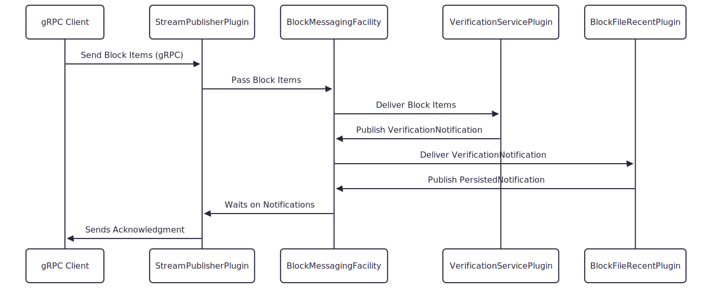
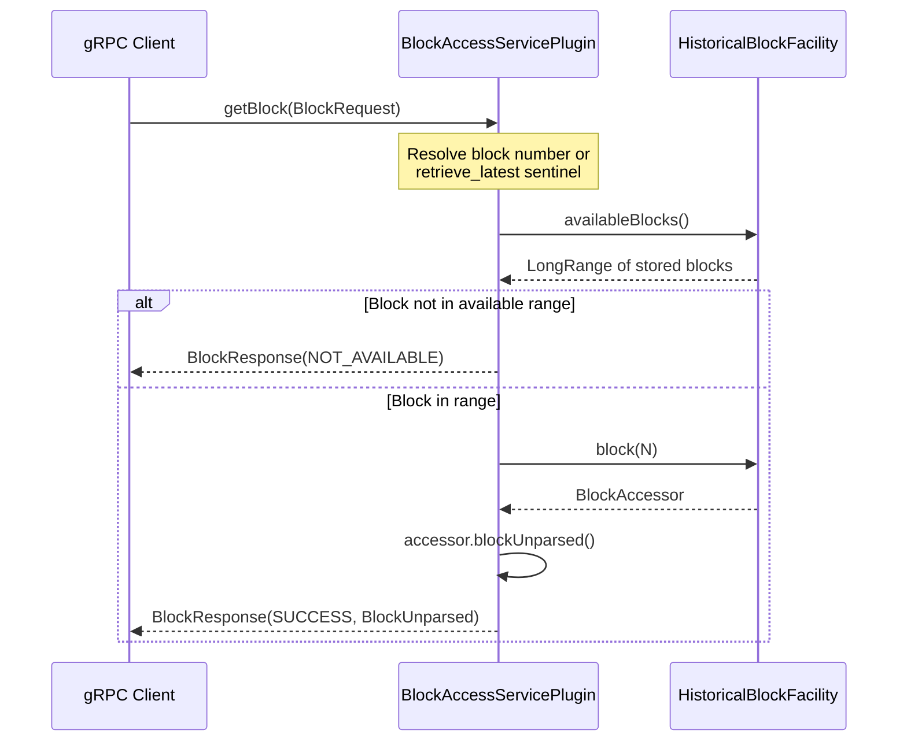
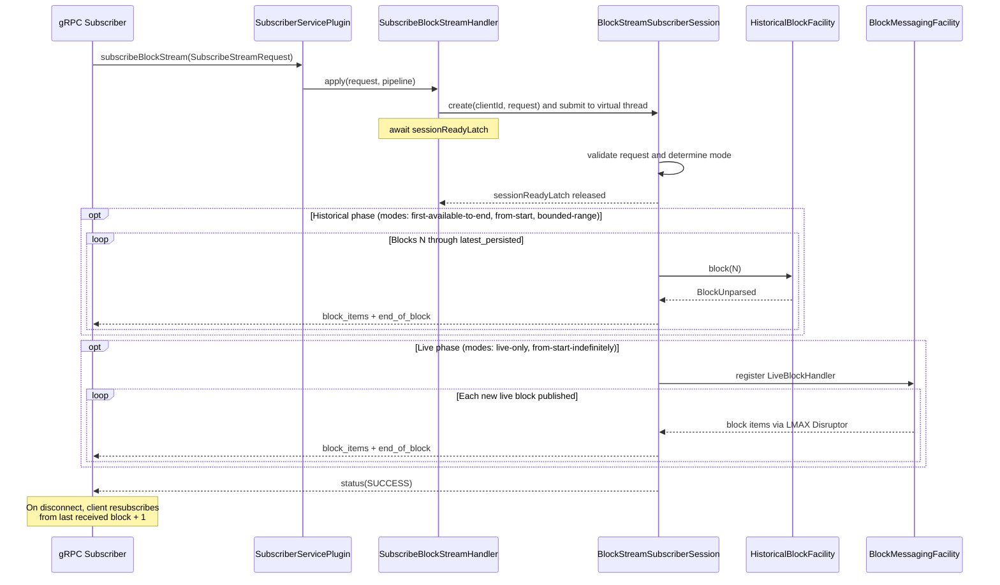
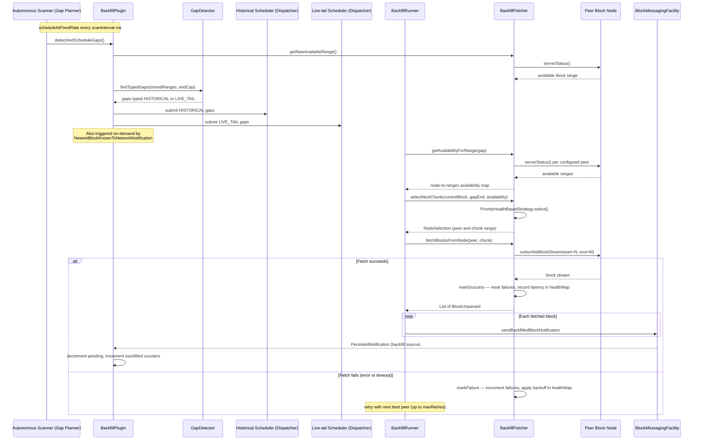

# BlockNode API Data Flows

This document describes multiple data flows between system components using its event-driven architecture.

## Block Stream Publish API Flow

** Overview should cover block items flow, merkle tree building, verification, persistence, and notification. **

Detailed Steps:

1. gRPC publisher client sends a stream of Block Items to a Block Node.
2. Block Node server receives the stream via the `BlockStreamPublishService` implemented by the `StreamPublisherPlugin`.
3. The `StreamPublisherPlugin` publishes the stream to the `BlockMessagingFacility`.
   - This plugin publishes Notifications when backfill is needed.
4. The `BlockMessagingFacility` broadcasts Block Items to all registered  plugins (handlers). Each handler runs on a
   pool of threads managed by the `BlockMessagingFacility`, reducing context switching for efficient scalability.
5. `VerificationServicePlugin` process Block Items building the block merkle tree and verifying it upon receipt of a
   block proof.
   - This plugin publishes a `VerificationNotification` upon successful verification.
6. `BlockFilesRecentPlugin` listens for a `VerificationNotification` and persists a verified block accordingly. It also
   publishes a `PersistedNotification` upon completion.
7. StreamPublisherPlugin responds to a notifications asynchronously and sends responses back to the gRPC client
   - on a successful `PersistedNotification` it sends an acknowledgment.
   - on a failed `VerificationNotification` or failed `PersistedNotification` it sends a failure message.

Note: Each plugin processes items independently making use of thread isolation

## Block Access API Flow

The `BlockAccessServicePlugin` exposes a unary gRPC endpoint that retrieves a single stored block by number.
A client sends one `BlockRequest`; the Block Node responds with the raw block bytes or an error code - no streaming involved.

Detailed Steps:

1. A gRPC client sends a `getBlock` unary request to `BlockAccessServicePlugin`. The request specifies either an explicit
   `block_number` or sets `retrieve_latest` to `true`.
2. The plugin resolves the target block number: an explicit `block_number ≥ 0` is used directly; `retrieve_latest = true`
   (or `block_number = -1`) resolves to the maximum block number returned by `HistoricalBlockFacility.availableBlocks().max()`.
   An unrecognised combination returns `INVALID_REQUEST`.
3. The plugin calls `availableBlocks().contains(N)` to confirm the resolved block number is within the current stored
   range. If not, it returns `NOT_AVAILABLE` without touching storage.
4. The plugin calls `blockProvider.block(N)`, which opens a `BlockAccessor` pointing at the requested block.
   `HistoricalBlockFacility` dispatches internally to whichever storage tier currently holds that block:
   `BlockFileRecentPlugin` (backed by fast NVMe, holds recent and live-stream blocks) for newer blocks, or
   `BlockFileHistoricPlugin` (backed by bulk HDD, holds the compressed historic archive) for deep history.
   These two storage plugins are what the core team has built so far; the plugin interface allows operators
   and third parties to build additional storage backends.
   Responses include all `BlockProof` items attached to the block. Recipients must verify these proofs
   independently — a block served by a Block Node should not be assumed verified simply because it was
   stored there.
5. The plugin calls `accessor.blockUnparsed()` to retrieve the block as raw bytes (`BlockUnparsed`). This deliberately
   avoids proto deserialization for two reasons: performance (large blocks do not need to be re-parsed to be forwarded),
   and forward compatibility (the block's proto encoding is returned as-is regardless of any version differences between
   the publisher and the subscriber).
6. The plugin returns `BlockResponse(SUCCESS, block)`. If the accessor returns null despite the block being in range
   (storage fault), it returns `NOT_FOUND`.

## Block Stream Subscription API Flow

The `SubscriberServicePlugin` exposes a server-streaming gRPC endpoint. A subscriber sends one `SubscribeStreamRequest`;
the Block Node streams any number of `SubscribeStreamResponse` messages back until the requested range is exhausted or
the stream is closed.

Detailed Steps:

1. A subscriber sends a `subscribeBlockStream` server-streaming request specifying
   `start_block_number` and `end_block_number`. Both are unsigned 64-bit integers; the sentinel value `uint64_max`
   (stored as `UNKNOWN_BLOCK_NUMBER = -1L` in Java) signals "first available" for start and "indefinite" for end.
2. `SubscriberServicePlugin` builds a server-streaming pipeline and delegates incoming requests to
   `SubscribeBlockStreamHandler`, which assigns a monotonically increasing `clientId` to the connection, constructs a
   `SessionContext`, and submits a `BlockStreamSubscriberSession` (`Callable`) to a virtual-thread
   `ExecutorCompletionService`.
3. The handler waits on `sessionReadyLatch` until the session initialises. The session validates the request and
   determines one of four streaming modes:
   - **Live-only** — both `start` and `end` are `uint64_max`: attach immediately to the live block queue and stream
     from the newest block published.
   - **First-available-to-end** — `start = uint64_max`, explicit `end = M`: serve from the earliest stored block
     through block M.
   - **From-start-indefinitely** — explicit `start = N`, `end = uint64_max`: serve history from block N, then
     transition to live.
   - **Bounded-range** — explicit `start = N`, explicit `end = M` (M ≥ N): serve blocks N through M and close.
4. **Historical phase** (modes 2, 3, and 4): the session reads blocks sequentially from `HistoricalBlockFacility`.
   Each block is serialized as one or more `BlockItemSet` messages (`block_items`) followed by a single `end_of_block`
   response carrying the block number.
5. **Live phase** (modes 1 and 3): the session registers a `LiveBlockHandler` (implementing
   `NoBackPressureBlockItemHandler`) on `BlockMessagingFacility`. New blocks published by `StreamPublisherPlugin`
   travel through `BlockMessagingFacility`'s LMAX Disruptor ring buffer and are forwarded to the subscriber
   pipeline in real time. The handler is "no back-pressure" because slow subscribers are switched between
   "historical" and "live" as needed rather than blocking the publish path.
6. When all requested blocks are delivered (or the node shuts down), the session sends `status(SUCCESS)` and the gRPC
   stream closes. Active sessions are tracked in the handler's `openSessions` map and deregistered on completion.
7. **Reconnect**: the Block Node itself is stateless with respect to subscriber position. On disconnect, the client
   is responsible for tracking the last received block number and resubscribing from `last_received + 1` in
   `from-start-indefinitely` or `bounded-range` mode.

## Backfilling Flow

The `BackfillPlugin` guarantees block stream continuity by detecting gaps in the local stored block range and filling
them by fetching the missing blocks from peer Block Nodes.

Detailed Steps:

1. `BackfillPlugin` runs two complementary gap-detection triggers. A periodic autonomous scanner runs
   `detectAndScheduleGaps()` on a `scheduleAtFixedRate` loop (interval: `backfillConfiguration.scanInterval()`).
   In addition, when the `stream-publisher` plugin broadcasts a `NewestBlockKnownToNetworkNotification` (a newer block seen
   on the network), the plugin calls `handleNewestBlockKnownToNetwork()` to trigger a live-tail check immediately
   without waiting for the next scheduled scan.
2. Gap detection: the plugin queries its current stored block ranges, then uses `BackfillFetcher` to call
   `serverStatus()` on each configured peer and determine the maximum available block across the network
   (the `endCap`). `GapDetector.findTypedGaps()` computes the delta between the local stored ranges and the target
   range, classifying each gap as:
   - **HISTORICAL** — blocks older than the current live stream head that are missing from local storage.
   - **LIVE_TAIL** — recent blocks that should be arriving from the live stream but have not yet been persisted.
3. Gaps are submitted to one of two independent schedulers: `historicalScheduler` (backed by `historicalExecutor`)
   handles HISTORICAL gaps; `liveTailScheduler` (backed by `liveTailExecutor`) handles LIVE_TAIL gaps. Keeping them
   separate ensures historical catch-up work never blocks live-tail synchronization.
4. For each gap, a `BackfillRunner` selects the best peer using `PriorityHealthBasedStrategy`, which scores
   candidates on four factors in order: (a) earliest available block number, (b) configured operator priority,
   (c) health score derived from recent failure count and latency, (d) random tie-breaker.
5. `BackfillFetcher` fetches the gap range from the selected peer by calling
   `subscribeBlockStream(start = N, end = M)` — the same bounded-range mode used by regular subscribers. The peer
   streams blocks back in chunks; `BackfillPersistenceAwaiter` provides backpressure so the fetcher does not outrun
   the local persistence pipeline.
6. **Fetch success**: on successful completion `BackfillFetcher` records the result in its `healthMap`
   (`SourceHealth` record), resetting the failure counter and accumulating latency. Each fetched block is then
   dispatched to `BlockMessagingFacility` via `sendBackfilledBlockNotification`. `VerificationServicePlugin`
   verifies it and `BlockFileRecentPlugin` persists it — mirroring the publish path. When the
   `PersistedNotification` arrives tagged with a backfill source, the plugin decrements `backfill_pending_blocks`
   and increments `backfill_blocks_backfilled`.
7. **Fetch failure**: on error or timeout `BackfillFetcher` increments the failure count and sets an exponential
   backoff window in `healthMap` for that peer. `BackfillRunner` retries with the next best peer (up to
   `maxRetries`), rerunning the `PriorityHealthBasedStrategy` selection with the updated health scores so that
   the failing peer is deprioritized automatically.

Note: The two schedulers use independent thread pools so that a slow historical catch-up does not starve the
live-tail scheduler, which is time-sensitive.
