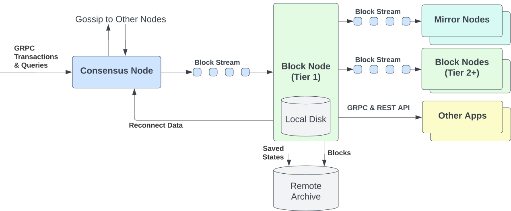

# Hiero Block Node Introduction

The Hiero network reaches consensus on transactions continuously, bundling each round of results
into a **block** - a permanent, cryptographically signed record of everything that finalized in
that round. A **Block Node** is a server that receives these blocks,
verifies their authenticity, stores them, and streams them to applications and services that need
them.

If you have used a [Mirror Node](./glossary.md#mirror-node), you know the model: block data is
indexed into a database and exposed through a REST API you query for history. A Block Node is
different - it delivers each block over a live [block stream](./glossary.md#block-stream) directly
to your application, in real time, with a cryptographic proof that the data came from
[Consensus Nodes](./glossary.md#consensus-node) and not from a third-party index. That means your
application can react to transactions the moment they finalize and independently verify that the
data is exactly what the network agreed on.

## Who is this for?

**Consensus Node operators and Governing Council members.** Your Consensus Node publishes blocks
to [Tier 1 Block Nodes](./glossary.md#tier-1-block-node), which are responsible for storing that
data and distributing it to the rest of the network. Understanding Block Nodes helps you know how
your blocks are stored, how they are redistributed, and what operational behavior to expect when
you pair with a Tier 1 operator.

**Developers and enterprises building on Hiero.** If you are building a wallet, explorer,
analytics platform, or compliance tool, Block Nodes expose the block stream over gRPC: subscribe
once and each finalized block is pushed to your application automatically. You can also query any
block by number and retrieve cryptographic proofs on demand, so you can give users independently
verifiable data without depending on a third-party index.

**Community and permissionless operators.** You do not need Council membership or Consensus Node
access to run a Block Node. [Tier 2 operators](./glossary.md#tier-2-block-node) connect to an
existing Block Node, receive the same verified block stream, and redistribute it to downstream
consumers - whether to run a public stream service, power a regional deployment, or supply data
to applications without operating a Consensus Node. No permission required.

**Mirror Node operators.** Your current setup downloads record files from Google Cloud Storage.
That model is being replaced: Mirror Nodes will migrate to consuming block streams from Block
Nodes directly. Block Nodes are the upstream data source your pipeline is moving to, and this
documentation explains how that integration works.

**Just learning or exploring.** You do not need to run or integrate with a Block Node to
understand how they work. Read through the sections below to build a mental model of where Block
Nodes sit in the Hiero ecosystem, then follow the "Where to go next" links for deeper technical
details or deployment guides.

## Background

Block stream infrastructure is driven by two
[Hiero Improvement Proposals](./glossary.md#hip-hiero-improvement-proposal):
[HIP-1056](https://hips.hedera.com/hip/hip-1056) standardized the block stream format, and
[HIP-1081](https://hips.hedera.com/hip/hip-1081) defined Block Nodes as the dedicated
infrastructure for receiving it.

Before block streams, Consensus Nodes wrote batched record files to a shared cloud storage
bucket and Mirror Nodes downloaded those files on a periodic polling schedule. Block streams
replace that file-pull model with a stream-push design: blocks flow directly from consensus to
consumers in real time, with a chain of cryptographic proofs linking each block back to the
Consensus Nodes that produced it.

## How it works

Consensus Nodes produce a block for every round of consensus and publish it directly to Tier 1
Block Nodes. Each Tier 1 Block Node verifies the block's cryptographic proof - checking that the
block was signed by the Consensus Nodes and has not been altered - stores it, and fans it out
downstream to Mirror Nodes, Tier 2 Block Nodes, and applications that subscribe directly.

[Tier 2 Block Nodes](./glossary.md#tier-2-block-node) follow the same pattern one level
downstream: they connect to a Tier 1 Block Node or another Tier 2, receive the same verified
stream, and redistribute it to their own subscribers. This lets community operators run their own
distribution layer without needing direct access to Consensus Nodes.

*Consensus Nodes publish block streams to Tier 1 Block Nodes. Tier 1 Block Nodes verify each
block's proof, store it, and redistribute the stream downstream to Mirror Nodes, Tier 2 Block
Nodes, and directly subscribed applications.*

## What Block Nodes do

A Block Node performs five core functions for every block it receives:

- **Ingest** a live block stream from one or more Consensus Nodes or upstream Block Nodes.
- **Verify** each block's cryptographic integrity against the
  [block proof](./glossary.md#block-proof) produced by Consensus Nodes.
- **Store** verified blocks on local NVMe, bulk HDD, or S3-compatible cloud archive, depending
  on the operator's deployment profile.
- **Stream** blocks downstream to Mirror Nodes, other Block Nodes, and applications over gRPC.
- **Serve** individual blocks on demand via random-access retrieval and cryptographic block
  proofs, enabling use cases like historical audits, compliance checks, and re-verification of
  past transactions.

## Where to go next

**To learn more about Block Nodes:**

- [Block Node Overview](./block-node-overview.md) - covers tiers, deployment profiles, and
  operator responsibilities in depth.
- [Block Node Types and Tiers](../Block-Node-Types.md) - describes the full taxonomy of node
  types.

**To start development or deployment:**

- **Tier 1 operator** (Council member or trusted network partner) -
  [Production Prerequisites](./operations/production-guide/prerequisites.md)
- **Tier 2 operator** - [Deploy with Solo Provisioner](./operations/solo-weaver-single-node-k8s-deployment.md)
  or [Bare-Metal Kubernetes Deployment](./operations/single-node-k8s-deployment.md)
- **Developer** - [Block Node gRPC API Quickstart](./api-quickstart.md) to query and subscribe
  to the block stream. To run your own instance, see
  [Deploy with Solo Provisioner](./operations/solo-weaver-single-node-k8s-deployment.md).
