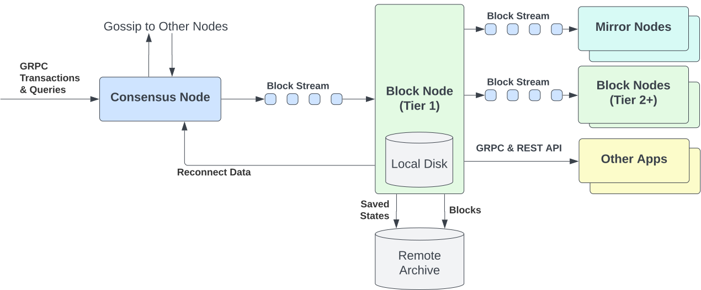

# Mirror Node Integration

This document explains why Mirror Nodes consume block streams from a Block Node and the high-level model operators must understand before configuring the integration.

For step-by-step configuration and verification commands, see the companion guide on [Connecting a Mirror Node to a Block Node](./operations/connecting-a-mirror-node-to-a-block-node.md).

## Why Mirror Nodes subscribe to Block Nodes

After the Hiero record-stream-to-block-stream [cutover](./glossary.md#cutover-release) ([HIP-1193](https://github.com/hiero-ledger/hiero-improvement-proposals/blob/main/HIP/hip-1193.md)), Mirror Nodes consume finalized block data from Block Nodes over a long-lived gRPC stream instead of polling record files from cloud storage. Subscribing to a Block Node gives a Mirror Node:

- **Low-latency live data** - blocks are pushed as they are produced, rather than waiting for batch file uploads to a cloud bucket.
- **Self-contained cryptographic verification** - Block Streams incorporate a [Block Proof](./glossary.md#block-proof) for each block that cryptographically verifies that block with no additional data.
- **Random-access historical replay** - a single gRPC call can replay an arbitrary block range to a freshly provisioned Mirror Node.
- **A decentralized data plane** - Mirror Nodes can subscribe to one or more Block Nodes ([Tier 1](./glossary.md#tier-1-block-node) or [Tier 2](./glossary.md#tier-2-block-node)) for redundancy.
- **Local storage and consolidation** - Mirror Node operators may choose to operate a local Block Node to independently store block data and redistribute the Block Stream to multiple Mirror Nodes from a single connection.

The network-level placement of Block Nodes between Consensus Nodes and Mirror Nodes is illustrated in the Block Node overview diagram:

## Subscription model

A Mirror Node subscribes to a Block Node by opening a **server-streaming gRPC call** to the `BlockStreamSubscribeService.subscribeBlockStream` RPC. The Block Node streams `SubscribeStreamResponse` messages back until the requested block range is fully served, the connection reaches the maximum connection lifetime, the client disconnects, or an error occurs.

### Request

A `SubscribeStreamRequest` expects two `uint64` fields:

|        Field         |                                                                                                                                                         Meaning                                                                                                                                                          |
|----------------------|--------------------------------------------------------------------------------------------------------------------------------------------------------------------------------------------------------------------------------------------------------------------------------------------------------------------------|
| `start_block_number` | Block number of the first block to return. The proto requires this to be less than or equal to the latest available block; the implementation additionally accepts requests up to `subscriber.maximumFutureRequest` blocks ahead of the latest live block and rejects anything beyond with `INVALID_START_BLOCK_NUMBER`. |
| `end_block_number`   | Block number of the last block to return, **or** `uint64_max` (`0xFFFFFFFFFFFFFFFF`) to stream indefinitely as new blocks arrive. If set to a finite value, it must be greater than or equal to `start_block_number`.                                                                                                    |

### Response

The Block Node sends a stream of `SubscribeStreamResponse` messages. Each response is one of three variants delivered through a `oneof`:

|    Variant     |                                                                   Carries                                                                   |           Frequency           |
|----------------|---------------------------------------------------------------------------------------------------------------------------------------------|-------------------------------|
| `block_items`  | A `BlockItemSet` with one or more `BlockItem` messages, batched into chunks. Large blocks are split across multiple `block_items` messages. | Many per block.               |
| `end_of_block` | A `BlockEnd` message containing the completed `block_number`.                                                                               | Exactly one per block.        |
| `status`       | A terminal `Code` value indicating why the stream is ending.                                                                                | Exactly one, at stream close. |

Over the wire the pattern is: `block_items + end_of_block` repeated per block, followed by exactly one terminal `status` when the stream closes.

### Status codes

|             Code             | Value |                                                       Meaning                                                       |
|------------------------------|-------|---------------------------------------------------------------------------------------------------------------------|
| `UNKNOWN`                    | `0`   | Reserved sentinel; the server MUST NOT return this. If observed, treat as a server-side defect.                     |
| `SUCCESS`                    | `1`   | Stream ended normally; all requested blocks were sent or the connection lifetime limit was reached.                 |
| `INVALID_REQUEST`            | `2`   | Defined for the protocol; the subscriber implementation does not return it.                                         |
| `ERROR`                      | `3`   | Block Node encountered an internal error and cannot continue. Client MAY retry.                                     |
| `INVALID_START_BLOCK_NUMBER` | `4`   | `start_block_number` is negative or outside the allowed range (including beyond the future-window).                 |
| `INVALID_END_BLOCK_NUMBER`   | `5`   | `end_block_number` is invalid (negative, or less than `start_block_number`).                                        |
| `NOT_AVAILABLE`              | `6`   | The requested stream is not available from this Block Node. Client MAY retry later or query a different Block Node. |

## Connecting to multiple Block Nodes

A Mirror Node should be configured to subscribe to more than one Block Node. The Mirror Node holds the full list as a configured array under `hiero.mirror.importer.block.nodes[]` and chooses which node to use according to a scheduler strategy - by default, `PRIORITY_THEN_LATENCY`. Each entry carries a `priority` (lower is higher priority) and an optional `requiresTls` flag.

The selection rules at a glance:

- At any moment, the Mirror Node maintains an active subscription to one Block Node - the highest-priority reachable node, with measured latency as a tiebreaker.
- A Block Node is marked **inactive** after `block.stream.maxSubscribeAttempts` consecutive failed subscribe attempts and is excluded from selection for `block.stream.readmitDelay`. After that window, it is eligible again.
- When the active Block Node closes the stream with an error or becomes unreachable, the Mirror Node selects the next eligible node automatically. The operator does not need to intervene for the common failure modes.
- For historical gaps that the current Block Node cannot serve (returns `NOT_AVAILABLE` on [backfill](./glossary.md#backfill)), configure a Tier-1 archive Block Node as a low-priority fallback so the Mirror Node can fall over to it without operator action.

The exact property names and the `nodes[]` YAML shape are documented in [Connecting a Mirror Node to a Block Node - Block Node endpoints](./operations/connecting-a-mirror-node-to-a-block-node.md#block-node-endpoints).

## Behaviour Mirror Node operators must know

Two non-obvious behaviours shape how a Mirror Node should integrate with a Block Node.

### Gaps and out-of-order blocks come from the unverified stream

Because a Mirror Node consumes the unverified block stream, gaps, interruptions, out-of-order resend, and incomplete blocks are visible in the subscribed stream. The Block Node forwards block items as they arrive from the Consensus Node — rather than waiting for each block to complete and verify (which would add roughly 5–500 ms of latency per block, more under load or for very large blocks) — so almost every blip, hiccough, resend, or other disruption in the upstream flow is visible to the subscriber.

The Mirror Node must detect these client-side by checking whether each received `end_of_block.block_number` is exactly `(last_committed_block + 1)`, and reconnect to backfill the missing range from history. The Block Node will not signal the gap itself.

If a Mirror Node falls behind the live stream, the Block Node silently switches that session back to history and streams from history until the subscriber catches up. Slow subscribers are fed from history, not given gaps.

### Reconnection is the client's responsibility

The Block Node closes the gRPC stream when (a) a finite requested range is fully served, (b) the connection reaches the connection lifetime limit configured for that Block Node, (c) an internal error or runtime exception is raised, or (d) the client disconnects. In every case other than (d), the Mirror Node must implement reconnection logic, typically with exponential backoff and a fresh [`serverStatus`](./glossary.md#serverstatus) check before each retry. The Mirror Node's importer ships with this logic built in and tunes it through the `block.stream.*` properties. See the [Connecting a Mirror Node to a Block Node](./operations/connecting-a-mirror-node-to-a-block-node.md#step-4-handle-disconnects-and-gaps) guide for the operator-facing details.

## Further reading

- [HIP-1056](https://hips.hedera.com/hip/hip-1056) - Block Streams specification.
- [HIP-1081](https://hips.hedera.com/hip/hip-1081) - Block Node specification.
- [HIP-1193](https://github.com/hiero-ledger/hiero-improvement-proposals/blob/main/HIP/hip-1193.md) - Records-to-block-streams cutover.
- [HIP-1200](https://hips.hedera.com/hip/hip-1200) - Threshold signature scheme (hinTS) and [WRAPS](./glossary.md#wraps) proofs.
- [`block_stream_subscribe_service.proto`](https://github.com/hiero-ledger/hiero-block-node/blob/main/protobuf-sources/src/main/proto/block-node/api/block_stream_subscribe_service.proto) - `SubscribeStreamRequest`, `SubscribeStreamResponse`, `Code`, `subscribeBlockStream` RPC.
- [`node_service.proto`](https://github.com/hiero-ledger/hiero-block-node/blob/main/protobuf-sources/src/main/proto/block-node/api/node_service.proto) - `BlockNodeService.serverStatus`.
- [Mirror Node Configuration Reference](https://github.com/hiero-ledger/hiero-mirror-node/blob/main/docs/configuration.md) - full `hiero.mirror.importer.block.*` property reference.
- [Block Node Overview](./block-node-overview.md) - Block Node concepts, tiers, and ecosystem position.
- [Block Node Architecture Overview](./architecture/architecture-overview.md) - Plugin model and BN internals.
- [Connecting a Mirror Node to a Block Node](./operations/connecting-a-mirror-node-to-a-block-node.md) - Operator-facing step-by-step guide.
