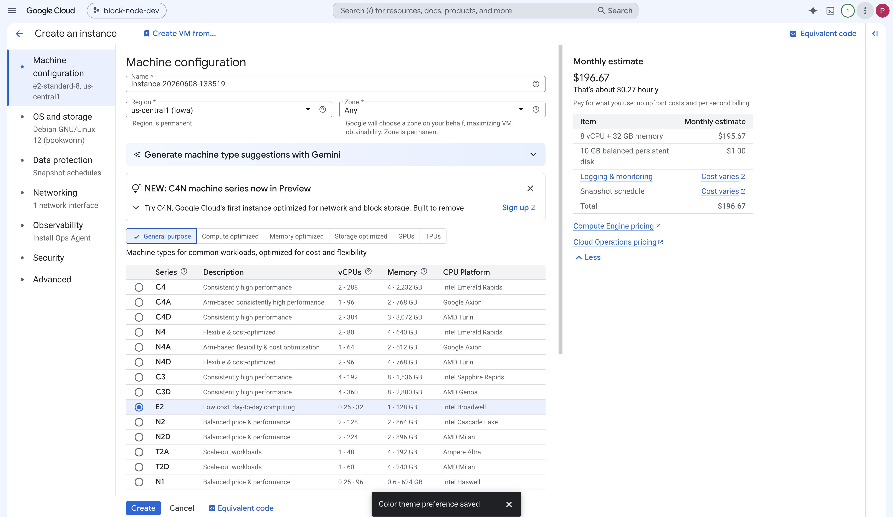
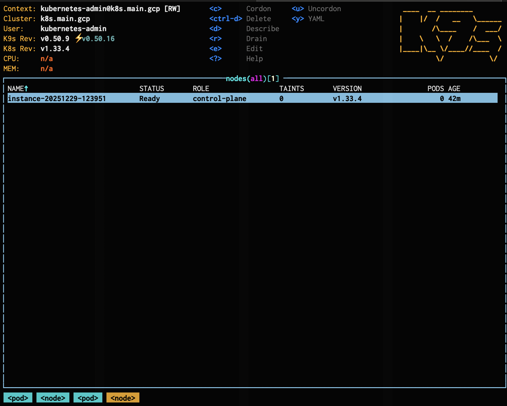

# Virtual Machine Single Node Kubernetes Deployment Guide

## Overview

This guide walks you through deploying a Hiero Block Node on a Google Cloud Platform (GCP) virtual machine using Solo Provisioner (formerly Solo Weaver). Solo Provisioner handles VM provisioning, Kubernetes setup, and Block Node Helm chart installation in a single flow.

GCP is used as the worked example. The same flow applies on other cloud providers — substitute the equivalent VM-creation and SSH steps for your provider.

## Prerequisites

Before you begin, ensure you have:

- Access to a cloud provider account (such as Google Cloud, AWS, or Azure) with permissions to create and manage VM instances.
- The `gcloud` CLI installed and authenticated (if using Google Cloud).

## Step-by-Step Guide

### Step 1: Create a Google Cloud VM

1. Open the [Google Cloud Console](https://console.cloud.google.com/).
2. In the project switcher at the top of the page, confirm the project you want to use is selected. To create a new project, click the project switcher and choose **New project**.
3. From the Welcome page's **Quick access** panel (or the navigation menu, ☰), open **Compute Engine**, then click **Create instance**.
4. Select a machine type appropriate for your Block Node profile. Solo Provisioner's preflight check measures **physical CPU cores** (not vCPUs), and the `local` profile requires a minimum of 3 physical cores. The recommendations below account for that:
   - **For a `local` profile (testing or learning)**: Choose **`e2-standard-8`** or larger (4 physical cores, 8 vCPUs, 32 GB RAM).
   - **For `previewnet` or `testnet`**: Select a machine with at least ~16 vCPUs (for example, **`e2-standard-16`**) and adequate RAM (≥ 32 GB) for non-mainnet block volume.
   - **For `mainnet` (Tier 1)**: Solo Provisioner on a single GCP VM is generally not the right deployment shape for production Tier 1. See [Block Node Hardware Specifications](./block-node-hardware-specifications.md) for the canonical hardware target, and follow the [Bare Metal Single Node Kubernetes Deployment](./single-node-k8s-deployment.md#prerequisites) guide as the recommended path.

     

5. Set the region and zone (defaults are fine unless you have a preference).

6. For the boot disk, select **Debian GNU/Linux 12 (bookworm)**, which Solo Provisioner is tested against. Other current Debian and Ubuntu LTS releases are also supported. Avoid relying on the cloud provider's default image, since the default may change over time.

7. Leave other instance settings at defaults for a standard deployment.

8. Click **Create** to launch the VM.

9. Wait until the instance status is **Running** before proceeding.

### Step 2: Install Solo Provisioner

The install script in this section downloads the correct Solo Provisioner binary for your VM's architecture automatically. You don't need to download anything manually. For air-gapped environments or other advanced cases, see [Manual install (advanced)](#manual-install-advanced) at the end of this section.

> All `solo-provisioner` commands except `-h` (help) and `-v` (version) must be run with `sudo`. Running other commands without `sudo` produces permission errors against the state files under `/opt/solo/weaver/`.

1. In the Google Cloud Console, open your VM's details page. You can also reach the SSH menu from the **Compute Engine > VM instances** list.
2. Select the **down arrow** next to **SSH**, then choose **View gcloud command**.
3. Copy the suggested `gcloud compute ssh` command displayed.
4. On your local machine, run the command in a terminal. It will look similar to:

   ```bash
   gcloud compute ssh --zone <ZONE> <INSTANCE_NAME> --project <PROJECT_ID>
   ```

- **Expected output**:

  On first connection, `gcloud` may generate an SSH key pair and prompt for a passphrase. On subsequent connections, key generation is skipped. Either way, the session ends at a Debian shell prompt similar to:

  ```bash
  Warning: Permanently added 'compute.7411203429349784578' (ED25519) to the list of known hosts.
  Linux instance-20260604-091229 6.1.0-49-cloud-amd64 #1 SMP PREEMPT_DYNAMIC Debian 6.1.174-1 (2026-05-26) x86_64

  The programs included with the Debian GNU/Linux system are free software;
  the exact distribution terms for each program are described in the
  individual files in /usr/share/doc/*/copyright.

  Debian GNU/Linux comes with ABSOLUTELY NO WARRANTY, to the extent
  permitted by applicable law.
  Last login: Thu Jun  4 09:24:14 2026 from 82.192.139.114
  <user>@<instance-name>:~$
  ```

5. Install the tool using the official script:

   ```bash
   curl -sSL https://raw.githubusercontent.com/hashgraph/solo-weaver/main/install.sh | bash
   ```

- **Expected output**: the script fetches the latest release, verifies the checksum, runs the binary's `install` subcommand (which creates the `weaver` service account), and prints the help summary. The load-bearing lines confirming success look like:

  ```text
  🔍 Fetching latest release info...
  🔖 Latest release: v0.18.1
  ⬇️ Downloading asset 353998752 → solo-provisioner-linux-amd64 ...
  ⬇️ Downloading asset 353998741 → solo-provisioner-linux-amd64.sha256 ...
  🔐 Verifying SHA256...
  ✅ Checksum OK
  Installing Solo Provisioner...
  2026-06-04T09:51:43Z INF Superuser privilege validated
  2026-06-04T09:51:43Z INF Created group weaver:2500
  2026-06-04T09:51:43Z INF Created user weaver:2500
  2026-06-04T09:51:44Z INF Created symlink to solo-provisioner binary in /usr/local/bin
  2026-06-04T09:51:44Z INF Solo Provisioner installed successfully
  🎉 Solo Provisioner installed successfully!
  ```

  The script then prints the binary's help summary (the same output as `solo-provisioner -h`). The exact `Latest release` value, asset IDs, and timestamps will reflect whatever's current when you run.

6. Verify that Solo Provisioner is installed correctly by running the version check:

   ```bash
   sudo solo-provisioner -v
   ```

- **Expected output**:

  ```bash
  {"version":"<version>","commit":"<git-sha>","goversion":"<go-version>"}
  ```

  The exact `version` value will match whichever release the install script downloaded.

#### Manual install (advanced)

If you prefer not to use the install script — for example, in an air-gapped environment — download the binary directly from the [official Solo Provisioner releases page](https://github.com/hashgraph/solo-weaver/releases):

- `solo-provisioner-linux-amd64` for x86_64 VMs
- `solo-provisioner-linux-arm64` for ARM-based VMs

The GitHub Releases UI labels these as `solo-provisioner (linux/amd64)` and `solo-provisioner (linux/arm64)`, but the underlying filenames use the dash-separated form.

Transfer the binary to your VM, then make it executable and run its `install` subcommand:

```bash
chmod +x solo-provisioner-linux-amd64
sudo ./solo-provisioner-linux-amd64 install
```

Then continue from the version-check step above.

### Step 3: Install the Block Node

The `block node install` command performs the full install in one pass: it creates the `weaver` service account if it doesn't already exist, runs system preflight checks, installs and configures Kubernetes components, installs MetalLB for load balancing, and deploys the Block Node Helm chart into the cluster. The whole flow takes several minutes.

1. Run the install command with `sudo` and the desired profile (`local`, `previewnet`, `testnet`, `mainnet`, or `perfnet`):

   ```bash
   sudo solo-provisioner block node install -p <profile>
   ```

   Replace `<profile>` with one of: `local`, `testnet`, `previewnet`, `mainnet`, or `perfnet`.

2. By default the install runs interactively and prompts for namespace, Helm release name, chart version, retention thresholds, storage paths, and plugin preset. Pressing Enter at each prompt accepts the default value shown. The defaults are appropriate for an initial deployment on a single VM:

   ```text
   Kubernetes Namespace: block-node
   Helm Release Name: block-node
   Storage Path Mode: Individual paths under /mnt/fast-storage
   Plugin Preset: Tier 1 — Local Full History (blocks stored on local disk)
   ```
3. To skip the prompts and accept all defaults, append `--non-interactive`:

   ```bash
   sudo solo-provisioner block node install -p local --non-interactive
   ```

On a successful run you will see a `Completed successfully` summary along with the paths to the setup report and provisioner log under `/opt/solo/weaver/logs/`.

#### Additional Options

- **Custom Helm values**: `--values <path-to-values.yaml>`

  ```bash
  sudo solo-provisioner block node install -p testnet --values my-values.yaml
  ```
- **Custom configuration**: `--config <path-to-config.yaml>`

  ```bash
  sudo solo-provisioner block node install -p testnet --values my-values.yaml --config config.yaml
  ```

  **Example `config.yaml`:**

  ```yaml
  log:
     level: debug
     consoleLogging: true
     fileLogging: false
  blockNode:
     namespace: "block-node"
     release: "block-node"
     chart: "oci://ghcr.io/hiero-ledger/hiero-block-node/block-node-server"
     version: "0.35.1"
     storage:
        basePath: "/mnt/fast-storage"
  ```

> The chart version shown reflects the default bundled with the current Solo Provisioner release. Check the [hiero-block-node releases page](https://github.com/hiero-ledger/hiero-block-node/releases) to confirm the latest available version before deploying.
>
> The legacy `block node setup` subcommand is deprecated. Use `block node install` for all Solo Provisioner v0.3.0+ deployments. See [Solo Provisioner v0.3.0 release notes](https://github.com/hashgraph/solo-weaver/releases/tag/v0.3.0).

### Step 4: Verify the Block Node Deployment

After completing the setup, confirm that your Block Node is deployed and running by checking the Kubernetes cluster:

1. Verify with **`kubectl`** (recommended)
   1. From the VM (where Solo Provisioner configured Kubernetes access), list all pods:

      ```bash
      kubectl get pods -A
      ```
   2. Look for Block Node pods. Ensure they show **`Running`** status and all containers are ready (e.g., **`1/1`** or **`2/2`**).
2. Verify with **K9s** (optional):

   If you prefer a text-based Kubernetes dashboard:

   1. Ensure [**Install `k9s`**](https://k9scli.io/) is available on your VM or on a machine that can reach the cluster.

   2. To Inspect pods, namespaces, and logs. Run:

      ```bash
      k9s
      ```

      To list pods across all namespaces, press 0:
      

      To list instances in all namespaces, press o:
      

   3. Confirm the Block Node `StatefulSet/Pods` are healthy.

If the pods are running and healthy, your Block Node is successfully installed and running on the Google Cloud VM.

### Step 5: Test Block Node Accessibility with grpcurl

1. **Install grpcurl**:

   ```bash
   curl -L https://github.com/fullstorydev/grpcurl/releases/download/v1.8.7/grpcurl_1.8.7_linux_x86_64.tar.gz -o grpcurl.tar.gz
   sudo tar -xzf grpcurl.tar.gz -C /usr/local/bin grpcurl
   rm grpcurl.tar.gz
   ```
2. **Download and extract the latest protobuf files** from the official release:

   ```bash
   curl -s https://api.github.com/repos/hiero-ledger/hiero-block-node/releases/latest | grep "browser_download_url.*block-node-protobuf.*tgz" | cut -d : -f 2,3 | tr -d \" | wget -qi -
   ```
3. **Determine the protobuf version directory.** The previous `wget` step downloads an archive named `block-node-protobuf-<VERSION>.tgz` and extracts it into a `block-node-protobuf-<VERSION>` directory. Use the same `<VERSION>` string in the next command. Inspect the working directory if you are unsure:

   ```bash
   ls -d block-node-protobuf-*
   ```
4. **Call the `serverStatus` endpoint** to verify the node is accessible:

   ```bash
   grpcurl -plaintext -emit-defaults -import-path block-node-protobuf-<VERSION> -proto block-node/api/node_service.proto -d '{}' <BLOCK_NODE_IP>:<GRPC_PORT> org.hiero.block.api.BlockNodeService/serverStatus
   ```

   - `<BLOCK_NODE_IP>` depends on where you are running `grpcurl`:
     - **From inside the VM** (most common, since `gcloud compute ssh` puts you on the VM): use the VM's internal IP (`hostname -I` returns it) or the Kubernetes service IP from `kubectl get svc -n block-node`. `localhost` does not work because the Block Node is published on the cluster service network, not the host loopback.
     - **From outside the VM**: use the VM's external IP from the GCP VM details page. By default, GCP firewall rules block all inbound traffic except SSH (port 22). To reach the Block Node from outside, add a firewall rule allowing TCP on the gRPC port (default `40840`) to the VM's network tag.
   - `<GRPC_PORT>` is the gRPC service port exposed by your Block Node. The default is `40840` (see `server.port` in [configuration.md](../configuration.md)).
5. **Review the output** for status information confirming the node is running and serving requests.

   Expected output:

   ```bash
   {
      "firstAvailableBlock": "18446744073709551615",
      "lastAvailableBlock": "18446744073709551615",
      "onlyLatestState": false
   }

   ```

> Note: The value `18446744073709551615` means the node has not stored any blocks yet. After the node finishes syncing, these fields will show real block numbers.

### Step 6: Deprovisioning and Shutdown

If you need to permanently remove a Block Node deployment (for decommissioning, upgrades, or migration):

- **Test environments:** Delete the VM from the Compute Engine page in Google Cloud Console to remove all associated resources.
- **Production nodes:** Follow organizational and project-specific procedures for graceful shutdown, backup, and ongoing monitoring to avoid service interruption or data loss.

## Troubleshooting

See below for common errors, causes, and solutions during Block Node setup:

1. Error: “Profile not set”
   - **Cause:** The **`Block Node install`** command was run without specifying a profile.
   - **Fix:** Re-run with a valid profile, for example:

     ```bash
     sudo solo-provisioner block node install -p testnet
     ```
2. Error: “solo-provisioner must be run with superuser privileges”
   - **Cause:** The **`block node install -p`** command was run without **`sudo`**.
   - **Fix:** Add **`sudo`** before your command:

   ```bash
   sudo solo-provisioner block node install -p testnet
   ```
3. Error: “CPU does not meet Block Node (Local) requirements (minimum 3 cores)” or “Insufficient memory”
   - **Cause:** The VM machine type does not meet the minimum physical CPU core count for the selected profile. Solo Provisioner counts physical cores, not vCPUs, so `e2-standard-2` (1 core) and `e2-standard-4` (2 cores) both fail the `local` profile preflight.
   - **Fix:**
     - Delete your current VM.
     - Create a new VM with at least the minimum core count: **`e2-standard-8`** (4 cores) for the `local` profile, **`e2-standard-16`** or larger for `testnet` and `previewnet`, and follow the [Block Node Hardware Specifications](./block-node-hardware-specifications.md) for `mainnet`.
     - Repeat the installation steps.
