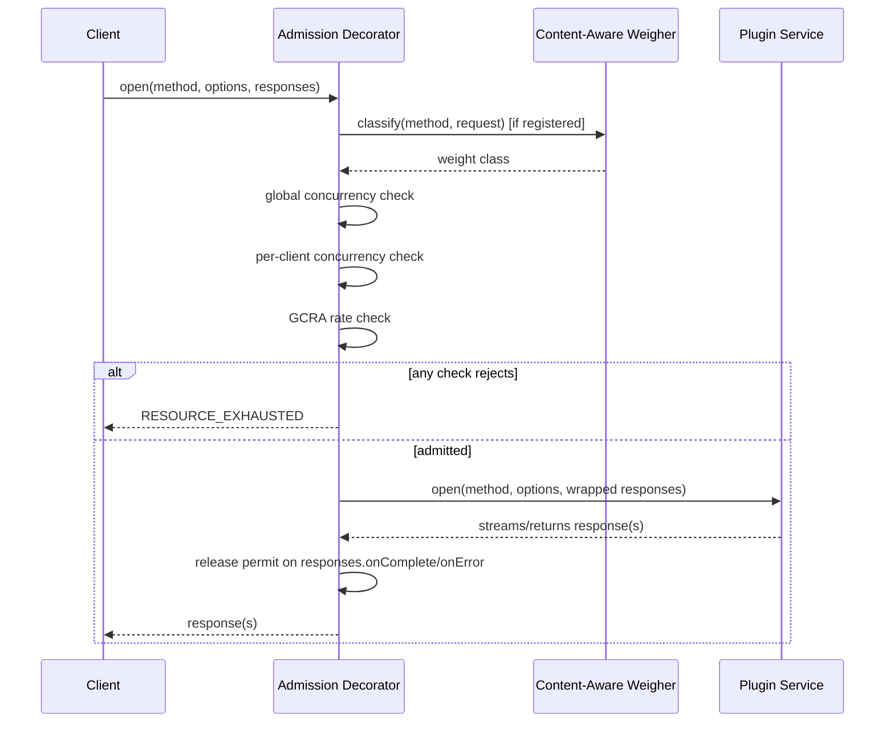
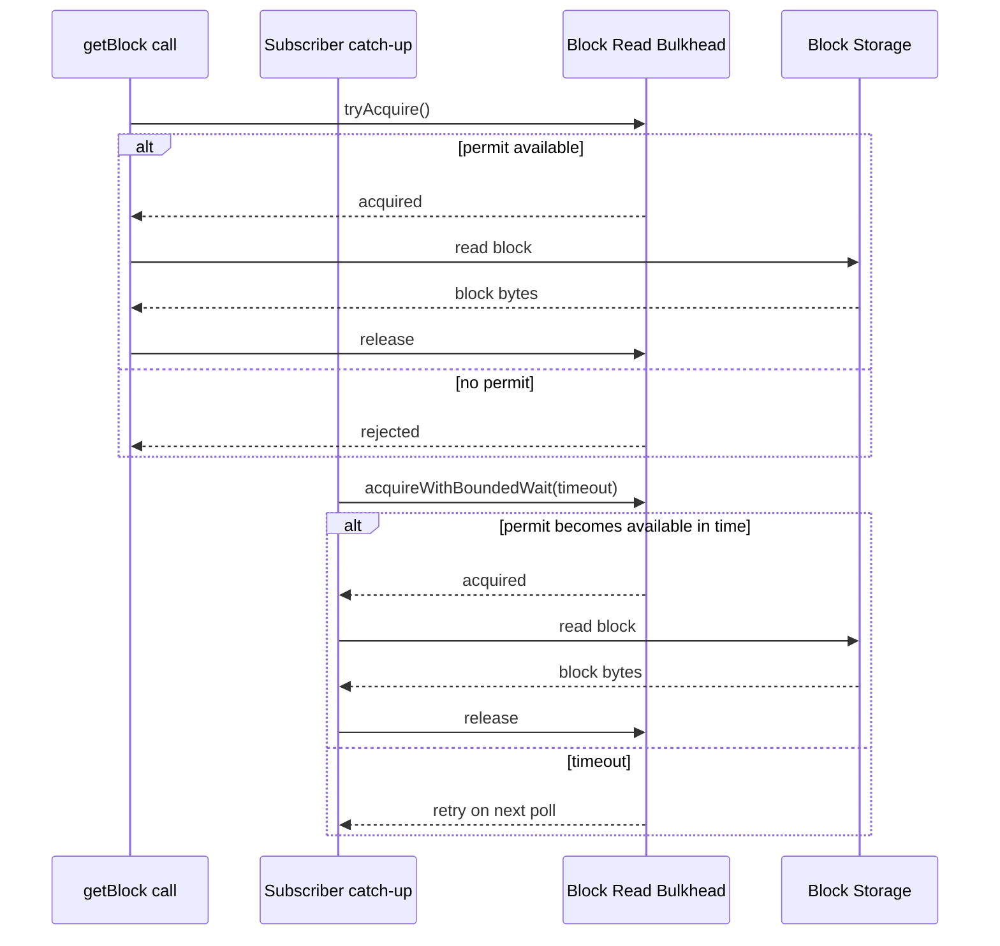

# API Throttling and Admission Control Design

## Table of Contents

1. [Purpose](#purpose)
2. [Goals](#goals)
3. [Terms](#terms)
4. [Entities](#entities)
5. [Design](#design)
6. [Diagram](#diagram)
7. [Configuration](#configuration)
8. [Metrics](#metrics)
9. [Exceptions](#exceptions)
10. [Acceptance Tests](#acceptance-tests)

## Purpose

The Block Node exposes several gRPC APIs with very different resource profiles: `publishBlockStream` (block ingest
from consensus nodes), `subscribeBlockStream` (long-lived streaming reads), `getBlock` (on-demand reads — cheap for
recent blocks, comparatively expensive for archived/historical ones), and lightweight status APIs (`serverStatus`,
`serverStatusDetail`). None of these APIs currently have any rate limiting, per-client concurrency limiting, or
admission control.

This means a burst of read traffic — many concurrent subscribers, or a spike of `getBlock` requests against
historical blocks — has no mechanism preventing it from consuming a disproportionate share of node resources (CPU,
memory, disk I/O, and connection capacity). This document proposes an admission-control layer that applies
per-client rate and concurrency limits to each gRPC API, tuned to how expensive that API's calls actually are, plus
a shared safeguard that protects the block-storage read path from concurrent-read overload regardless of which
client or API triggered it.



## Goals

1. Apply per-client rate and concurrency limits to each gRPC API.
2. Distinguish cost *within* a single API where it matters — e.g. `getBlock`/`subscribeBlockStream` requests for
   live/recent blocks are materially cheaper than requests for historical/archived blocks, and should be limited
   differently.
3. Protect the shared backend block-storage read path from concurrent-read overload, independent of and
   complementary to per-client limits.
4. Fit naturally on top of the project's existing gRPC service layer (`ServiceInterface`), without coupling the
   mechanism to a specific web server implementation.
5. Favor a small number of simple, well-understood, proven mechanisms (rate limiting, concurrency limiting) over a
   complex adaptive system.
6. Be performant: admission control must not become a meaningful source of latency or resource consumption itself,
   and must not compromise the Block Node's own low-latency, high-throughput goals for the path it exists to
   protect. See [Performance](#performance) under Design.

**Non-goals for this iteration:**

- **Throttling `publishBlockStream`.** This work exists to protect the ingest path from resource contention caused
  by other APIs, not to further constrain it. Misbehaving-publisher protection (e.g. penalizing a publisher that
  repeatedly sends invalid data) is a separate concern.
- **Authenticated client identity.** No authentication mechanism exists for the read APIs today. Clients are
  identified by network address for now; the identification mechanism is designed to be replaceable without
  reworking the rest of the system. Network address is a best-effort signal, not a reliable identity: any L4+
  router, load balancer, or NAT gateway between a caller and the node can make many independent callers appear
  as one address (CGNAT, corporate NAT, cloud egress gateways) or let one caller cheaply present many addresses
  (source-IP rotation on any cloud provider). Per-address limiting therefore reduces the blast radius of the
  common case (a buggy or greedy single consumer) rather than guaranteeing fairness against a motivated,
  distributed adversary; the identity-agnostic node-wide ceilings (the global concurrency check in
  [Component A](#component-a--per-client-admission-gate) and [`BlockReadBulkhead`](#component-b--shared-backend-block-read-bulkhead))
  are the actual backstop for that threat, and hold regardless of how this per-client signal is defeated.
- **Fully adaptive / self-tuning rate limiting.** A closed-loop controller that automatically discovers sustainable
  throughput is a reasonable future evolution if static limits prove insufficient, but is materially more complex
  to build and operate, and is not warranted without evidence that static, well-tuned limits fall short. The static
  *capacity* knobs specifically (node-wide concurrency ceilings, `BlockReadBulkhead` permits) are a plausible
  exception to this if hardware heterogeneity across deployments makes one hand-tuned default impractical — see the
  adaptive-bulkhead-sizing follow-up under the throttling epic — but that applies narrowly to capacity sizing, not
  to per-client policy (rate, burst, per-client concurrency), which stays a static fairness choice by design.

## Terms

<dl>
<dt>Admission control</dt><dd>Deciding, at the point a request or stream is opened, whether to accept it now or
reject it immediately.</dd>
<dt>Client key</dt><dd>An identifier used to group a caller's requests for the purpose of per-client limits. Derived
from the caller's network address in this design.</dd>
<dt>Weight class</dt><dd>A cost tier assigned to a request (e.g. LIGHT, MODERATE, HEAVY) that determines which
rate/concurrency policy applies to it.</dd>
<dt>Content-aware weigher</dt><dd>A per-API function that inspects a request's content (e.g. the requested block
number) to classify it into a weight class before admission, rather than relying on a single static weight for the
whole API.</dd>
<dt>Leaky bucket (rate limiter)</dt><dd>The rate-limiting model used per client per method: a request adds to a
conceptual bucket, the bucket drains at a fixed rate, and a request is admitted only if the bucket isn't already
full. Used strictly as a policer here (reject on arrival), not a shaper (delay and re-admit later); see
[Alternatives considered](#alternatives-considered). The state representation used to implement this model — GCRA,
see [`GcraLimiter`](#gcralimiter) — is an implementation choice, not part of the model itself.</dd>
<dt>Bulkhead</dt><dd>A bounded pool of permits that caps how many callers can concurrently use a shared resource,
independent of who those callers are.</dd>
<dt>Concurrency permit</dt><dd>A slot representing one in-flight call or session against a limit; acquired on
admission and released when the call/session ends.</dd>
</dl>

## Entities

### `ThrottlePolicy`

The runtime policy applied to one gRPC method for one client: a rate (requests per second), a burst tolerance, a
per-client concurrency ceiling, and a node-wide concurrency ceiling.

### `GcraLimiter`

A lock-free leaky-bucket rate limiter, keyed per client, implemented via GCRA. Holds one monotonic-clock timestamp
(the theoretical arrival time) per key, advanced via compare-and-swap on each admitted request — deliberately not a
token counter, since that would need the same timestamp anyway (to know when to refill) plus a second field.

### `ClientKeyExtractor`

Derives a client key from an incoming call's connection metadata. The default implementation uses the caller's
remote network address. The interface is designed so an authenticated-identity-based implementation (e.g. an mTLS
client certificate, or an OAuth/bearer-token subject once a token-based auth scheme exists) can replace it later
without changing anything else in the system — the design deliberately doesn't commit to either as the eventual
mechanism.

### `ContentAwareWeigher`

An optional, per-API function that classifies a request into a weight class based on its content, evaluated once at
admission time before any rate/concurrency check runs. Used by `getBlock` and `subscribeBlockStream` to distinguish
live/recent requests from historical ones.

### The admission decorator

A wrapper around a plugin's `ServiceInterface` implementation that performs the admission decision on every call
and, if admitted, tracks the call's concurrency permit for its full lifetime.

### `BlockReadBulkhead`

A single, shared, bounded permit pool protecting the block-storage read path. Not keyed by client — it protects the
resource itself, independent of who is reading from it.

### Per-API and global throttle configuration

Each plugin owns a small configuration record describing its own per-client limits (rate, burst, per-client
concurrency). Node-wide concurrency ceilings, which represent an allocation of shared node capacity across APIs,
live in one shared, node-level configuration record.

### How the entities relate



The `ClientKeyExtractor` interface is deliberately factored out as its own pluggable type rather than inlined into
the decorator, specifically so a future authenticated-identity mechanism (an mTLS client certificate, or an API key)
can be introduced later as a new implementation of this one interface, without changing the admission decorator,
`ThrottlePolicy`, or any configuration record. `RequestOptions.remoteCertificateChain()` already exists on the
underlying request options today, unused — it is exactly what a future `TlsCertificateKeyExtractor` would read from.

## Design



### Where admission control attaches

Every gRPC service implemented by this project's plugins is a PBJ `ServiceInterface`, and every call to any of them
— unary or streaming — passes through exactly one method:

```java
Pipeline<? super Bytes> open(Method method, RequestOptions options, Pipeline<? super Bytes> responses)
```

This is the attachment point for admission control: a decorator wraps a plugin's `ServiceInterface` before it is
registered with the server, and every call is checked before the plugin's real implementation ever runs. Because
this sits at the `ServiceInterface` level rather than inside a specific web server's request-routing layer, the
mechanism does not depend on which web server hosts the gRPC service.

`RequestOptions` already exposes what's needed for the default client-key extraction (the caller's remote address)
and, if authenticated client identity is introduced later, the caller's certificate chain.

### Component A — per-client admission gate



For every call, in order — the first check that rejects wins, and no later check runs:

1. **Global concurrency check** — is the node-wide concurrency ceiling for this method already reached? (a pure
   read of shared state)
2. **Per-client concurrency check** — has this client already reached its own concurrency ceiling for this method?
   (a pure read of per-client state)
3. **Rate check (leaky bucket, via GCRA)** — is this client calling faster than its allowed rate? This check is the only one that
   mutates state (it advances the client's theoretical-arrival-time marker), so it deliberately runs last: a call
   that's going to be rejected by a cheaper check must not be allowed to consume a rate-limiting slot first.

If every check passes, the call is admitted: both concurrency counters are incremented, and the real service's
`open()` is invoked. If any check fails, the call is rejected immediately (see [Exceptions](#exceptions)) and the
real service method is never invoked.

**Overload prevention vs. single-consumer abuse are different guarantees.** The global concurrency check above,
and `BlockReadBulkhead` (Component B), are identity-agnostic: they cap total in-flight work regardless of who's
generating it, so this holds even if every per-client check is defeated (e.g. by IP rotation, per the client-key
caveat above). This is the real, hard backstop against overload. The per-client concurrency and rate checks, by
contrast, are a best-effort deterrent for the common case (a buggy or greedy single consumer) — without an
authenticated identity, they cannot be a guarantee against a motivated, distributed adversary.

**Concurrency-permit lifecycle.** The decorator must release a call's concurrency permit exactly once, whenever the
call ends — but "the call ends" is not signaled the same way for every RPC shape. The permit must be attached to the
*outgoing* `responses` pipeline (the pipeline passed into `open()`), not the pipeline that `open()` returns. For a
server-streaming call such as `subscribeBlockStream`, the client sends one request and then half-closes its side
almost immediately — but that does not mean the call is finished, since the server may continue streaming responses
for a long time afterward. The `responses` pipeline's completion callbacks, by contrast, reliably fire exactly once
when the call actually ends — on normal completion, on a business-logic error, on client cancellation, and on a
deadline being exceeded — for both unary and streaming calls alike. The release logic needs its own single-fire
guard, since more than one of those signals can arrive for the same call (for example, a cancellation arriving
immediately after a business-logic error).

**Content-aware weighting for `getBlock` and `subscribeBlockStream`.** A single static weight per API cannot express
that a historical block read is more expensive than a live one. Both APIs register a `ContentAwareWeigher` that
inspects the requested block number (for `getBlock`) or the requested start block (for `subscribeBlockStream`)
against the current recent/historical boundary, classifying the call *before* the admission checks above run, so a
historical request is checked against a stricter policy than a live one. For `subscribeBlockStream`, this
classification happens once, at admission time — a session that starts as a live subscription and later needs to
catch up on history is protected by Component B below, not by re-evaluating its weight mid-session.

### Component B — shared backend block-read bulkhead



Component A limits *admission*: how many requests or sessions a given client is allowed to have outstanding. It says
nothing about whether the node currently has spare capacity to actually serve them, and that capacity is shared
across more than one API: both `getBlock` and a subscriber catching up on historical blocks read from the same
underlying block storage. A per-client limit on `getBlock` alone would leave that shared resource unprotected
against combined load from both call paths.

Component B is a single, bounded, non-client-keyed pool of permits guarding every read against block storage:

- `getBlock` acquires a permit without waiting; if none is available, the call is rejected immediately, since this
  is a single request-response exchange from the client's perspective.
- A subscriber session catching up on historical blocks acquires a permit with a brief bounded wait instead of an
  immediate rejection. A session is a standing resource whose purpose is to keep running; rejecting the whole
  session over one momentary saturation instant is a worse outcome than a short internal delay before retrying.
  This wait is purely internal scheduling for already-admitted work — it never affects the admission decision in
  Component A.

The node-wide concurrency ceilings Component A applies to historical `getBlock` requests should be sized with this
bulkhead's capacity in mind, since both draw from the same underlying resource — but because the bulkhead is also
shared with subscriber catch-up traffic, which Component A's `getBlock` ceiling has no visibility into, sizing the
two independently is a reasonable approximation rather than a guarantee that the bulkhead can never be contended by
both sources at once. The bulkhead's own bounded behavior (reject or brief wait, never unbounded growth) is what
keeps that scenario safe even so.

### Configuration ownership

Each gRPC method has exactly one plugin that implements it, so a client's rate and per-client concurrency limits for
that method are naturally a concern of that one plugin — they require no coordination with any other plugin. Each
plugin therefore declares its own per-client throttle configuration in its own module, following the same pattern
already used for that plugin's other configuration.

A method's node-wide concurrency ceiling is different: it represents an allocation of one shared, node-wide capacity
budget (connections, heap, disk I/O) across every API on the node, which is inherently a node-level view rather than
something any single plugin can reason about on its own. Node-wide ceilings therefore live in one small, shared,
node-level configuration record.

Enforcement stays centralized in the one place that already sees every plugin's service registration: a plugin
hands its own per-client policy in at registration time, and the registration point merges it with the
corresponding node-wide ceiling before applying the decorator described above. This keeps per-client tuning fully
owned by the plugin that the limit governs, while keeping the actual enforcement logic — and the ability to validate
that per-plugin and node-wide numbers agree with each other — in one place.

### Client-state bookkeeping

Per-client rate and concurrency state is held in a bounded, concurrent map keyed by client key and method. Left
unmanaged, this map's key space would grow without bound as new clients connect over time — which would recreate,
inside the throttling system itself, the same kind of unbounded resource growth this system exists to prevent.
Entries are evicted lazily when a stale entry is encountered on the read path, backed by a low-frequency full sweep
that catches clients who are never looked up again.

### Performance

Admission control must not become a meaningful cost on the request path it protects, and must never add latency or
resource overhead to the one path that stays fully exempt from it (`publishBlockStream`). The design keeps overhead
small and bounded by construction:

- **No blocking, no locks.** The GCRA rate check is a single compare-and-swap loop on one `AtomicLong` per client per
  method; the concurrency checks are reads and atomic increments/decrements on plain counters. None of Component A's
  checks acquire a lock or perform I/O.
- **No extra threads, no extra network hops.** The admission decorator runs synchronously, in-process, on the same
  thread that would have handled the call anyway. It is one additional layer of method dispatch per call, applied
  once at service-registration time — not a new pipeline stage, background thread, or process boundary.
- **`publishBlockStream` carries zero added cost.** Because it is fully exempt, no decorator, no counters, and no
  extra allocation are introduced on the ingest path at all.
- **Two implementation details are worth calling out explicitly, since they are the parts most likely to erode this
  if done carelessly:**
  - **Client-key derivation should happen once per connection, not once per call.** Deriving a key from
    `RequestOptions.remoteAddress()` on every single unary call (e.g. every `getBlock` request on a connection that
    is reused for many calls) would allocate a string repeatedly for no new information; the key should be computed
    once and reused for the life of the underlying connection where possible.
  - **Content-aware weighing must not require a full protobuf deserialization.** A weigher only needs to read one or
    two fields (e.g. a block number) to classify a request. It should do a targeted read of that field directly from
    the wire format, not fully deserialize the request message before the real handler does its own full parse —
    otherwise every classified call would pay for parsing the request twice.
- **Acceptance criterion.** This goal should be validated, not assumed: a benchmark comparing per-call latency and
  allocation with admission control enabled versus disabled on the same hardware belongs in the acceptance tests for
  the implementation, not just asserted here (see [Acceptance Tests](#acceptance-tests)).

### Extensibility

Two extension points are designed in from the start, since both are anticipated future work:

- **Client identification.** `ClientKeyExtractor` is a small, isolated interface specifically so that authenticated
  client identity — an API key, or an mTLS client certificate — can replace network-address-based identification
  later by adding one new implementation, with no change needed to the admission decorator, `ThrottlePolicy`, or any
  per-plugin configuration. `RequestOptions.remoteCertificateChain()` already exists today, unused, as exactly what
  a future certificate-based extractor would read.
- **Additional bulkheads for other shared resources.** `BlockReadBulkhead` is one instance of a general pattern: a
  bounded, non-client-keyed permit pool guarding a specific shared resource against combined load from every call
  path that uses it. Nothing in the design ties this pattern to block storage specifically — a future resource with
  the same shape of problem (several call paths contending for one constrained backend resource) could be protected
  by a new, independently-named and independently-sized bulkhead instance, following the same shape as
  `BlockReadBulkhead`, without changing Component A at all.

### Alternatives considered

- **A single combined per-client "weighted cost" system instead of two separate components.** Rejected: it would
  couple two concerns that change independently — how many clients exist and how they behave has nothing to do with
  how much backend read capacity the node has — and would make the backend-protection guarantee only as strong as
  every client's individually configured weight, rather than a hard shared ceiling.
- **A classic token bucket with a background refill thread, instead of GCRA.** Rejected: GCRA achieves the same
  smooth rate-limiting behavior with one comparison and one atomic update per call, no background thread, and no
  per-bucket refill bookkeeping.
- **Queueing or delaying a call briefly instead of rejecting it immediately when a limit is hit.** Rejected for the
  client-facing admission decision: a queue is itself a resource that needs its own bound, timeout, and monitoring,
  which works against keeping this mechanism simple. The one deliberate exception is internal to Component B: a
  subscriber session catching up on history gets a brief bounded wait rather than being disconnected, because
  killing a long-lived session over one transient saturation instant is a worse outcome than a short delay, and this
  wait never affects the admission decision itself.
- **Node-wide concurrency ceilings owned by each plugin, alongside its per-client settings.** Rejected: a ceiling
  represents an allocation of the node's total shared capacity across every API, which requires a node-level view no
  single plugin has on its own. Splitting ownership this way keeps every other per-client setting fully owned by the
  plugin it governs.
- **A fully adaptive, self-tuning controller from the start.** Rejected for the initial delivery: it would require
  an independent controller per API cost tier (since a single latency target does not fit APIs with genuinely
  different cost profiles), and depends on a clean backlog signal this node does not have a single, unified source
  of today. Static, well-tuned limits are simpler to build, reason about, and operate, and can be replaced with an
  adaptive approach later if evidence shows static limits are insufficient.

## Diagram





## Configuration

Each throttled API's own module declares its per-client settings:

|         Property         |                                             Meaning                                              |
|--------------------------|--------------------------------------------------------------------------------------------------|
| `ratePerSecond`          | Sustained requests (or, for streaming APIs, new session opens) per second allowed for one client |
| `burstTolerance`         | How far ahead of the even-pacing schedule a client's request may arrive and still be admitted    |
| `maxConcurrentPerClient` | Maximum concurrent in-flight calls/sessions for one client on this method                        |

A single shared, node-level configuration record holds one node-wide concurrency ceiling per throttled method
(`maxConcurrentGlobal`-equivalent), since this represents an allocation of shared node capacity across APIs rather
than a single plugin's own concern.

The shared block-read bulkhead has its own single configuration value: the number of permits in the pool, informed
by the target deployment's storage characteristics.

`publishBlockStream` declares no throttle configuration and is not subject to any of the checks above.

## Metrics

|          Metric           |                          Type                          |                                   Meaning                                   |
|---------------------------|--------------------------------------------------------|-----------------------------------------------------------------------------|
| Admitted calls            | Counter, labeled by service/method/weight class        | Calls that passed all admission checks                                      |
| Rejected calls            | Counter, labeled by service/method/weight class/reason | Calls rejected, broken down by which check rejected them                    |
| Per-client in-flight      | Gauge, labeled by service/method                       | Distinct clients currently holding at least one in-flight call for a method |
| Node-wide in-flight       | Gauge, labeled by service/method                       | Current node-wide concurrent call count per method                          |
| Client-state table size   | Gauge                                                  | Size of the per-client bookkeeping table, to catch unexpected growth        |
| Block-read bulkhead usage | Gauge (in-use / available)                             | Current utilization of the shared backend read permit pool                  |

## Exceptions

A call rejected by any admission check fails immediately with a `RESOURCE_EXHAUSTED` gRPC status and a message
describing which check rejected it; the plugin's real service method is never invoked, and no partial response is
produced. `publishBlockStream` is not subject to any admission check and is unaffected by this feature entirely.

## Acceptance Tests

1. A client exceeding its configured rate limit for a method receives `RESOURCE_EXHAUSTED`; traffic within the limit
   is unaffected.
2. A client exceeding its per-client concurrency limit for a method is rejected without affecting other clients'
   ability to call the same method.
3. The node-wide concurrency ceiling for a method rejects new calls once reached, regardless of which client they
   come from.
4. `getBlock` and `subscribeBlockStream` requests for historical blocks are limited independently of requests for
   live/recent blocks, using the same client's traffic on both tiers.
5. A concurrency permit is released exactly once for a call that completes normally, for a call cancelled by the
   client, and for a call that exceeds its deadline — verified for both a unary call and a long-lived streaming
   call.
6. Sustained subscribe/unsubscribe churn from many clients does not cause per-client or node-wide in-flight counts,
   or the client-state table size, to grow without bound.
7. Concurrent `getBlock` (historical) and subscriber catch-up traffic together are capped by the shared block-read
   bulkhead's permit count, regardless of how that load is split between the two call paths.
8. `publishBlockStream` traffic is entirely unaffected by any of the above, at any load level.
9. A benchmark measuring per-call latency and allocation rate, with admission control enabled versus disabled on the
   same hardware, shows no meaningful regression on throttled APIs and zero measurable overhead on
   `publishBlockStream`.
