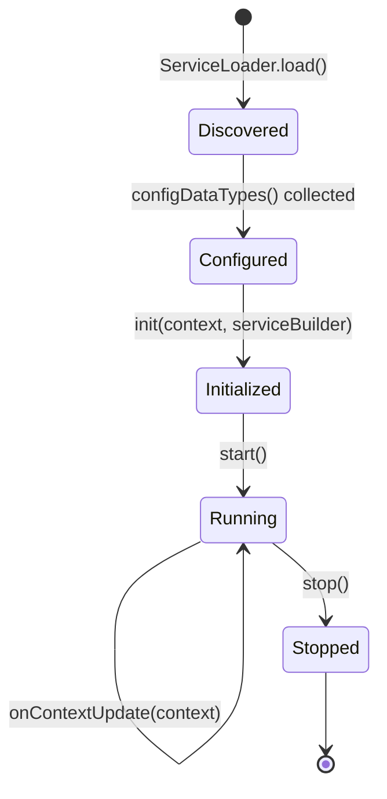
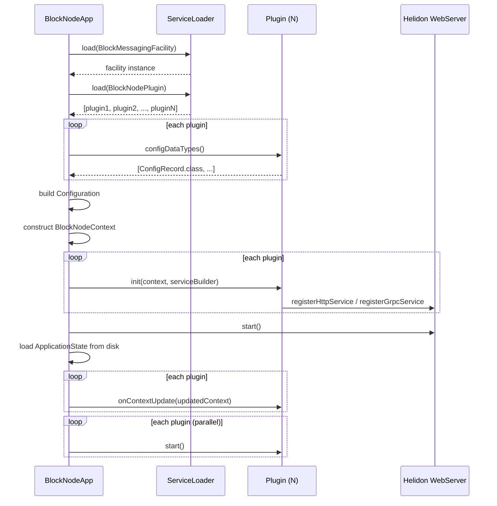
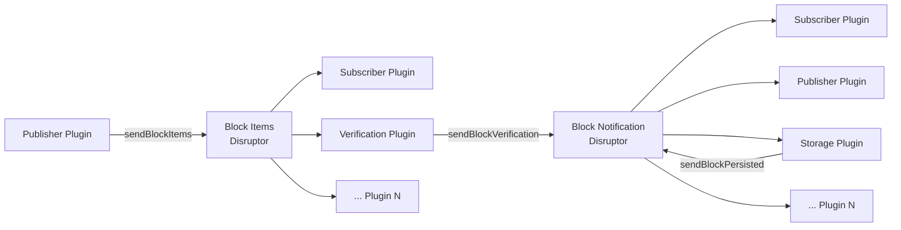
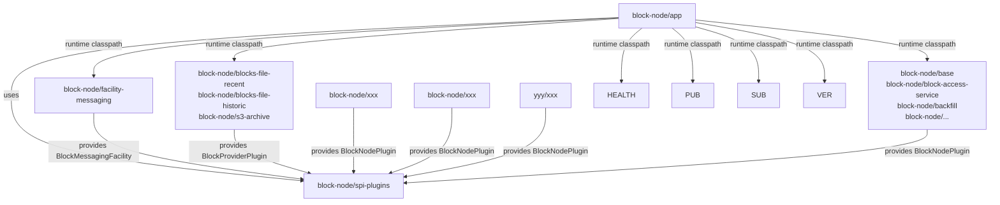

# Plugin Architecture

## Table of Contents

1. [Purpose](#purpose)
2. [Goals](#goals)
3. [Terms](#terms)
4. [Entities](#entities)
5. [Design](#design)
6. [Diagram](#diagram)
7. [Configuration](#configuration)
8. [Metrics](#metrics)
9. [Exceptions](#exceptions)
10. [Acceptance Tests](#acceptance-tests)

## Purpose

The Block Node is composed of many independently-developed functional components: block publishing, subscribing, verification, persistence, health checking, cloud archival, roster bootstrapping, and more. Rather than wiring these together statically at compile time, the Block Node uses a **plugin architecture** that discovers, configures, and manages the lifecycle of each component at runtime.

This document describes the design of that architecture — the `BlockNodePlugin` SPI, the `BlockNodeContext` facility registry, the inter-plugin messaging bus, and the conventions that allow any module to contribute behavior to the running node simply by providing an implementation of the SPI.

## Goals

- Allow functional components to be added, replaced, or removed without modifying the application bootstrap code.
- Provide each plugin with uniform, injected access to shared facilities (config, metrics, health, messaging, block storage, threading).
- Enforce a clear lifecycle (`configDataTypes → init → start → onContextUpdate → stop`) so plugins initialize and shut down cleanly.
- Enable high-throughput inter-plugin communication with back-pressure via a ring-buffer messaging bus.
- Support typed, immutable configuration for each plugin using Java records and the Swirlds Config API.
- Remain entirely within the Java Platform Module System so that module boundaries are enforced by the JVM.

## Terms

<dl>
  <dt>Plugin</dt>
  <dd>Any class that implements <code>BlockNodePlugin</code> and is registered as a Java module service. Plugins are the unit of extension — each adds a distinct capability to the running Block Node.</dd>

  <dt>Facility</dt>
  <dd>A shared service exposed through <code>BlockNodeContext</code>. Examples: <code>BlockMessagingFacility</code>, <code>HistoricalBlockFacility</code>, <code>HealthFacility</code>. Some facilities are themselves plugins (they implement <code>BlockNodePlugin</code>) but are loaded and wired before general plugins are initialized.</dd>

  <dt>SPI</dt>
  <dd>Service Provider Interface — a Java interface declared in the <code>spi-plugins</code> module and consumed via <code>java.util.ServiceLoader</code>. Plugins provide implementations of SPI interfaces in their own modules.</dd>

  <dt>BlockNodeContext</dt>
  <dd>An immutable Java record passed to every plugin during <code>init()</code>. It is the sole mechanism through which plugins access shared facilities. A new context instance is constructed whenever mutable shared state (TssData, NodeAddressBook) changes, and all plugins are notified via <code>onContextUpdate()</code>.</dd>

  <dt>ServiceBuilder</dt>
  <dd>An interface passed alongside <code>BlockNodeContext</code> during <code>init()</code> that allows plugins to register HTTP and gRPC service routes on the Helidon web server.</dd>

  <dt>Disruptor</dt>
  <dd>The LMAX Disruptor ring buffer used by <code>BlockMessagingFacility</code> as the underlying transport for both block-item distribution and block-notification events between plugins.</dd>

  <dt>BlockProviderPlugin</dt>
  <dd>A specialization of <code>BlockNodePlugin</code> that contributes a source of historical blocks (e.g., file system, S3, RAM cache). The <code>HistoricalBlockFacility</code> composes all registered providers in priority order.</dd>
</dl>

## Entities

### `BlockNodePlugin` (interface)

The root SPI interface. Every plugin implements this interface, and the application discovers all implementations via `ServiceLoader<BlockNodePlugin>`. All methods have default no-op implementations so plugins only override what they need.

|             Method              |               When called               |                                                                  Purpose                                                                   |
|---------------------------------|-----------------------------------------|--------------------------------------------------------------------------------------------------------------------------------------------|
| `name()`                        | Anytime                                 | Human-readable identifier; defaults to the simple class name.                                                                              |
| `version()`                     | After load                              | Returns the plugin's version from its JAR manifest.                                                                                        |
| `configDataTypes()`             | Before config load                      | Declares `@ConfigData`-annotated record classes the plugin needs. All types are collected from every plugin before configuration is built. |
| `init(context, serviceBuilder)` | During startup                          | Plugin receives its context and registers HTTP/gRPC routes. Facilities are available; background threads must not start yet.               |
| `start()`                       | After all `init()` calls                | Plugin starts background threads and begins processing. All facilities are guaranteed to be fully initialized.                             |
| `onContextUpdate(context)`      | When TssData or NodeAddressBook changes | Plugin receives an updated context and should re-read the changed state.                                                                   |
| `stop()`                        | During graceful shutdown                | Plugin stops threads and releases resources.                                                                                               |

### `BlockNodeContext` (record)

An immutable record injected into every plugin. Fields:

|           Field            |            Type            |                                       Description                                        |
|----------------------------|----------------------------|------------------------------------------------------------------------------------------|
| `configuration`            | `Configuration`            | Swirlds typed configuration. Plugins call `configuration.getConfigData(MyConfig.class)`. |
| `metricRegistry`           | `MetricRegistry`           | Register counters, gauges, and histograms.                                               |
| `serverHealth`             | `HealthFacility`           | Query node state; trigger graceful shutdown.                                             |
| `blockMessaging`           | `BlockMessagingFacility`   | Publish/subscribe to block items and block lifecycle notifications.                      |
| `historicalBlockProvider`  | `HistoricalBlockFacility`  | Random-access read of any stored block by number.                                        |
| `applicationStateFacility` | `ApplicationStateFacility` | Persist and update mutable node state (TssData, NodeAddressBook).                        |
| `serviceLoader`            | `ServiceLoaderFunction`    | Load additional SPI extensions at runtime.                                               |
| `threadPoolManager`        | `ThreadPoolManager`        | Create managed virtual-thread or platform-thread executors.                              |
| `blockNodeVersions`        | `BlockNodeVersions`        | Version information for all loaded plugins.                                              |
| `tssData`                  | `TssData`                  | Current threshold signature scheme data.                                                 |
| `nodeAddressBook`          | `NodeAddressBook`          | Current RSA address book for peer communication.                                         |

### `ServiceBuilder` (interface)

Passed to plugins during `init()`. Allows plugins to register routes without a direct dependency on Helidon.

```java
void registerHttpService(String path, HttpService... service);
void registerGrpcService(ServiceInterface service);
```

### `BlockMessagingFacility` (interface + plugin)

The inter-plugin event bus. Itself a plugin (and a required facility — startup fails if not found). Built on LMAX Disruptor ring buffers for high-throughput, low-latency delivery.

**Block Items** — a stream of `BlockItems` records carrying unparsed protobuf items for one logical block:
- `sendBlockItems(BlockItems)` — called by the publisher plugin for every batch received from a Consensus Node.
- `registerBlockItemHandler(BlockItemHandler, cpuIntensive, name)` — subscribe with back-pressure; a slow handler slows the producer.
- `registerNoBackpressureBlockItemHandler(...)` — subscribe without back-pressure; if the handler falls 80% behind, `onTooFarBehindError()` is called instead of blocking the producer.

**Block Notifications** — five typed notification events for block lifecycle milestones:

|              Notification               |       Sender        |                          Meaning                           |
|-----------------------------------------|---------------------|------------------------------------------------------------|
| `VerificationNotification`              | Verification plugin | Block passed or failed cryptographic verification.         |
| `PersistedNotification`                 | Storage plugins     | Block has been durably written by a provider.              |
| `BackfilledBlockNotification`           | Backfill plugin     | A previously missing block was retrieved and stored.       |
| `NewestBlockKnownToNetworkNotification` | Publisher plugin    | Consensus Node has reported the latest known block header. |
| `PublisherStatusUpdateNotification`     | Publisher plugin    | Publisher connection state changed.                        |

Any plugin may subscribe to notifications via `registerBlockNotificationHandler(BlockNotificationHandler, ...)`.

### `HistoricalBlockFacility` (interface + plugin)

Aggregates all registered `BlockProviderPlugin` implementations and presents a unified read interface:

- `block(long blockNumber)` → `BlockAccessor` — queries providers in descending priority order; returns the first non-null result.
- `availableBlocks()` → `BlockRangeSet` — the union of all providers' available ranges.

### `HealthFacility` (interface)

```java
enum State { STARTING, RUNNING, SHUTTING_DOWN }
State blockNodeState();
void shutdown(String className, String reason);
```

The `HealthServicePlugin` registers `/healthz/livez` and `/healthz/readyz` HTTP endpoints that return `200 OK` while the state is `RUNNING` and `503 Service Unavailable` otherwise.

### `ApplicationStateFacility` (interface)

```java
void updateTssData(TssData tssData);
boolean updateAddressBook(NodeAddressBook nodeAddressBook);
```

Updates are persisted to disk as JSON and trigger `onContextUpdate()` on every loaded plugin with a newly constructed `BlockNodeContext`.

### `BlockProviderPlugin` (interface)

Specialization of `BlockNodePlugin` for block storage backends. Each provider declares a `defaultPriority()` (higher = preferred). The `HistoricalBlockFacility` loads all providers and sorts them by priority.

## Design

### Plugin Discovery and Bootstrap Sequence

```
1. BlockNodeApp instantiates ServiceLoader for:
   a. BlockMessagingFacility  (required; throws if missing)
   b. HistoricalBlockFacility (constructed internally; discovers BlockProviderPlugins)
   c. BlockNodePlugin          (all other plugins)

2. Collect configDataTypes() from every plugin + built-in config types.

3. Load Configuration from sources (classpath properties, environment variables,
   system properties) using the collected record types.

4. Construct BlockNodeContext with all facilities + loaded config.

5. Call plugin.init(context, serviceBuilder) for every plugin (sequentially).
   Plugins register HTTP/gRPC routes via ServiceBuilder.

6. Start Helidon WebServer using routes accumulated in ServiceBuilder.

7. Load and apply ApplicationState from disk (TssData, NodeAddressBook).
   Call onContextUpdate(context) on all plugins with updated context.

8. Call plugin.start() for every plugin (in parallel via virtual threads).
   Plugins launch background workers, open network connections, etc.

9. Node is RUNNING. State scanner thread watches for asynchronous
   TssData/NodeAddressBook updates, persists them, and calls onContextUpdate().

10. On shutdown signal:
    a. Transition to SHUTTING_DOWN.
    b. Wait for configurable shutdown delay.
    c. Stop WebServer.
    d. Call plugin.stop() for every plugin.
    e. Close MetricRegistry.
    f. Exit JVM.
```

### Module System Integration

Every module declares its service registrations in `module-info.java`. The SPI module declares `uses` directives; provider modules declare `provides` directives. No classpath scanning occurs — the JVM resolves services at module-layer open time.

```java
// spi-plugins module-info.java
uses org.hiero.block.node.spi.BlockNodePlugin;
uses org.hiero.block.node.spi.blockmessaging.BlockMessagingFacility;
uses org.hiero.block.node.spi.historicalblocks.BlockProviderPlugin;

// facility-messaging module-info.java
provides org.hiero.block.node.spi.blockmessaging.BlockMessagingFacility
    with BlockMessagingFacilityImpl;

// health module-info.java
provides org.hiero.block.node.spi.BlockNodePlugin
    with HealthServicePlugin;
```

Adding a new plugin requires only:
1. Implementing `BlockNodePlugin` (or a specialization).
2. Declaring `provides ... with YourPlugin` in `module-info.java`.
3. Adding the module to the Gradle build.

No changes to `BlockNodeApp` or any existing plugin are required.

### Inter-Plugin Messaging

The `BlockMessagingFacility` decouples producers from consumers using two independent Disruptor ring buffers:

```
Publisher Plugin
      │
      ▼  sendBlockItems()
┌─────────────────────┐
│  Block Items Buffer  │  (Disruptor ring)
└─────────────────────┘
      │           │
      ▼           ▼
 Subscriber    Verification    ...  (N handlers, each with optional back-pressure)

Block Lifecycle Events (verification, persistence, backfill, etc.)
      │
      ▼  sendBlockVerification() / sendBlockPersisted() / ...
┌────────────────────────────┐
│  Block Notification Buffer  │  (Disruptor ring)
└────────────────────────────┘
      │           │
      ▼           ▼
  Subscriber   Publisher   ...  (N handlers)
```

Handlers registered with back-pressure (default) slow the producer if they fall behind, providing flow control. Handlers registered without back-pressure (`NoBackPressureBlockItemHandler`) are called with a skip notification (`onTooFarBehindError`) when they fall more than 80% of the ring size behind.

### Typed Configuration

Each plugin declares the `@ConfigData`-annotated record classes it needs in `configDataTypes()`. All types from all plugins are aggregated before configuration is loaded, so a single `Configuration` instance serves the entire node.

```java
// Declaring config needs
@Override
public List<Class<? extends Record>> configDataTypes() {
    return List.of(PublisherConfig.class);
}

// Using config in init()
@Override
public void init(BlockNodeContext context, ServiceBuilder serviceBuilder) {
    PublisherConfig config = context.configuration().getConfigData(PublisherConfig.class);
}
```

Configuration sources are applied in ascending priority order:
1. Classpath (`application.properties`)
2. Environment variables (auto-mapped: `BLOCK_NODE_PUBLISHER_MAX_CONNECTIONS` → `publisher.maxConnections`)
3. System properties

### Mutable State Propagation

`TssData` and `NodeAddressBook` can change while the node is running (e.g., when a bootstrap plugin fetches peer data). Updates flow as follows:

```
Bootstrap Plugin
    │
    ▼ applicationStateFacility.updateTssData(newData)
BlockNodeApp (ApplicationStateFacility impl)
    │
    ├── Persist to disk (JSON)
    ├── Enqueue new BlockNodeContext
    │
    ▼
State scanner thread
    │
    ▼ plugin.onContextUpdate(newContext) for every loaded plugin
```

This ensures all plugins see a consistent snapshot of shared state without race conditions — each plugin receives the same immutable `BlockNodeContext` record.

## Diagram

### Plugin Lifecycle



### Startup Sequence



### Messaging Architecture



### Module Dependency Structure

Plugins can be built internally, by the community, or by private thirdParties.



## Configuration

The plugin architecture itself has no configuration. Each plugin declares its own configuration needs. The global sources and priorities are:

|                Source                | Priority |                  Example                  |
|--------------------------------------|----------|-------------------------------------------|
| System properties                    | Highest  | `-Dpublisher.maxConnections=10`           |
| Environment variables                | Middle   | `BLOCK_NODE_PUBLISHER_MAX_CONNECTIONS=10` |
| `application.properties` (classpath) | Lowest   | `publisher.maxConnections=10`             |

Environment variable mapping: `BLOCK_NODE_` prefix is stripped, remaining text is lowercased with `_` converted to `.` to match property key format.
