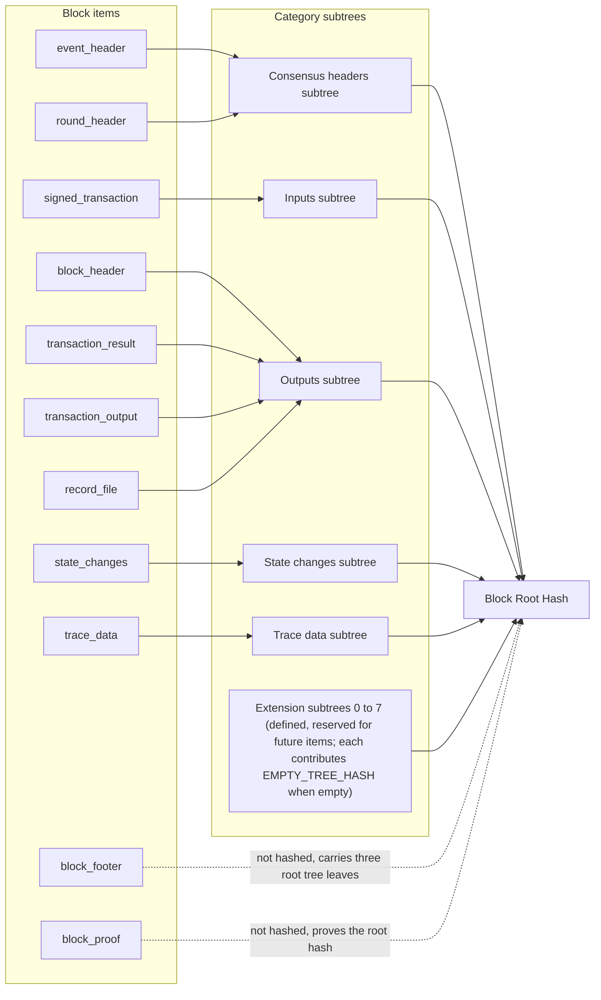
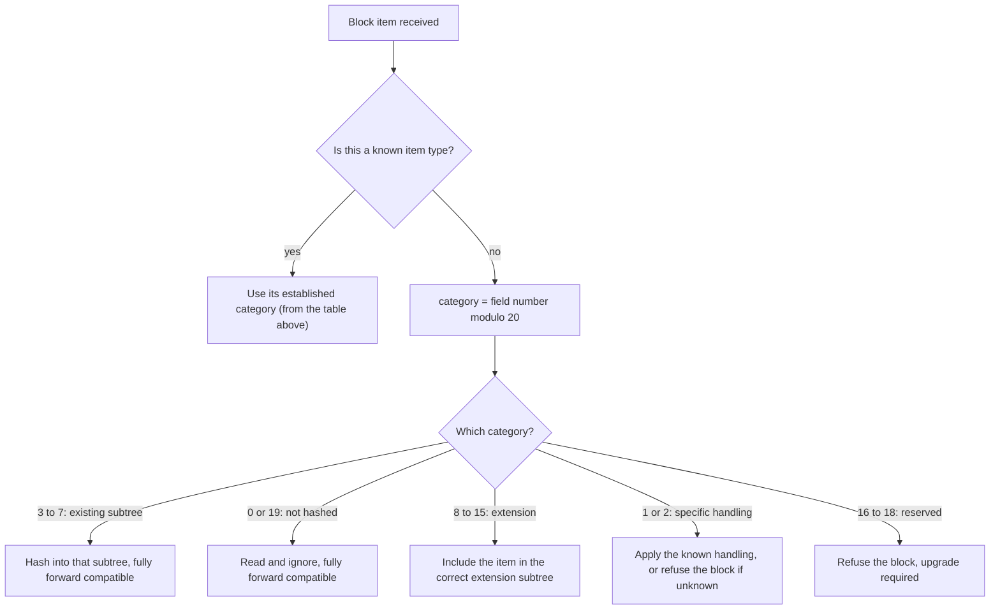
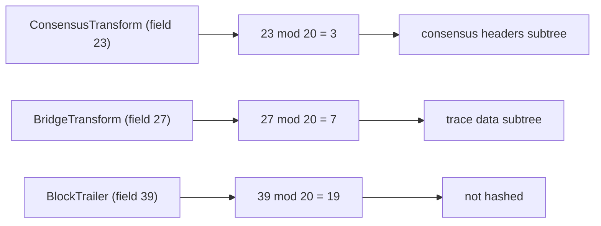

# Block Stream Forward Compatibility Design

## Table of Contents

1. [Purpose](#purpose)
2. [Goals](#goals)
3. [Terms](#terms)
4. [Entities](#entities)
5. [Design](#design)
6. [Diagram](#diagram)
7. [Configuration](#configuration)
8. [Metrics](#metrics)
9. [Exceptions](#exceptions)
10. [Acceptance Tests](#acceptance-tests)

## Purpose

A block arrives as a stream of block items. To verify a block, the Block Node
groups these items into a small number of **categories**, hashes each category
into its own **subtree**, and combines the subtree roots into the block's
**root hash**. The category an item belongs to is decided from the item's type.

Today that decision is only made for the item types that exist now. If the block
stream later gains a new item type, which is an *ordinary additive change* to the
block stream format, an older Block Node has no rule for it and rejects the
block, even though the block is *perfectly valid*. That leaves the Block Node
*backward looking*, because it has to be upgraded in lockstep with every format
addition.

This document describes how to make block hashing **forward compatible**. Known
item types keep their current category. New item types are assigned to a category
by a fixed, published **numbering rule** based on the item's field number, so a
Block Node can correctly hash a block that contains item types which did not
exist when the node was built. This works for every category that already has a
place in the block's hash tree, and it needs no code change.

This document is a companion to the
[Block Verification](./block-verification.md) design, since forward compatibility
is a property of the hashing step described there.

> **Note on the source of truth.** The numbering rule is defined by the block
> stream format itself, not by the Block Node. Earlier drafts of the rule have
> already changed before implementation, so the numbering **must be confirmed
> against the current block stream format definition before implementing**. If
> the format changes the rule, **the format wins**, and this design has to be
> brought back in line with it.

## Goals

1. Every item type defined today **must** continue to be placed in exactly the
   same category, so existing blocks hash identically and nothing regresses.
2. An item type that was unknown when the Block Node was built **must** still be
   placed in the correct category using only the numbering rule, as long as that
   category has a defined subtree in the block's hash tree.
3. Future item types that are explicitly defined as **not part of the block hash**
   must be safely ignored.
4. The rule **must** be deterministic and identical on every Block Node, so two
   nodes always compute the same hash for the same block.
5. Where forward compatibility cannot be achieved without an upgrade, the Block
   Node **must** fail clearly and refuse the block. It must *never guess*, and it
   must *never* produce a hash that could disagree with an upgraded node.

## Terms

<dl>
<dt><code>Block Item</code></dt><dd>A single, self-contained element of the block
stream, such as a header, an event, a transaction, its result, state changes, or
trace data.</dd>
<dt><code>Category</code></dt><dd>The logical bucket an item is placed in for
hashing: <code>consensus headers</code>, <code>inputs</code>,
<code>outputs</code>, <code>state changes</code>, or <code>trace data</code>.
Each category is hashed independently into its own subtree.</dd>
<dt><code>Subtree</code></dt><dd>The independent hash tree built from all items in
one category. Its root becomes a leaf of the block's root hash tree.</dd>
<dt><code>Block Root Hash</code></dt><dd>The single hash that identifies a block.
It is formed by combining the category subtree roots with a few block level
values.</dd>
<dt><code>Field Number</code></dt><dd>The number assigned to each item type in the
block stream format. It is stable across releases and is the value the numbering
rule is applied to.</dd>
<dt><code>Numbering Rule</code></dt><dd>The published convention that assigns any
newly added item type to a category based on its field number, so the category is
known without any node side knowledge of the new type.</dd>
<dt><code>Forward Compatibility</code></dt><dd>The ability of an existing Block
Node to correctly process a block that contains item types introduced after that
node was built.</dd>
<dt><code>Extension Category</code></dt><dd>One of eight additional categories
(Extension 0 to Extension 7) whose subtrees are already defined in the block's
hash tree and reserved for future item types.</dd>
<dt><code>Not Hashed</code></dt><dd>An item that is intentionally left out of the
block hash, for example the block footer and the block proof. It is read but
contributes nothing to any subtree.</dd>
</dl>

## Entities

### The Block Stream Format

This is the authoritative definition of block items and the numbering rule. It
lists the item types that exist today, reserves positions for future additions,
and states how any future addition maps to a category. The Block Node treats this
as a **contract** and follows the rule rather than inventing its own.

### The Hashing Step

This is the stage of verification that reads the items of a block, places each
one into its category, and produces the block root hash. It is the only place
that needs to know the category of an item, so it is also the only place that
applies the forward compatibility rule.

### The Category Subtrees and the Block Root Hash

Five categories carry items today: `consensus headers`, `inputs`, `outputs`,
`state changes`, and `trace data`. In addition, eight `extension subtrees`
(Extension 0 to Extension 7) are already defined in the tree and reserved for
future item types. The subtree roots, together with a few block level values
(the previous block's hash, the running root of all prior blocks, the start of
block state root, and the block timestamp), are combined into the block root
hash. The set of category leaves is **fixed and cannot ever be extended**, which
is why the truly reserved categories (16 to 18) cannot be folded into the hash
without an upgrade that defines the correct subtree.

The 16 leaves of the block root tree (positions 0 to 15) are **always** fed
into a single streaming Merkle hasher — the same primitive used for each
category subtree — and any position without content contributes
`EMPTY_TREE_HASH` (`SHA-384(0x00)`). This includes empty category subtrees,
an absent state root, and every extension slot that is not populated yet. The
16-leaf tree shape is therefore fully stable across all presence patterns, so
Merkle proof paths for any fixed position are independent of which other
positions are populated. An extension slot going from empty to populated
replaces its `EMPTY_TREE_HASH` leaf with the real subtree root; the tree
structure itself does not change.

## Design

### The Structure of the Block Stream

Each item in the block stream **SHALL** be self-contained and independent, with
the following constraints applicable to the *unfiltered* stream:

- A block **SHALL** start with a `header`.
- A block **SHALL** end with a `block_proof`.
- A `block_header` **SHALL** be followed by an `event_header`.
- An `event_header` **SHALL** be followed by one or more `event_transaction`
  items.
- An `event_transaction` **SHOULD** be followed by a `transaction_result`.
- A `transaction_result` **MAY** be followed by one or more
  `transaction_output`s.
- A `transaction_result` (or a `transaction_output`, if present) **MAY** be
  followed by one or more `state_changes`.

This forms the following required sequence for each block, which is then repeated
within the block stream, indefinitely. Note that there is no container structure
in the stream; the indentation below is only to highlight repeated subsequences.
The order of items within each block below is **REQUIRED** and **SHALL NOT**
change.

```text
header
  repeated {
    start_event
    repeated {
      event_transaction
      transaction_result
      (optional) transaction_output
      (optional) repeated state_changes
      (optional) filtered_single_item
    }
    block_footer
    repeated block_proof
  }
```

A filtered stream may exclude some items above, depending on filter criteria. A
filtered item is replaced with a merkle path and hash value to maintain block
stream verifiability.

A block item **SHALL** be individually and directly processed to create the item
hash. Items to be hashed **MUST NOT** be contained within another item, and items
which might be filtered out of the stream **MUST NOT** be contained in other
items.

### Today's Item Types

Every item type that exists now has a settled assignment to a subtree category.
These assignments are fixed and are **not** derived from the numbering rule:

|        Category         |                                                Item types                                                 |
|-------------------------|-----------------------------------------------------------------------------------------------------------|
| `consensus headers`     | `event_header`, `round_header`                                                                            |
| `inputs`                | `signed_transaction`                                                                                      |
| `outputs`               | `block_header`, `transaction_result`, `transaction_output`, `record_file`                                 |
| `state changes`         | `state_changes`                                                                                           |
| `trace data`            | `trace_data`                                                                                              |
| any subtree             | `filtered_single_item`, `redacted_item` (each contains its own path in the tree and must be fully parsed) |
| no subtree (not hashed) | `block_footer`, `block_proof`                                                                             |

Two of the not-hashed items deserve a note:

- `block_footer` is a container for the first three leaves of the block root tree
  (previous block root hash, all block hashes tree root, and state root hash); it
  is not itself a leaf in the tree.
- `block_proof` contains the cryptographic proof of the block hash; it is not
  part of the block root hash computation.

Some items need a little extra handling *beyond* being placed in a category.
Reading the format version from the block header is one example, and letting a
filtered or redacted item state its own target subtree is another. That handling
stays as it is.

**None of this changes.** The point of the design is only what happens for item
types that do not exist yet.

### The Single Field Invariant

A `BlockItem` is a protobuf `oneof`, so a valid item carries **exactly one
field**. The wire format cannot enforce this: any combination of fields parses
successfully, with fields unknown to the compiled schema preserved as unknown
fields. The hashing step therefore checks the invariant itself, before any
category placement:

- An item with a known type and **no** unknown fields is processed normally.
- An item with **no type set and exactly one unknown field** is a future item,
  and the numbering rule below applies to it.
- An item with a known type **and** one or more unknown fields is a valid
  encoding but not a processable stream, and the block is refused as an
  unsupported stream format.
- An item with no type set and **more than one** unknown field is likewise
  refused as an unsupported stream format.
- An item with **no field at all** carries nothing valid to process and is
  refused as an unknown error.

None of these refusals are parse failures: the bytes are well formed protobuf
and parsing succeeds. They are structural violations detected after parsing.

### The Numbering Rule for Future Item Types

To maximize forward compatibility, and to minimize the need to coordinate
deployments of different systems creating and processing block streams in the
future, the block stream format requires the following rule for field numbering.

An unknown field numbered **below 20** is a first release field, reserved for
item types that require specific handling. A version that does not know such a
field cannot process it and refuses the block as an unsupported item type.

Fields numbered **20 and above** MUST be numbered so that:

```text
category = N modulo 20        (N is the actual field number)
```

The resulting category number means:

| Category (N mod 20) |                       Meaning                        | Forward compatible? |
|---------------------|------------------------------------------------------|---------------------|
| 0                   | Not hashed (not part of the block proof merkle tree) | Yes                 |
| 1                   | Requires specific handling                           | Partially           |
| 2                   | Requires specific handling                           | Partially           |
| 3                   | `consensus headers`                                  | Yes                 |
| 4                   | `inputs`                                             | Yes                 |
| 5                   | `outputs`                                            | Yes                 |
| 6                   | `state changes`                                      | Yes                 |
| 7                   | `trace data`                                         | Yes                 |
| 8                   | Extension 0                                          | Yes                 |
| 9                   | Extension 1                                          | Yes                 |
| 10                  | Extension 2                                          | Yes                 |
| 11                  | Extension 3                                          | Yes                 |
| 12                  | Extension 4                                          | Yes                 |
| 13                  | Extension 5                                          | Yes                 |
| 14                  | Extension 6                                          | Yes                 |
| 15                  | Extension 7                                          | Yes                 |
| 16 to 18            | Reserved for future use                              | No                  |
| 19                  | Not hashed (not part of the block proof merkle tree) | Yes                 |

Reading the table by kind:

- **Categories 0 and 19** are not hashed. A future item here is read and ignored,
  and it contributes nothing to the block hash. *Fully forward compatible*.
- **Categories 1 and 2** are for items that need specific handling beyond
  category placement. These are *partially forward compatible*: the category
  clearly expresses a field that is not compatible unless the field's schema is
  separately known. There is never ambiguity here; the processing needed is
  either known, or the block cannot be processed.
- **Categories 3 to 7** are the five subtrees that carry items today. A future
  item here is hashed into that subtree exactly like any other item, with no
  code change. *Fully forward compatible*.
- **Categories 8 to 15** are `extension categories`. Their subtrees are already
  defined in the block's hash tree, with the names given here. A future item in
  one of them is hashed into the matching extension subtree, replacing that
  slot's `EMPTY_TREE_HASH` leaf with the real subtree root — the tree shape
  does not change. *Fully forward compatible*.
- **Categories 16 to 18** are reserved and carry no meaning yet. See
  [Where Forward Compatibility Ends](#where-forward-compatibility-ends).

### Worked Examples

A future update adds three new item types: a `BlockTrailer` which is not part of
the merkle tree, a `ConsensusTransform` which belongs in consensus headers, and a
`BridgeTransform` which belongs in trace data. All three fields are at least 20,
so they are additions and the rule applies:

- `BlockTrailer` is field `39`. `39 modulo 20 = 19`, so it is **not hashed** and
  is safely ignored.
- `ConsensusTransform` is field `23`. `23 modulo 20 = 3`, so it is a
  **`consensus headers`** item and is hashed into that subtree.
- `BridgeTransform` is field `27`. `27 modulo 20 = 7`, so it is a
  **`trace data`** item and is hashed into that subtree.

A Block Node built before any of these existed hashes the first block that
contains them correctly, with no code change, because each one lands in a category
that already has a place in the hash tree (or is explicitly not hashed).

### Where Forward Compatibility Ends

Forward compatibility is complete for categories 3 to 15 (the defined subtrees)
and for categories 0 and 19 (not hashed). It **cannot** be complete for
`reserved categories` (16 to 18). The block root hash is built from a fixed set
of category leaves that cannot ever be extended, so an item in a reserved
category cannot be added to the hash without an upgrade that defines the correct
subtree.

The "requires specific handling" categories (1 and 2) have defined subtrees for
each specific field, but may also require specific preprocessing or other
handling, so while compatibility is version dependent, the exact processing
needed is always either known or the block cannot be processed. There is never
ambiguity for categories 1 and 2.

When a Block Node meets an item it cannot process, meaning a reserved category or
a specific handling item whose processing this version does not know, it has to
**refuse the block** rather than drop the item or place it somewhere plausible.
Either shortcut would let two nodes compute *different hashes for the same
block*, which is the exact problem verification exists to prevent. Refusing the
block is safe, and it also makes the situation obvious, because it shows that the
block stream has moved ahead of this node and an upgrade is needed.

## Diagram

How today's item types feed the subtrees, and how the subtrees form the block
root hash:



How a single block item is placed:



The worked examples, applied through the rule:



The set of category leaves is **fixed and cannot ever be extended**. The
extension subtrees are part of that fixed set, so items landing in them need no
upgrade; only the reserved categories (16 to 18) have no subtree, which is why
such items require an upgrade before they can be hashed.

## Configuration

No configuration is introduced, and the rule is intentionally **not
configurable**. The numbering rule comes from the block stream format, and making
it adjustable per node would let two nodes disagree on a block's hash. The
existing verification configuration is unchanged.

## Metrics

Three counters make forward compatibility events visible to operators and give
early warning of a needed upgrade:

- a count of future item types placed into a subtree by the rule, including the
  extension subtrees,
- a count of future items safely ignored as `not hashed`,
- a count of future items refused because they fell into a reserved category
  (16 to 18), needed specific handling (1 or 2) that this version does not
  know, or carried an unknown first release field (below 20).

## Exceptions

Hashing does not surface internal errors to callers. It reports a **verification
failure** for the block instead.

- A future item that maps to a defined subtree (3 to 15, including the extension
  subtrees) or to `not hashed` (0 or 19) is handled normally and is not a
  failure.
- A future item that maps to a reserved category (16 to 18), or to a "requires
  specific handling" category (1 or 2) whose processing this version does not
  know, causes the block to be refused, with a clear failure showing that an
  upgrade is required. It is never silently dropped or placed elsewhere.
- A future item carrying an unknown first release field (below 20) is refused
  the same way, as an unsupported item type.
- An item that violates the single field invariant (a known type together with
  unknown fields, or several unknown fields at once) parses successfully but is
  refused as an **unsupported stream format**; an item with no field at all is
  refused as an **unknown error**. These are structural violations, not parse
  failures.
- A malformed item whose bytes cannot be decoded at all is treated as a
  **parse failure**, as it is today.

## Acceptance Tests

1. **No regression.** Every item type that exists today is placed in the same
   category and produces the same block root hash as before this change.
2. **New item, defined subtree.** A block containing a simulated future item
   whose `field number modulo 20` is 3 to 15 (including the extension subtrees)
   hashes to the same value a node would produce if it had always known that
   item type.
3. **New item, not hashed.** A block containing a simulated future item whose
   `field number modulo 20` is 0 or 19 verifies successfully, with the item left
   out of every category.
4. **Reserved category refused.** A block containing a simulated future item
   whose `field number modulo 20` is 16 to 18, or is 1 or 2 with processing this
   version does not know, is refused with the designated failure. It is never
   accepted and never silently dropped.
5. **Two nodes agree.** For each case above, independent runs compute identical
   block root hashes for identical input.
6. **Stays in step with the format.** A test ties the rule used for hashing to the
   rule published in the block stream format, so any future change to the format's
   numbering breaks the build rather than drifting apart unnoticed.
