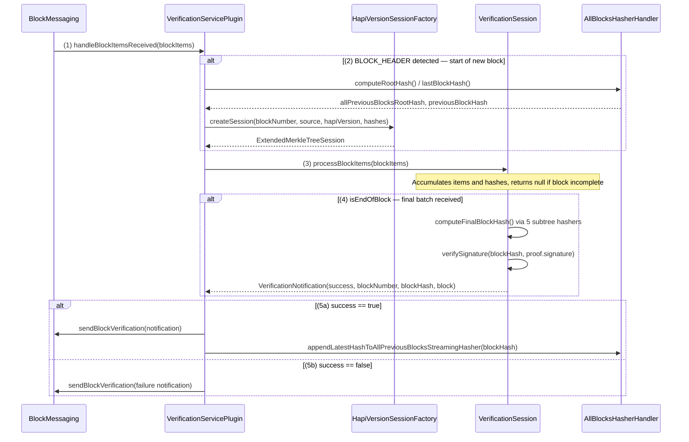

# Block Verification Design

## Table of Contents

1. [Purpose](#purpose)
2. [Goals](#goals)
3. [Terms](#terms)
4. [Entities](#entities)
5. [Design](#design)
6. [Configuration](#configuration)
7. [Metrics](#metrics)
8. [Exceptions](#exceptions)

## Purpose

The Block Node is able to receive blocks from different types of sources.
Once received, blocks must pass verification in order to be safely propagated
downstream. Other plugins have access to the verified blocks via the internal
messaging system.

Block verification, or in other words the process through which we can verify
that a block, received from any source is valid and not tampered with, is the
central point of the Block Node.
We achieve this by having a Verification Service Plugin.

- Upon successful verification, the Verification Service Plugin is able to
  propagate the block downstream via the internal messaging system.
- Upon verification failure - be that the block fails to verify, parse, has
  missing mandatory items or fields, or any other reason, the Verification
  Service Plugin will convey the failure throughout the Block Node via the
  internal messaging system.
- In both cases, any plugin can take an appropriate action.

Due to the asynchronous nature of the Block Node and the way blocks are received
from different sources, strict ordering of block reception CANNOT be guaranteed.
It is therefore a requirement of the Verification Service Plugin to ensure that
the strong ordering of messages for blocks that pass verification is maintained.
This guarantee ensures that it is not possible for any given block to be left
unprocessed downstream. This essentially achieves a contiguous, in order data
stream that downstream plugins can process safely.

## Goals

1. The Block Node MUST be able to receive blocks as raw data from any given
   source.
2. The Block node MUST be able to start a block verification process that
   always returns a result.
3. The Block Node MUST be able to accurately convey verification results to
   plugins downstream, utilizing the internal messaging system.
   - Successful verification of blocks MUST be propagated downstream strictly
     in order.

## Terms

<dl>
<dt>Publisher</dt><dd>A type of data source that is able to publish
(i.e. stream) blocks as raw data to the Block Node.</dd>
<dt>Consensus Node (CN)</dt><dd>A type of Publisher. Consensus Nodes execute the
Hashgraph consensus algorithm, and execute the transactions that reach
consensus. The output of transaction execution is the Block Stream.</dd>
<dt>Block Items</dt><dd>The block data pieces (header, events, transactions,
transaction result, state changes, proof) that make up a block.</dd>
<dt>Block Root Hash</dt><dd>A SHA2-384 hash at the root of the block merkle tree
as defined in HIP-1424.</dd>
<dt>Signature</dt><dd>A cryptographic operation on the Block Root Hash. The
exact operation depends on signature type and algorithm, but may include a
TSS/hinTS algorithm as defined in HIP-1200, a collection of RSA signatures, a
collection of Schnorr signatures, or a (future) TSS signature defined for
post-quantum cryptography.</dd>
<dt>Public Key</dt><dd>The public key (which is algorithm-dependent) that a node
or network will use to sign events and block proofs.</dd>
<dt>Empty-tree Hash</dt><dd>The hash returned by a streaming Merkle tree hasher
when no leaves were added (i.e. an empty subtree). Since HAPI v0.72 this is
SHA-384(0x00), matching the CN convention.</dd>
<dt>Block Verification</dt><dd>The process of verifying the integrity of a block
by computing its hash and verifying its signature.</dd>
<dt>Verification Session</dt><dd>A session that completes the verification of a
single block.</dd>
<dt>Verification Result</dt><dd>The result of a block verification
session.</dd>
<dt>Verification Notification</dt><dd>A message sent to the internal messaging
system that conveys verification session results and other data.</dd>
<dt>Session Handler</dt><dd>A component that handles completed verification
sessions. It is responsible for the correct post-processing of a completed
session. This includes making updates to internal state, preserving and ensuring
a strong and correct order of messages sent downstream, handle failures and
more.</dd>
</dl>

## Entities

### VerificationServicePlugin

The main plugin class. Implements `BlockNodePlugin`, `BlockItemHandler`, and
`BlockNotificationHandler`. It:
- Receives blocks from multiple sources, either in the form of a stream of
individual block items, or a whole block all at once.
- When a block is received, a verification session is started. Sessions run
asynchronously. Sessions always produce an end result.
- Completed sessions are handled by a session handler and appropriate action(s)
are taken to ensure we comply with a strong ordering requirement, but also
to preserve historic hashes, update in-memory state, metrics and more.
- The session handler uses the internal messaging system to communicate the
result of a verification session. It utilizes a detailed
`VerificationNotification` to convey the result.

### HapiVersionSessionFactory

Routes block verification to the correct `VerificationSession` implementation
based on the block's HAPI proto version:

| HAPI Version |                      Session                      |
|--------------|---------------------------------------------------|
| >= 0.72.0    | `ExtendedMerkleTreeSession` (Merkle verification) |
| < 0.72.0     | Not supported — throws `IllegalArgumentException` |

### VerificationSession

- A single session deals with a single block.
- It runs asynchronously.
- It produces a Verification Result when complete.
- It is able to process items dynamically, i.e. it can keep receiving items
  in multiple batches.

### ExtendedMerkleTreeSession

A type of VerificationSession, the full block verification implementation, used
for HAPI v0.72.0 and above when a TssSignature block proof (or TSS signed
StateProof block proof) is to be verified.

Maintains five `StreamingTreeHasher` instances — one per block-item
category — that incrementally compute subtree roots as items arrive:

|         Hasher          |                      Block item types                      |
|-------------------------|------------------------------------------------------------|
| `inputTreeHasher`       | `SIGNED_TRANSACTION`                                       |
| `outputTreeHasher`      | `BLOCK_HEADER`, `TRANSACTION_RESULT`, `TRANSACTION_OUTPUT` |
| `consensusHeaderHasher` | `ROUND_HEADER`, `EVENT_HEADER`                             |
| `stateChangesHasher`    | `STATE_CHANGES`                                            |
| `traceDataHasher`       | `TRACE_DATA`                                               |

On finalization, it combines the five subtree roots with the previous block
hash, all-previous-blocks root hash, state root hash, and block timestamp into
a final block hash via `HashingUtilities.computeFinalBlockHash()`. The
signature in the block proof is then verified against that hash.

Empty subtrees use `SHA-384(0x00)` as the empty-tree hash, matching the CN
convention introduced in HAPI v0.72.

### DummyVerificationSession

A type of VerificationSession, a temporary placeholder that unconditionally
returns a success notification with a zeroed hash. It will be removed; HAPI
versions prior to 0.76 are not supported in production.

### AllBlocksHasherHandler

Maintains a persistent, streaming Merkle tree over the hashes of all
previously verified blocks. Its root hash is included in each block's hash
computation.

The Application State Facility (a component that manages state that has to be
persistent and accessible across registered plugins) manages the All Blocks
Hasher instance and its state. On startup, the Verification Service Plugin
queries the Application State Facility to get the last data stored. Then, the
Verification Service Plugin will update the Application State Facility with new
data (block number and block root hash) for each block that is received and
verified successfully. The Application State Facility is responsible for
delivering this data to the All Blocks Hasher instance. Based on a configurable
interval (measured in number of blocks), the Application State Facility will
persist the All Blocks Hasher state to disk, thus making it persistent. The
configurable persistence interval is an optimization to avoid excessive disk
usage. IO failures must be reported but must not prevent the Block Node from
functioning. Upon restart, an attempt to update the all blocks hasher will be
made using local storage.

If all blocks hasher data is not available to the verification plugin, the
handlers and verifiers automatically use the hash data provided in the block
footer.

## Design

### Core Design Workflow

1. The Verification Service Plugin receives data from multiple sources.
   The plugin is source-agnostic. It verifies every block according to the same
   rules and only includes the source in the result notification. At the
   moment, we have two distinct sources:
   1. **Publisher** - blocks arrive as a stream of individual items
   2. **Backfill** - blocks are received via backfill and are provided to the
      plugin as a whole block.
2. The plugin will start a verification session for each received block. The
   session runs asynchronously, and it has the responsibility of running the
   verification process. The sessions could accept a whole block, or be fed a
   stream of block items continuously until the whole block is received. A
   session must always complete eventually and produce a result of the
   verification process.
3. The session handler, which also runs asynchronously, will continuously check
   for completed sessions and then process the results thereof. The handler is
   responsible for ordering correctly the messages sent downstream, keeping a
   configurable sized buffer of completed results - cancelling sessions if need
   be, keeping metrics up to date, making updates to the all blocks hasher. The
   handler must be resilient and handle failures gracefully, ensuring an
   uninterrupted flow of results.

### Verification Failure Types

Each time a session completes, it will return a meaningful result, whether
success or failure. The session handler will then process this result, take
appropriate action(s), and then send a notification, using the internal
messaging system. Those notifications will be of type
`VerificationNotification`. In case of failure, a failure type will be provided.
Subscribers to the internal messaging system will be able to handle these
messages and take appropriate action(s).

Failure types could be standard or informational. The purpose of the
verification service plugin is to successfully complete verification on every
block. If we complete verification on a block with a success result, subsequent
failures on the same block are considered informational.

Failure types include:

- **BAD_BLOCK_PROOF**: If the computed hash does not match the hash signed by
  the network, or the signature cannot be verified as correct, the block is
  considered unverified.
- **UNABLE_TO_PARSE**: If a block is received, but parsing fails, the block is
  considered unverified.
- **MISSING_MANDATORY_ITEM**: If a mandatory item for a block is missing,
  the block is considered unverified. Mandatory items are:
  - `BLOCK_HEADER`
  - `BLOCK_FOOTER`
  - `BLOCK_PROOF` (at least one)
  - at least one of the other types of items (different from the
    above-mentioned) in between the header and the footer.
- **MISSING_MANDATORY_FIELD**: If the block has all the mandatory items, but
  one or more of the mandatory fields are missing (no value provided), the block
  is considered unverified.
- **CANCELLED**: If a session takes to long to complete, measured in N number of
  subsequent sessions started, the session is canceled and the block that the
  session is trying to verify is considered unverified.
- **UNKNOWN_ERROR**: If an unexpected error occurs during the verification
  process, the block is considered unverified.

In case of failures that are informational, the prefix `INFO_` is added to the
failure type.

---

Sequence Diagram:

## Configuration

Configuration class: `VerificationConfig`

|               Property               |                                  Default                                  |                      Description                       |
|--------------------------------------|---------------------------------------------------------------------------|--------------------------------------------------------|
| `allBlocksHasherFilePath`            | `/opt/hiero/block-node/application-state/rootHashOfAllPreviousBlocks.bin` | Path for the persistent hasher snapshot                |
| `allBlocksHasherEnabled`             | `true`                                                                    | Enable or disable the all-blocks root hash computation |
| `allBlocksHasherPersistenceInterval` | `10` (blocks)                                                             | How often the hasher snapshot is written to disk       |

## Metrics

All metrics are in the `verification` category.

|             Metric             |     Type     |                                Description                                 |
|--------------------------------|--------------|----------------------------------------------------------------------------|
| `verification_blocks_received` | Counter      | Blocks started (one per `BLOCK_HEADER` seen)                               |
| `verification_blocks_verified` | Counter      | Blocks successfully verified                                               |
| `verification_blocks_failed`   | Counter      | Blocks where the header was invalid                                        |
| `verification_blocks_error`    | Counter      | Blocks that triggered an exception or returned a failure notification      |
| `verification_block_time`      | Counter (ns) | Cumulative time spent in the verification handler per block                |
| `hashing_block_time`           | Counter (ns) | Cumulative hashing time, excluding the initial block-header detection step |

## Exceptions

- **PLUGIN_LEVEL_ERROR:** Issues with node configuration or bugs. The details
  are logged, metrics updated. There could be an attempt to recover, but also
  the plugin can signal the node's health facility that it is unhealthy.
  The plugin must never throw an exception.
