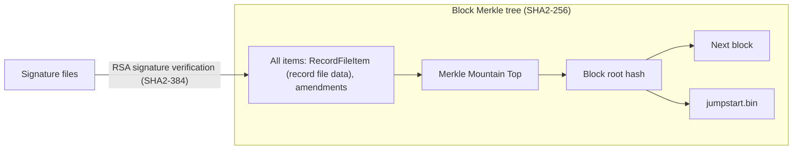
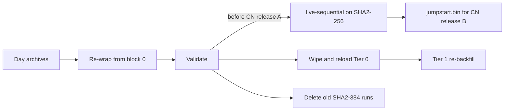

# Change CLI's block-hash algorithm from SHA2-384 to SHA2-256

## Purpose

Hiero is moving block (Merkle tree) hashing from SHA2-384 to SHA2-256 for EVM compatibility
and performance.

After this algorithm update all block Merkle tree hashing, for both Block Stream and WRB, is SHA2-256,
including the `RecordFileItem` and amendment leaves. SHA2-384 is used only to verify the legacy
RSA-signed record data.

Every block root hash is contained in the next block as previous block root hash and the all-blocks tree.
This implies that a change of this nature invalidates every Wrapped Record Block (WRB) after it. Therefore,
the full history of all non-reset production networks must be re-wrapped from block 0.
Every consumer of existing WRBs must clear that history and obtain the revised block data.

## Goals

1. Wrap producers (`blocks wrap`, `days live-sequential`) **must** emit WRBs with merkle tree
   computation using only SHA2-256
2. Repair operations (`blocks repair-zips`) **must** use SHA2-256.
3. Validation (`blocks validate` and its validations) **must** use only SHA2-256

## Terms

<dl>
  <dt>All-blocks tree</dt>
  <dd>A Merkle tree containing the root hashes of all previous blocks. The Merkle tree for block N includes both the previous block
  root hash _and_ this subtree (<code>root_hash_of_all_block_hashes_tree</code>)</dd>

  <dt>Block root hash</dt>
  <dd>The single hash that identifies a block. Not stored in the block itself, but chained into the
  next block, the all-blocks tree, the CLI state files and the jumpstart data</dd>

  <dt>Consensus timestamp hash</dt>
  <dd>Leaf hash of the block's consensus timestamp from the <code>BlockHeader</code>. The block root hash is the
  internal node hash of this leaf and the Merkle Mountain Top root. Stored in the jumpstart data</dd>

  <dt>Empty-tree hash</dt>
  <dd>Hash used for an empty subtree, the reserved leaves of the fixed root tree and the genesis previous hash</dd>

  <dt>Fixed root tree</dt>
  <dd>The 16-leaf Merkle tree that combines the previous block root hash, the historical block subtree, the start of
  block state root hash, the item subtrees and additional empty subtrees sufficient to complete 16 entries. 
  This is also referred to as the "Merkle Mountain Top".</dd>

  <dt>Hash registry</dt>
  <dd><code>blockStreamBlockHashes.bin</code>: headerless array of fixed-width block root hashes, one slot per block,
  in the wrap output directory</dd>

  <dt>Jumpstart data</dt>
  <dd><code>jumpstart.bin</code>: last wrapped block number, block hash, consensus-timestamp hash, output-items root
  and open all-blocks tree state. Consumed by the CN to continue the chain from the last WRB</dd>

  <dt>Output items root</dt>
  <dd>Root hash of the output items subtree, one of the item subtrees of the Merkle Mountain Top. In a WRB it holds
  the <code>RecordFileItem</code>. Stored in the jumpstart data</dd>

  <dt>Re-wrap</dt>
  <dd>Wrapping the full record file history of a network from genesis, with the new algorithm</dd>

  <dt>Tier 0</dt>
  <dd>Special-purpose Block Node that receives the WRBs from the CLI and serves them to other Block Nodes</dd>

  <dt>Tier 1</dt>
  <dd>Block Nodes that receive blocks directly from consensus nodes. 
      Tier 1 nodes may backfill historical WRBs from Tier 0</dd>

  <dt>Wrapped Record Blocks (WRBs)</dt>
  <dd>Block stream wrapper around historical record file content. 
  These contain BlockHeader, RecordFileItem, BlockFooter, BlockProof, and may contain amendments</dd>

  <dt>Wrap output directory</dt>
  <dd>Directory given to <code>blocks wrap -o</code> or <code>days live-sequential --wrap-output-dir</code>.
  Holds the wrapped blocks and the state files that let a run resume</dd>
</dl>

## Entities

### `Sha256` (helper)

- Lives in `utils`, next to `Sha384`.
- Provides a new SHA2-256 `MessageDigest` and the 32-byte hash size for the block-hashing classes.

## Design

- All block Merkle tree hashing is SHA2-256, including the `RecordFileItem` and amendment leaves.
- SHA2-384 is used only to verify the legacy RSA-signed record data.

### The algorithm change

- Block-hashing classes in `blocks/model/hashing` stop calling `utils/Sha384.java`
- A new `Sha256` helper class is introduced next to `Sha384`. All block-hashing classes
  in `blocks/model/hashing` call that
- Blocks declare `BlockHeader.hash_algorithm = SHA2_256` once the CN proto with the updated
  `BlockHashAlgorithm` enum (`SHA2_256 = 0`, `SHA2_384 = 1`) is released. The CLI moves to that `cnVersion`
- Consumers (`blocks validate`, `blocks push`, `blocks bulk-load`) require SHA2-256. A block hash of any length
  other than 32 bytes is an error

### Jumpstart format

- `jumpstart.bin` keeps its current field order with every hash field at 32 bytes and no version marker
- It is written by `blocks wrap` and `days live-sequential` and read by various internal and external
  tools (Solo E2E, consensus node)
- All the readers of `jumpstart.bin` switch to 32 bytes together

### Operational flow

1. Re-wrap from block 0 with SHA2-256 into a fresh output directory, reading the existing day archives,
   and run a full `blocks validate` on the result. This completes before the CN release that switches to
   SHA2-256 (release A).
2. Keep `days live-sequential` running on SHA2-256 from the re-wrapped tip.
3. Deliver `jumpstart.bin` for the following CN release (release B).
4. Reset Tier 0 and Tier 1
   - Tier 0 upgrades to the block node release that verifies SHA2-256 WRBs, wipes its block stores,
     `block-ranges.json` and the CLI bulk-load resume state, then bulk-loads the new WRBs.
   - Tier 1 nodes wipe their stored WRBs and range state and re-backfill from Tier 0.
5. Delete the old SHA2-384 runs. The most recent one is kept until the SHA2-256 re-wrap is validated.

There is no rollback to SHA2-384 blocks once the old data is deleted.

## Diagram

All block hashing uses SHA2-256, including the record file data carried in `RecordFileItem` and any amendments.
SHA2-384 is used only to verify the legacy RSA signatures over the record file data:

Operational flow:

## Configuration

No new configuration. The algorithm is fixed to SHA2-256.

## Metrics

No new metrics.

## Exceptions

No new exception types. The existing hash-length checks move from 48 to 32 bytes.

## Acceptance Tests

1. **Hashing core is SHA2-256.** `HashingUtils`, `StreamingHasher`, `InMemoryTreeHasher`,
   `BlockStreamBlockHasher` and `BlockStreamBlockHashRegistry`, including save and load, produce 32-byte
   hashes, and no class in `blocks/model/hashing` calls `Sha384`.
2. **Golden vectors.** SHA2-256 block root hashes, previous block root hashes, all-blocks tree roots and the
   empty-tree hash for the CN reference record files (v2, v5, v6, genesis, a block after an address-book
   change) match the values from the CN implementation.
3. **Wrap producers emit SHA2-256.** `blocks wrap` and `days live-sequential` emit WRBs whose block Merkle
   tree is computed with SHA2-256, and `blockStreamBlockHashes.bin` and `streamingMerkleTree.bin` hold 32-byte
   hashes.
4. **Repair.** `blocks repair-zips` fills missing blocks in a SHA2-256 output directory, and every recomputed
   block hash matches its registry entry.
5. **Validation.** `blocks validate` passes on a SHA2-256 wrapped set.
6. **Legacy signature verification unchanged.** RSA signature verification of v2, v5 and v6 record files
   still uses SHA2-384, and `days validate` passes as before.
7. **Push and bulk-load.** `blocks push` and `blocks bulk-load` load a SHA2-256 wrapped set into a Block Node
   end to end.
8. **Jumpstart readers.** `JumpstartValidation`, `extractJumpstartData.py` and `validate_jumpstart_format.py`
   read the 32-byte `jumpstart.bin` written by `blocks wrap` and `days live-sequential`.
9. **Cross-check with the CN.** The Solo E2E `wrb-cli-wrap-and-compare.sh` flow shows SHA2-256 WRB hashes
   equal to the CN-produced hashes.
10. **Performance baseline.** Wrap throughput on the `2019-09-13.tar.zstd` test day is recorded before and
    after the change.
