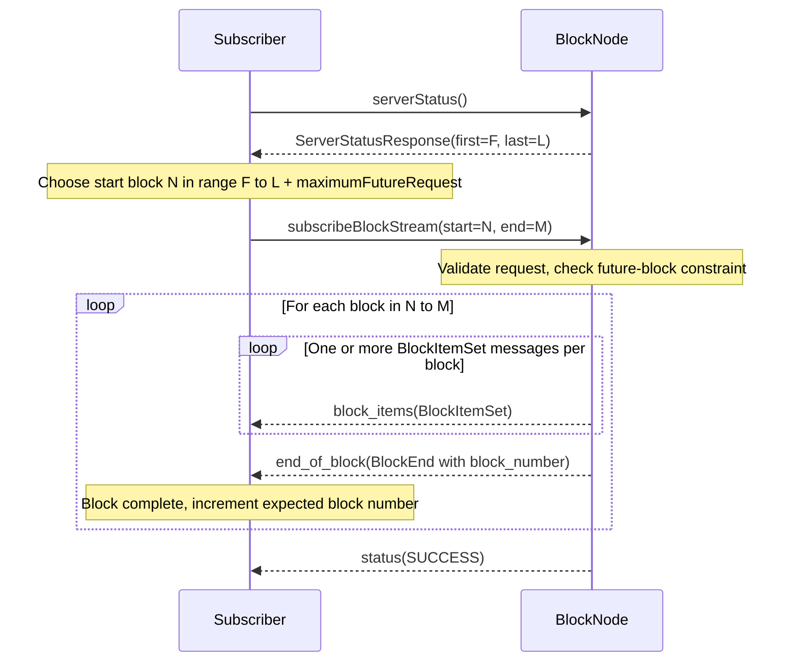
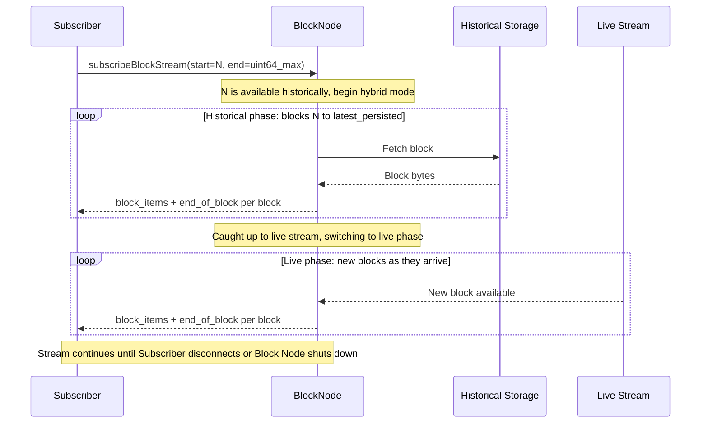
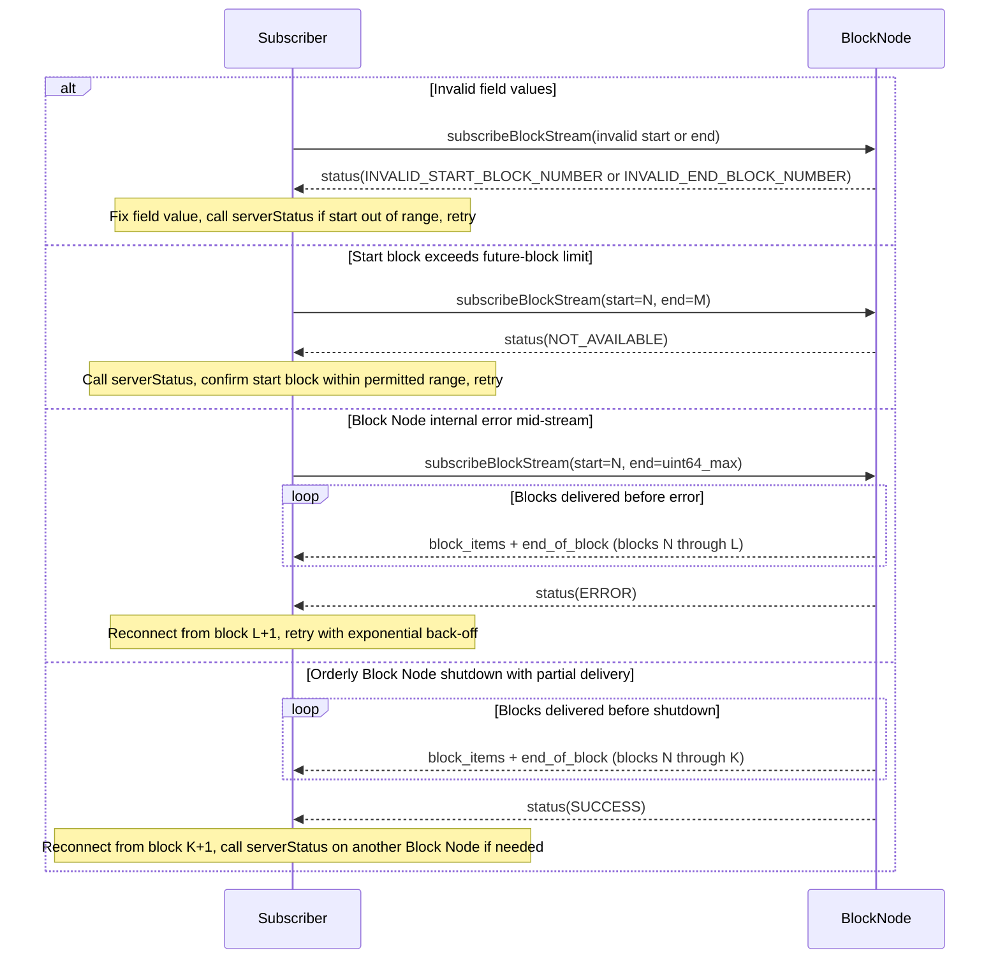

# subscribeBlockStream Protocol

The `subscribeBlockStream` RPC is a server-streaming call exposed by `BlockStreamSubscribeService`. A client sends one `SubscribeStreamRequest` and the Block Node responds with a sequence of `SubscribeStreamResponse` messages until the requested range is delivered or an error occurs. This document describes the wire protocol a subscriber — typically a Mirror Node — must implement to consume that stream correctly.

For how to configure a Mirror Node to connect to a Block Node in production, see [Connecting a Mirror Node to a Block Node](../../block-node/operations/connecting-a-mirror-node-to-a-block-node.md).


## gRPC service definition

The subscribe service is defined in `block_stream_subscribe_service.proto` and exposes a single RPC:

```
rpc subscribeBlockStream(SubscribeStreamRequest)
    returns (stream SubscribeStreamResponse);
```

| Message                   | Fields                                                                          |
|:--------------------------|:--------------------------------------------------------------------------------|
| `SubscribeStreamRequest`  | `start_block_number` (uint64, field 1), `end_block_number` (uint64, field 2)    |
| `SubscribeStreamResponse` | oneof: `status` (Code), `block_items` (BlockItemSet), `end_of_block` (BlockEnd) |
| `BlockItemSet`            | repeated `BlockItem` — defined in `shared_message_types.proto`                  |
| `BlockEnd`                | `block_number` (uint64) — defined in `shared_message_types.proto`               |

## Pre-flight: query available blocks

Before constructing a request, call the `serverStatus` RPC defined in `node_service.proto`. The `ServerStatusResponse` returns two fields:

- `first_available_block` — the lowest block number currently in persistent storage.
- `last_available_block` — the highest block number currently available.

A request with a `start_block_number` below `first_available_block` is rejected with `INVALID_START_BLOCK_NUMBER`. A request whose `start_block_number` exceeds the future-block limit is rejected with `NOT_AVAILABLE` (see [Future-block constraint](#future-block-constraint)).

## Request format

Both request fields are `uint64`. The value `18446744073709551615` (`0xFFFFFFFFFFFFFFFF`, `uint64` maximum) is a sentinel value with two distinct meanings depending on which field it appears in:

- In `start_block_number`: begin from `first_available_block` as reported by `serverStatus`.
- In `end_block_number`: stream indefinitely; no terminal `SUCCESS` is sent until the stream is closed by an error or a Block Node shutdown.

The four supported streaming modes are:

| Mode                           | `start_block_number` | `end_block_number` | Behavior                                               |
|:-------------------------------|:--------------------:|:------------------:|:-------------------------------------------------------|
| Live-only                      |     `uint64_max`     |    `uint64_max`    | Stream from the next complete live block, indefinitely |
| First-available to fixed end   |     `uint64_max`     |         M          | Stream from `first_available_block` through block M    |
| From fixed start, indefinitely |          N           |    `uint64_max`    | Stream from block N forward, indefinitely              |
| Bounded range                  |          N           |      M (≥ N)       | Stream blocks N through M inclusive                    |

The request is rejected with `INVALID_END_BLOCK_NUMBER` if a specific (non-sentinel) `end_block_number` is less than `start_block_number`.

## Response stream structure

Each `SubscribeStreamResponse` carries exactly one of three variants:

**`block_items`** — a `BlockItemSet` containing one or more `BlockItem`s from the same block. A large block is split across multiple consecutive `block_items` messages. The following ordering invariants apply across those messages:

- A `BlockItemSet` SHALL NOT span more than one block.
- The `BlockHeader` appears exactly once per block, in the first `block_items` message for that block, and MUST be the first item in that set.
- The `BlockFooter` appears exactly once per block and is the last non-proof block item. One or more `BlockProof` items follow the `BlockFooter`.
- All `block_items` messages between the header and footer carry intermediate block items with no header or footer.

When reassembling a block from the stream, a new block begins on each `BlockHeader`, is complete when the corresponding `BlockFooter` is received, is followed by one or more `BlockProof` items, and terminated by a single `end_of_block` message.

**`end_of_block`** — a `BlockEnd` message carrying the `block_number` of the completed block. The Block Node sends exactly one `end_of_block` per block, emitted immediately after all `block_items` for that block. The message immediately following a `BlockEnd` is either a new `block_items` starting with a `BlockHeader`, or the terminal `status`.

**`status`** — a `Code` value that terminates the stream. This is always the last message. Subscribers MUST NOT expect any further messages after receiving `status`.

For a bounded request (blocks N through M), the message sequence is:

```
block_items...  end_of_block(N)
block_items...  end_of_block(N+1)
...
block_items...  end_of_block(M)
status(SUCCESS)
```

For an indefinite request (`end_block_number` = `uint64_max`) the `status` message is sent only when the stream is closed by an error, a Block Node shutdown, or when the stream reaches maximum connection duration (typically around 600,000 blocks, if enabled).

### Base protocol diagram



## Streaming modes

### Historical streaming

In bounded-range mode (`start_block_number` = N, `end_block_number` = M where M ≥ N) the Block Node reads the requested blocks from persistent storage. The stream ends with `status(SUCCESS)` once block M has been fully delivered.

If `end_block_number` M extends beyond the latest persisted block, the Block Node transitions to live-stream delivery for the remaining blocks rather than returning `NOT_AVAILABLE`. `NOT_AVAILABLE` is returned mid-stream only when a specific block cannot be provided at all — for example, because it was pruned from storage after the request was accepted.

### Live streaming

In live-only mode (both fields = `uint64_max`) the Block Node attaches the subscriber to the live block queue and begins delivery from the next complete block it receives. No historical blocks are delivered. If the Block Node is mid-block at connection time, delivery begins after that block completes.

> **Note:** Live blocks are delivered concurrently with verification and are therefore not guaranteed to be verified before delivery. Live blocks may contain errors, may be repeated, or may be incomplete. Receivers are responsible for handling these conditions and are encouraged to verify each block using all attached `BlockProof` items.

### Hybrid streaming

In from-start-indefinite mode (`start_block_number` = N, `end_block_number` = `uint64_max`) the Block Node first delivers historical blocks from N up to the latest persisted block, then transitions seamlessly to the live queue. The subscriber receives a single continuous stream with no gap at the transition.

This is the most common pattern for Mirror Nodes, which require a contiguous block history from a known checkpoint through the current tip and onward.

> **Note:** The Block Node maintains a live-block queue per session. If a subscriber processes historical blocks more slowly than the Block Node receives new live blocks, older live-queue entries may be dropped to prevent the queue from filling. Dropped entries are not lost: the Block Node re-reads those blocks from persistent storage when the historical phase catches up to them.
>
> **Note:** Blocks delivered from the live queue are not verified before delivery. Live blocks may contain errors, may be repeated, or may be incomplete. Receivers are responsible for handling these conditions and are encouraged to verify each block using all attached `BlockProof` items.

### Streaming mode diagram



## Future-block constraint

The Block Node enforces a limit on how far ahead of the current tip a `start_block_number` may be. A request whose `start_block_number` is more than `subscriber.maximumFutureRequest` blocks ahead of the latest known block is rejected immediately with `NOT_AVAILABLE`. Call `serverStatus` first to find the current `last_available_block`, then choose a `start_block_number` within the permitted window.

The `subscriber.maximumFutureRequest` configuration key controls this limit:

| Config key                        |        Default |     Minimum |
|:----------------------------------|---------------:|------------:|
| `subscriber.maximumFutureRequest` | `4,000` blocks | `10` blocks |

A request for a start block within the permitted future window but not yet produced will be held — the Block Node waits for that block to arrive on the live stream before beginning delivery.

> **Note:** `NOT_AVAILABLE` (not `INVALID_START_BLOCK_NUMBER`) is returned when `start_block_number` is too far ahead of the current tip. `INVALID_START_BLOCK_NUMBER` is returned only when `start_block_number` is below `first_available_block` or is otherwise structurally invalid.

## Result Codes

The terminal `status` message carries one of the following `Code` values. The Block Node sends exactly one `status` per session, as the final message.

| Code                         | Value | When returned                                                                                                                    | Subscriber action                                                                     |
|:-----------------------------|:-----:|:---------------------------------------------------------------------------------------------------------------------------------|:--------------------------------------------------------------------------------------|
| `UNKNOWN`                    |   0   | Software defect; SHALL NOT be intentionally set                                                                                  | Treat as `ERROR`; reconnect with exponential back-off                                 |
| `SUCCESS`                    |   1   | All requested blocks delivered, orderly Block Node shutdown, or maximum connection duration reached (if enabled)                 | If more blocks are expected, reconnect from the last received `block_number` + 1      |
| `INVALID_REQUEST`            |   2   | Request is structurally malformed (defensive code; not triggered by a well-formed gRPC call with valid uint64 fields)            | Fix the request; do not retry unchanged                                               |
| `ERROR`                      |   3   | Block Node internal error                                                                                                        | Reconnect with exponential back-off; try a different Block Node if the error persists |
| `INVALID_START_BLOCK_NUMBER` |   4   | `start_block_number` is below `first_available_block` or is otherwise invalid                                                    | Call `serverStatus`; correct `start_block_number`; retry                              |
| `INVALID_END_BLOCK_NUMBER`   |   5   | `end_block_number` is less than `start_block_number`                                                                             | Correct `end_block_number`; retry                                                     |
| `NOT_AVAILABLE`              |   6   | `start_block_number` exceeds the future-block limit, a required block is absent from storage, or the Block Node is shutting down | Call `serverStatus`; adjust the block range; retry with exponential back-off          |

When the Block Node shuts down gracefully it closes each open session with `status(SUCCESS)`. New connection attempts received during shutdown are immediately closed with `NOT_AVAILABLE`.

Because `SUCCESS` does not imply all requested blocks were delivered (orderly shutdown and connection limit are also reported as `SUCCESS`), subscribers MUST NOT assume delivery is complete on receiving `SUCCESS` for an indefinite or partially-delivered stream.

### Error handling diagram



## Reconnection and gap handling

If the stream closes for any reason, the subscriber SHOULD:

1. Record the `block_number` from the last `end_of_block` message received. Use `block_number + 1` as `start_block_number` for the next request. If no `end_of_block` was received before the stream closed, reconnect using the original `start_block_number`.
2. Call `serverStatus` to confirm the new start block is within the available range on the target Block Node, or not overly far in the future.
3. Apply exponential back-off if consecutive attempts fail across multiple Block Nodes.
4. Switch to a different Block Node and issue a new `subscribeBlockStream` request from that start block.

The Block Node makes a reasonable effort to stream blocks in strict ascending order with no gaps within a session, but some exceptions may occur, particularly for "live" blocks. If a block in the requested range cannot be provided mid-stream (for example because it was pruned from storage after the request was accepted), the Block Node closes the stream with `NOT_AVAILABLE`. On receiving `NOT_AVAILABLE` mid-stream, call `serverStatus` and reconnect from the earliest block that covers the needed range, potentially from a different Block Node.
