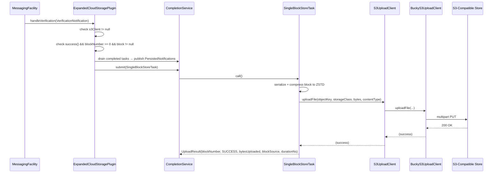
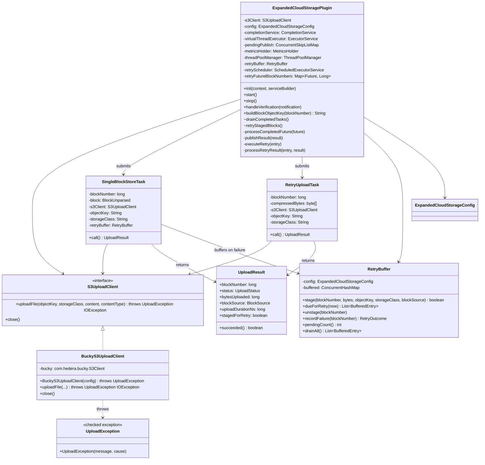

# Cloud Storage Expanded Plugin

## Table of Contents

1. [Purpose](#purpose)
2. [Goals](#goals)
3. [Terms](#terms)
4. [Entities](#entities)
5. [Design](#design)
6. [Diagram](#diagram)
7. [Configuration](#configuration)
8. [Metrics](#metrics)
9. [Exceptions](#exceptions)
10. [Acceptance Tests](#acceptance-tests)

## Purpose

The `cloud-storage-expanded` plugin (CSEP) uploads each individually-verified block as a compressed
`.blk.zstd` object directly to any S3-compatible object store (AWS S3, GCS via S3-interop,
etc.). Unlike the previous `s3-archive` plugin, which batched blocks into large tar
archives, this plugin uploads **one block per S3 object** — making individual blocks
immediately queryable and suitable for consumers that need block-level granularity in the
cloud.

## Goals

* The plugin must store every block, as received, after verification.
* The plugin must store each verified block as a single ZStandard-compressed file using ZSTD-compressed
  Protobuf encoding.
* The plugin must adhere to a file pattern as defined below.
* The plugin must store all blocks as files or objects in a cloud storage system.
* The plugin must not report success until data is stored such that it can be
  recovered if the local system fails unexpectedly, including a failure that
  results in complete and unrecoverable loss of all local storage.
* The plugin must support any S3-compatible store (AWS S3, GCS S3-interop, etc)
  backed by the `com.hedera.bucky:bucky-client` library.

## Terms

<dl>
  <dt>Cloud Storage</dt>
  <dd>Any storage API that stores data remotely with very high
      availability and reliability. Multiple such APIs may be supported
      by the plugin and controlled by configuration.<br/>
      An example of a common cloud storage API is S3 storage.</dd>

  <dt>S3-compatible object store</dt>
  <dd>Any storage service that implements the AWS S3 REST API, including AWS S3 and Google Cloud
      Storage (via S3 interoperability).</dd>

  <dt>Object key</dt>
  <dd>The full path of an object within an S3 bucket, e.g.
      <code>blocks/0000/0000/0000/0000/001.blk.zstd</code>.</dd>

  <dt>ZSTD_PROTOBUF</dt>
  <dd>The block encoding that serialises a block as Protobuf then ZSTD-compresses it. This is
      the canonical on-disk and in-cloud format.</dd>

  <dt>bucky-client</dt>
  <dd><code>com.hedera.bucky:bucky-client</code> — the Hedera S3 client library on Maven
      Central. Provides <code>com.hedera.bucky.S3Client</code> (a final concrete class) and
      the exception hierarchy <code>S3ClientException</code> →
      <code>S3ClientInitializationException</code> / <code>S3ResponseException</code>.
      These types are an implementation detail confined to <code>BuckyS3UploadClient</code>;
      no other class in the package imports them.</dd>

  <dt>S3UploadClient</dt>
  <dd>Package-private interface that abstracts the S3 upload operation. It exposes only
      <code>uploadFile(...)</code> and <code>close()</code>, throwing
      <code>UploadException</code> or <code>IOException</code> — no bucky types.
      Unit tests implement it directly to capture calls or simulate failures without requiring
      a real S3 endpoint or a mocking framework.</dd>

  <dt>BuckyS3UploadClient</dt>
  <dd>Package-private final class that is the sole production implementation of
      <code>S3UploadClient</code>. Wraps <code>com.hedera.bucky.S3Client</code> and
      translates all bucky exceptions (<code>S3ClientInitializationException</code>,
      <code>S3ClientException</code>) into <code>UploadException</code> at the boundary
      so that bucky is fully contained within this one class.</dd>

  <dt>UploadException</dt>
  <dd>Package-private checked exception thrown by <code>S3UploadClient.uploadFile</code>
      and by the <code>BuckyS3UploadClient</code> constructor to signal an S3 service
      error (auth failure, 4xx/5xx response, or initialisation failure). Distinguished
      from <code>IOException</code>, which signals a transport-level failure. Callers use
      this distinction to set <code>UploadStatus.S3_ERROR</code> vs
      <code>UploadStatus.IO_ERROR</code>.</dd>
</dl>

## Entities

### `S3UploadClient` (interface)

Package-private interface in `org.hiero.block.node.cloud.storage.expanded`. Defines the
upload contract used by the rest of the package. Exposes:

- `uploadFile(objectKey, storageClass, Iterator<byte[]> content, contentType)` — throws
  `UploadException, IOException`
- `close()` (from `AutoCloseable`)

The sole production implementation is `BuckyS3UploadClient`, instantiated directly in
`ExpandedCloudStoragePlugin.start()`. Tests implement `S3UploadClient` directly, never
importing bucky types.

### `BuckyS3UploadClient` (concrete class)

Package-private final class. The only class in the package that imports
`com.hedera.bucky.*`. Wraps `com.hedera.bucky.S3Client` and provides the translation
boundary:

- Constructor: catches `S3ClientInitializationException` → rethrows as `UploadException`.
- `uploadFile(...)`: delegates to `bucky.uploadFile(...)`; catches `S3ClientException`
  → rethrows as `UploadException`.
- `close()`: delegates to `bucky.close()`.

Having a named concrete class (rather than an anonymous inner class) makes it visible by
name in stack traces and heap dumps.

### `UploadException`

Package-private checked exception. Wraps any bucky S3 error (initialisation failure,
service error, HTTP error response) so that the rest of the package is decoupled from
bucky's exception hierarchy. Always wraps the original cause for diagnostics.

### `SingleBlockStoreTask`

`Callable<UploadResult>` submitted per block to the `CompletionService`. Responsible for:
1. Serialising the block to Protobuf bytes via `BlockUnparsed.PROTOBUF.write(block, streamingData)`
written into a `ByteArrayOutputStream`.
2. Compressing to ZSTD (`CompressionType.ZSTD.compress(...)`).
3. Uploading via `S3UploadClient.uploadFile()` directly, relying on S3 SDK connection/socket timeouts.

Returns `UploadResult(blockNumber, status, bytesUploaded, blockSource, uploadDurationNs, stagedForRetry)`.
The `uploadDurationNs` field records wall-clock time of the upload call in nanoseconds, used
to populate the latency metric. Failures (`UploadException`, `IOException`) are captured as
`succeeded=false` and `bytesUploaded=0` so the `CompletionService` always receives a result —
exceptions never propagate to the caller. On `S3_ERROR` / `IO_ERROR`, the task hands the
already-compressed bytes to `RetryBuffer.stage(...)`; `stagedForRetry` reflects whether
buffering succeeded (`false` for `COMPRESSION_ERROR`, since there are no valid bytes to buffer, or if
`stage(...)` itself was rejected).

The `UploadStatus` enum distinguishes failure types:

|       Status        |                     Cause                      |
|---------------------|------------------------------------------------|
| `SUCCESS`           | Upload completed successfully                  |
| `S3_ERROR`          | `UploadException` (S3 service or auth error)   |
| `IO_ERROR`          | `IOException` (transport / socket error)       |
| `COMPRESSION_ERROR` | Compressed bytes were empty (should not occur) |

### `RetryBuffer`

Package-private class holding, purely in memory, the blocks whose upload failed and are
awaiting background retry. Nothing is ever written to local disk — the block node's
cloud-archive plugins must not depend on local storage — so a buffered block is lost if the
process restarts. A `ConcurrentHashMap<Long, BufferedEntry>` maps block number to its buffered
bytes, object key, storage class, source, attempt count, and timing. Bounded by
`retryMaxAgeSeconds` (how long a block may stay buffered) and `retryMaxPendingBlocks` (how many
blocks may be buffered at once), so a prolonged S3 outage cannot grow the buffer without bound.

`stage`, `recordFailure`, and `unstage` mutate the map via `ConcurrentHashMap#computeIfAbsent` /
`ConcurrentHashMap#compute` so that concurrent calls for the *same* block number (a duplicate
`VerificationNotification` is possible upstream) are serialized; different block numbers may
still be manipulated fully concurrently.

Key operations: `stage(...)` (no-op returning `false` if `retryEnabled` is `false` or the buffer
is at `retryMaxPendingBlocks` capacity), `dueForRetry(now)` (entries whose backoff has elapsed),
`unstage(blockNumber)`, `recordFailure(blockNumber)` (pushes the next eligible retry time out by
the fixed `retryIntervalSeconds` and returns `EXHAUSTED` once the block has been buffered longer
than `retryMaxAgeSeconds`, or `NOT_STAGED` if a concurrent `unstage()` already resolved the block),
and `drainAll()` (removes and returns every buffered entry, used by `stop()`).

### `RetryUploadTask`

Package-private `Callable<UploadResult>` used for retry attempts. Takes the block number,
pre-compressed bytes held in the `RetryBuffer`, and the upload target; calls
`S3UploadClient.uploadFile(...)` directly — no compression step, since the bytes were already
compressed when originally buffered. Reuses `SingleBlockStoreTask.UploadResult`; `stagedForRetry`
is always `false` on its results, since the retry pipeline in `ExpandedCloudStoragePlugin`
handles buffer bookkeeping itself (`unstage` / `recordFailure`) rather than re-buffering an
already-buffered block.

### `ExpandedCloudStorageConfig`

`@ConfigData("cloud.storage.expanded")` record carrying all plugin settings. The
`storageClass` field is typed as `StorageClass` (an enum), which causes the config
framework to reject unknown values at startup. `uploadTimeoutSeconds` and the `retry*` numeric
fields carry `@Min(1)` for framework-level range validation.

### `ExpandedCloudStoragePlugin`

Implements `BlockNodePlugin` and `BlockNotificationHandler`. Listens for
`VerificationNotification`, builds the S3 object key, and submits one `SingleBlockStoreTask`
per verified block to a `CompletionService` backed by a virtual-thread executor.

The notification handler is always registered during `init()`. If `start()` fails to create
the S3 client (blank endpoint URL, bad credentials, unreachable endpoint), `s3Client` remains
`null` and all `handleVerification` calls are no-ops for the duration of the process
(`completionService` is always created regardless).

When `retryEnabled` is `true`, `start()` also schedules `retryStagedBlocks()` on a dedicated
single-thread scheduled executor (`ThreadPoolManager.createSingleThreadScheduledExecutor`) at
`retryIntervalSeconds` intervals. `stop()` shuts this scheduler down, waits for in-flight uploads
to drain, then flushes any block still left in the `RetryBuffer` as a terminal
`PersistedNotification(succeeded=false)` — since nothing persists across a restart, a block left
buffered here would otherwise never receive any notification at all.

## Design

### Trigger: `VerificationNotification`

The plugin registers as a `BlockNotificationHandler` and reacts to `VerificationNotification`
events. Block bytes are taken directly from `notification.block()`, eliminating any dependency
on the local historical block provider and allowing cloud upload to run in parallel with local
file storage.

### Upload flow (`handleVerification`)

1. **Guard**: log TRACE and return if `s3Client == null` (plugin inactive — S3 client failed to
   initialise).
2. **Guard**: `notification.success() == false` → skip (log TRACE).
3. **Guard**: `notification.blockNumber() < 0` → skip (log INFO).
4. **Guard**: `notification.block() == null` → skip (log INFO).
5. **Drain**: poll `CompletionService` for any previously completed upload tasks; publish a
   `PersistedNotification` for each result (success or failure).
6. Build object key using `buildBlockObjectKey(blockNumber)`.
7. Submit `SingleBlockStoreTask` to the `CompletionService`.

Inside `SingleBlockStoreTask.call()`:
- Record `uploadStartNs = System.nanoTime()`.
- Serialise and ZSTD-compress the block bytes.
- Upload via `S3UploadClient.uploadFile()` directly.
- Return `UploadResult(blockNumber, status, bytesUploaded, blockSource, uploadDurationNs)`.

### Shutdown drain (`stop`)

`stop()` unregisters from block notifications, then shuts down the virtual-thread executor
and waits up to `uploadTimeoutSeconds` for in-flight uploads to complete:

- `virtualThreadExecutor.shutdown()` — stops accepting new tasks (none expected since
  notification handling was unregistered above).
- `virtualThreadExecutor.awaitTermination(uploadTimeoutSeconds, SECONDS)` — blocks until all
  submitted tasks finish or the timeout elapses.
- A final non-blocking `drainCompletedTasks()` sweep publishes results for any tasks that
  completed during the wait.

After draining, `s3Client.close()` is called and the reference cleared.

### Processing and publishing results

Results flow through two methods:

**`processCompletedFuture(future)`** — called per drained future:
1. If the future was cancelled (expected during shutdown): logs TRACE and skips.
2. Otherwise calls `future.get()` and stages the `UploadResult` in `pendingPublish` keyed by
block number.
3. On `ExecutionException` (unexpected `RuntimeException` escaped the task): increments
`uploadFailuresTotal` and logs WARNING. No `PersistedNotification` is sent for this case.

**`publishResult(result)`** — called per staged result in ascending block-number order:
1. On success: publishes `PersistedNotification(blockNumber, true, 0, blockSource)`; increments
`uploadsTotal` and `uploadBytesTotal` by `bytesUploaded`.
2. On failure **with** `stagedForRetry == true`: publishes **no** notification yet — logs INFO and
updates the `cloud_expanded_pending_retry_blocks` gauge. The deferred `succeeded=false` fires
later, only once retries are exhausted (see [Background retry](#background-retry) below).
3. On failure **without** `stagedForRetry` (compression error, or retry disabled/staging
rejected): publishes `PersistedNotification(blockNumber, false, 0, blockSource)` immediately;
increments `uploadFailuresTotal`, logs INFO.
4. Always increments `uploadLatencyNs` by `uploadDurationNs`.

### Background retry

**Why deferred, not immediate, on failure:** two downstream consumers overreact to an immediate
`succeeded=false` for what may be a merely-transient S3 error — `LiveStreamPublisherManager`
tears down all live publisher connections for `BlockSource.PUBLISHER`, and `BackfillPlugin`
re-fetches the block from a peer. Since the block already passed verification and just needs an
S3 retry, `succeeded=false` is deferred until the retry buffer gives up on it (or buffering itself
isn't possible) rather than sent on the first failure.

**Why in memory, not on disk:** the block node's cloud-archive plugins have a standing design
goal of not depending on local disk. A failed upload's compressed bytes are held in the
`RetryBuffer` instead — bounded by a short `retryMaxAgeSeconds` window and a
`retryMaxPendingBlocks` cap rather than surviving a restart.

When enough time remains under `retryMaxAgeSeconds`, a failed upload's compressed bytes are
buffered via `RetryBuffer.stage(...)` instead of being discarded. The scheduled tick
`retryStagedBlocks()`:
1. Returns immediately if `s3Client == null`.
2. For each `RetryBuffer.dueForRetry(now)` entry not already retrying
(`retryFutureBlockNumbers` guards against a second concurrent attempt for the same block), submits a
`RetryUploadTask` on `virtualThreadExecutor` — independent of `completionService` /
`pendingPublish`, since that machinery exists to keep the *live* stream monotonically
increasing, and retries are out-of-band corrections for already-verified blocks.

`processRetryResult(entry, result)` applies the outcome:
- **Success**: `RetryBuffer.unstage(...)`, publish `PersistedNotification(true)`,
increment `retrySuccessTotal` + `uploadsTotal` + `uploadBytesTotal`.
- **Failure, `RETRYING`**: `RetryBuffer.recordFailure(...)` pushes the next eligible retry time
out by the fixed `retryIntervalSeconds`; log DEBUG; no notification yet.
- **Failure, `EXHAUSTED`**: once buffered longer than `retryMaxAgeSeconds`, publish
`PersistedNotification(false)`, increment `retryExhaustedTotal` + `uploadFailuresTotal`, log
WARNING — this is the "silently missing" failure mode the feature exists to surface.

The `cloud_expanded_pending_retry_blocks` gauge is refreshed after every outcome that changes the
buffered set. `stop()` additionally flushes any block still in the buffer as a terminal
`PersistedNotification(false)`, since nothing persists across a restart to pick it up later.

### Object key format

```
{objectKeyPrefix}/AAAA/BBBB/CCCC/DDDD/EEE.blk.zstd
```

The 19-digit zero-padded block number is split into four 4-digit folder groups plus a 3-digit
leaf (4/4/4/4/3) for lexicographic ordering and S3 prefix partitioning.

| Block number |                Object key                 |
|--------------|-------------------------------------------|
| 1            | `blocks/0000/0000/0000/0000/001.blk.zstd` |
| 1 234 567    | `blocks/0000/0000/0000/1234/567.blk.zstd` |
| 108 273 182  | `blocks/0000/0000/0010/8273/182.blk.zstd` |

If `objectKeyPrefix` is blank, the hierarchy key is used bare (no leading `/`).

Zero-padding is computed via integer division to produce each segment directly (no string
formatting of the full 19-digit number):

```java
long seg1 = blockNumber / 1_000_000_000_000_000L;
long seg2 = blockNumber / 100_000_000_000L % 10_000L;
long seg3 = blockNumber / 10_000_000L        % 10_000L;
long seg4 = blockNumber / 1_000L             % 10_000L;
long seg5 = blockNumber                      % 1_000L;
```

### Misconfiguration handling

If `cloud.storage.expanded.endpointUrl` is blank or the S3 client fails to initialise at
startup (e.g. invalid credentials, unreachable endpoint), `BuckyS3UploadClient`'s
constructor throws `UploadException`. The plugin catches this in `start()`, logs a WARNING,
and `s3Client` remains `null` — all `handleVerification` calls are no-ops for the duration
of the process. `completionService` and `metricsHolder` are still created normally.

**Intent**: once per-plugin health checks are supported, a misconfigured plugin should be
marked **UNHEALTHY** and surfaced appropriately rather than silently degrading.

## Diagram

### Upload sequence



### Class relationships



## Configuration

All properties are under the `cloud.storage.expanded` namespace.

|                    Property                    |  Default   |                                                        Description                                                         |
|------------------------------------------------|------------|----------------------------------------------------------------------------------------------------------------------------|
| `cloud.storage.expanded.endpointUrl`           | `""`       | S3-compatible endpoint URL. **Required. Blank value causes plugin to log a WARNING and be inactive.**                      |
| `cloud.storage.expanded.bucketName`            | `""`       | Name of the S3 bucket. Required when plugin is active.                                                                     |
| `cloud.storage.expanded.objectKeyPrefix`       | `""`       | Prefix prepended to every object key. Set to empty string for no prefix.                                                   |
| `cloud.storage.expanded.storageClass`          | `STANDARD` | S3 storage class (`STANDARD`). Validated as enum at startup.                                                               |
| `cloud.storage.expanded.regionName`            | `""`       | AWS / S3-compatible region. Required when plugin is active.                                                                |
| `cloud.storage.expanded.accessKey`             | `""`       | S3 access key (not logged). Leave blank to use env vars or IAM role.                                                       |
| `cloud.storage.expanded.secretKey`             | `""`       | S3 secret key (not logged). Leave blank to use env vars or IAM role.                                                       |
| `cloud.storage.expanded.uploadTimeoutSeconds`  | `60`       | Max seconds to wait for in-flight uploads during `stop()`. Min value: 1.                                                   |
| `cloud.storage.expanded.retryEnabled`          | `true`     | Whether failed uploads are held in memory and retried in the background instead of failing immediately. Never disk-backed. |
| `cloud.storage.expanded.retryIntervalSeconds`  | `10`       | Fixed interval at which the background retry tick re-attempts every buffered block. Min value: 1.                          |
| `cloud.storage.expanded.retryMaxAgeSeconds`    | `60`       | Maximum time a block may remain buffered for retry before it is dropped and reported as a terminal failure. Min value: 1.  |
| `cloud.storage.expanded.retryMaxPendingBlocks` | `30`       | Maximum number of blocks held in the in-memory retry buffer at once. Min value: 1.                                         |

**Why the retry window is short:** the buffer is purely in memory, so it must stay small
enough to bound memory usage — there is no disk backstop. `retryMaxAgeSeconds` and
`retryMaxPendingBlocks` are the two independent bounds; either one being exceeded drops the
block and reports a terminal failure.

### Credential options

Three strategies are supported, in priority order:

1. **Config properties** — set `cloud.storage.expanded.accessKey` and `cloud.storage.expanded.secretKey`
   directly. Use `${CLOUD_EXPANDED_ACCESS_KEY}` in the value to avoid embedding credentials
   in config files on disk (Swirlds Config supports environment-variable substitution).
2. **Environment variables** — if `accessKey` and `secretKey` are blank, the underlying
   S3 client falls back to: `CLOUD_EXPANDED_ACCESS_KEY` / `CLOUD_EXPANDED_SECRET_KEY`.
3. **IAM / instance role** — leave both fields blank and attach an IAM role with
   `s3:PutObject` on the bucket. Recommended for cloud-native deployments
   (EC2 / ECS / GKE Workload Identity).

## Metrics

All counters are registered under the `hiero_block_node` Prometheus category via
`MetricsHolder.createMetrics(MetricRegistry)` in `start()`. Each counter uses the
`org.hiero.metrics.LongCounter` / `MetricKey` API.

|              Metric name               |                                                                         Description                                                                          |
|----------------------------------------|--------------------------------------------------------------------------------------------------------------------------------------------------------------|
| `cloud_expanded_total_uploads`         | Number of blocks successfully uploaded to S3-compatible storage (first attempt or retry).                                                                    |
| `cloud_expanded_total_upload_failures` | Number of block uploads that ended in terminal failure (compression error, retry disabled/rejected, or retries exhausted).                                   |
| `cloud_expanded_total_upload_bytes`    | Total compressed bytes successfully uploaded to S3-compatible storage.                                                                                       |
| `cloud_expanded_upload_latency_ns`     | Total wall-clock time spent in upload calls, in nanoseconds (success + failure).                                                                             |
| `cloud_expanded_pending_retry_blocks`  | Gauge: current number of blocks buffered in memory and awaiting a background retry upload.                                                                   |
| `cloud_expanded_retry_success_total`   | Number of blocks recovered by a later background retry after an initial upload failure.                                                                      |
| `cloud_expanded_retry_exhausted_total` | Number of blocks dropped after exhausting all background retry attempts, **or** still buffered when the plugin shut down (not itself a sign of S3 failures). |

`cloud_expanded_total_upload_failures` changed meaning with the retry feature: it now counts
*terminal* failures only, not every single failed attempt — a block that fails once and later
recovers via retry does **not** increment it.

Counters are registered in `start()`. If `start()` fails (e.g., S3 client creation error),
`metricsHolder` remains `null` and no counters are registered.

## Exceptions

|                 Exception                 |                      Source                       |                                                                                                                    Handling                                                                                                                     |
|-------------------------------------------|---------------------------------------------------|-------------------------------------------------------------------------------------------------------------------------------------------------------------------------------------------------------------------------------------------------|
| `UploadException`                         | `S3UploadClient.uploadFile`                       | Logged at WARNING; upload marked `S3_ERROR`; compressed bytes buffered for retry (`stagedForRetry=true`) if `retryEnabled` and buffer capacity remains, else `PersistedNotification` sent immediately with `succeeded=false`; plugin continues. |
| `IOException`                             | `S3UploadClient.uploadFile`                       | Same handling as `UploadException`, marked `IO_ERROR`.                                                                                                                                                                                          |
| `UploadException` (init)                  | `BuckyS3UploadClient` constructor                 | Caught in `start()`; logged at WARNING; `s3Client` remains `null`; plugin is effectively inactive (all subsequent `handleVerification` calls are no-ops).                                                                                       |
| Block bytes empty after compression       | `SingleBlockStoreTask.call`                       | Logged at WARNING; upload skipped; `PersistedNotification` sent with `succeeded=false` immediately (`COMPRESSION_ERROR` status; nothing valid to buffer).                                                                                       |
| `UploadException` / `IOException` (retry) | `S3UploadClient.uploadFile` via `RetryUploadTask` | Logged at DEBUG (expected, not the first-failure signal); `RetryBuffer.recordFailure` pushes out the next retry time or exhausts once `retryMaxAgeSeconds` is exceeded.                                                                         |

`UploadException` is a package-private wrapper that isolates the rest of the package from
bucky's exception hierarchy. `BuckyS3UploadClient` is the only class that imports
`com.hedera.bucky.*`; it translates all bucky exceptions into `UploadException` at the
boundary.

The plugin is designed to be **fault-isolated**: no exception from S3 will propagate up to
crash the node.

## Acceptance Tests

1. **Correct object key format**: block number `1234567` →
   `blocks/0000/0000/0000/1234/567.blk.zstd` (4/4/4/4/3 folder hierarchy).
2. **Correct content type**: `uploadFile` is called with `"application/octet-stream"`.
3. **Correct storage class**: `uploadFile` receives the configured `storageClass` value.
4. **Failed verification skip**: `VerificationNotification` with `success=false` → no upload.
5. **`UploadException` isolation**: `UploadException` thrown by `uploadFile` → plugin does
   not rethrow; with `retryEnabled=false`, sends `PersistedNotification` with `succeeded=false`
   immediately.
6. **`IOException` isolation**: `IOException` thrown by `uploadFile` → same handling as above.
7. **Uploads skipped on blank s3 credentials**: If `bucketName`, `endPointUrl` or `regionName` are blank →
   `BuckyS3UploadClient` constructor throws `UploadException` → plugin logs WARNING and
   `handleVerification` is a no-op and uploads are not attempted.
8. **Integration (S3Mock)**: after `handleVerification` for blocks 100–104, all five objects
   appear in the S3Mock bucket with the correct folder-hierarchy keys.
9. **PersistedNotification on success**: successful upload publishes
   `PersistedNotification(blockNumber, succeeded=true)`.
10. **PersistedNotification on failure**: with `retryEnabled=false`, failed upload publishes
    `PersistedNotification(blockNumber, succeeded=false)` immediately.
11. **Latency metric recorded**: `uploadLatencyNs` counter is incremented for both successful
    and failed uploads.
12. **stop() drains before close**: in-flight uploads complete and publish
    `PersistedNotification` before `stop()` calls `s3Client.close()`.
13. **ExecutionException isolation**: unchecked exception escaping `SingleBlockStoreTask.call()`
    increments `uploadFailuresTotal`, sends no `PersistedNotification`, and does not propagate.
14. **Deferred notification on buffered failure**: with retry enabled (default), a failed upload
    buffers the compressed bytes in memory and sends **no** `PersistedNotification` yet; the
    `cloud_expanded_pending_retry_blocks` gauge reflects the buffered block.
15. **Retry recovers a transient failure**: driving `retryStagedBlocks()` after a block that
    failed once now succeeds → publishes `PersistedNotification(succeeded=true)`, clears
    the buffer, increments `cloud_expanded_retry_success_total`.
16. **Retry exhaustion**: with `retryMaxAgeSeconds=1`, a retry tick after the block has been
    buffered longer than that exhausts it → publishes `PersistedNotification(succeeded=false)`,
    increments `cloud_expanded_retry_exhausted_total`.
17. **`stage()` respects `retryEnabled=false`**: with retry disabled, `stage(...)` is a no-op
    that returns `false` without buffering anything.
18. **`stage()` respects `retryMaxPendingBlocks`**: once the buffer holds `retryMaxPendingBlocks`
    blocks, a new failure is not buffered and `stage(...)` returns `false`.
19. **stop() flushes pending retries**: any block still in the `RetryBuffer` when `stop()` is
    called is reported as `PersistedNotification(succeeded=false)` before the buffer is
    discarded — since nothing persists across a restart, this is the only chance to report it.
