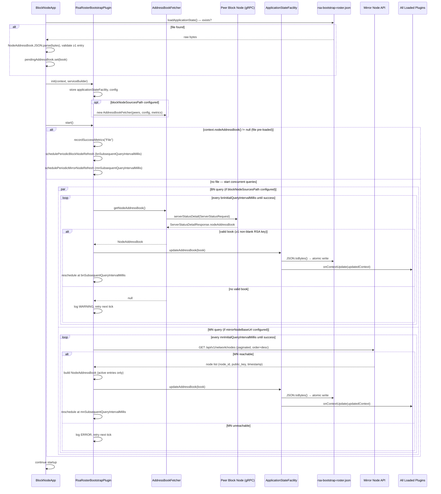
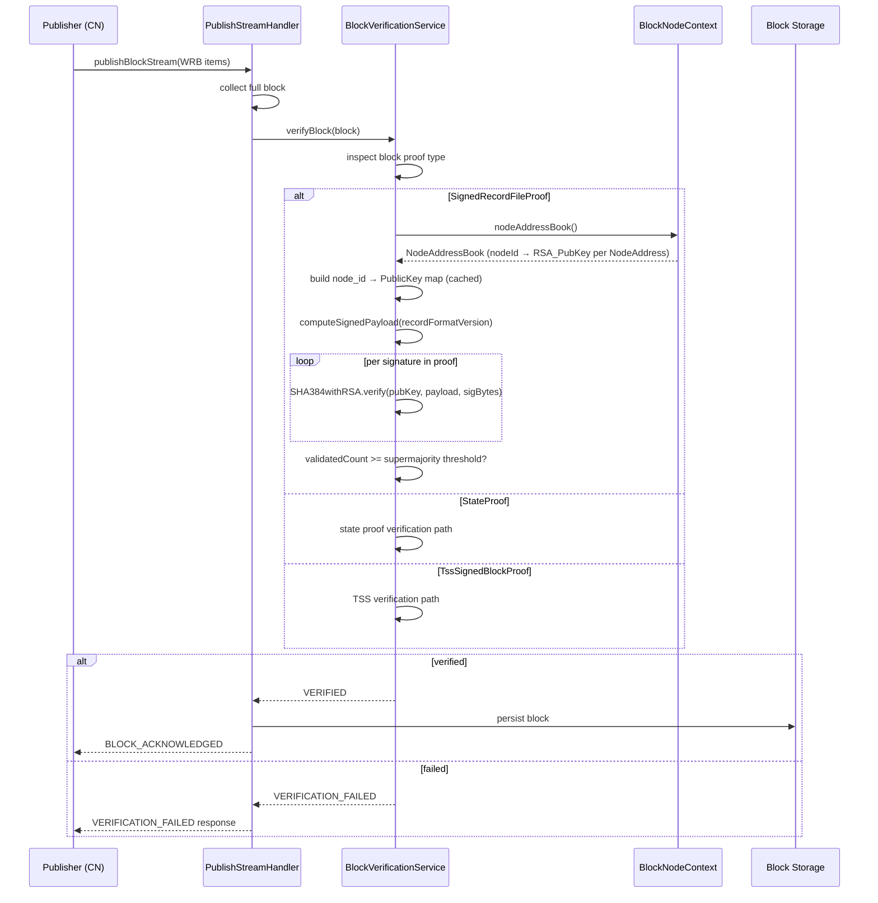

# Bootstrap RSA Roster Plugin — Design Document

---

## Table of Contents

1. [Purpose](#1-purpose)
2. [Goals](#2-goals)
3. [Terms](#3-terms)
4. [Design](#4-design)
   - 4.1 [Plugin Structure](#41-plugin-structure)
   - 4.2 [Bootstrap File Format](#42-bootstrap-file-format)
   - 4.3 [Peer Block Node Query](#43-peer-block-node-query)
   - 4.4 [Mirror Node Fetch](#44-mirror-node-fetch)
   - 4.5 [Startup Sequence & Address Book Lifecycle](#45-startup-sequence--address-book-lifecycle)
   - 4.6 [RSA Signature Verification](#46-rsa-signature-verification)
   - 4.7 [Phase 2b Transition](#47-phase-2b-transition)
5. [Diagram](#5-diagram)
6. [Configuration](#6-configuration)
7. [Metrics](#7-metrics)
8. [Security](#8-security)
   - 8.1 [Bootstrap File Integrity](#81-bootstrap-file-integrity)
9. [Operator Tooling](#9-operator-tooling)
10. [Acceptance Tests](#10-acceptance-tests)
11. [Follow-on Ticket Mapping](#11-follow-on-ticket-mapping)
12. [Open Questions and Deferred Items](#12-open-questions-and-deferred-items)

**Issue:** [#2560](https://github.com/hiero-ledger/hiero-block-node/issues/2560),
[#2682](https://github.com/hiero-ledger/hiero-block-node/issues/2682)
**Informs:** [#2561](https://github.com/hiero-ledger/hiero-block-node/issues/2561), [#2562](https://github.com/hiero-ledger/hiero-block-node/issues/2562), [#2563](https://github.com/hiero-ledger/hiero-block-node/issues/2563)

---

## 1. Purpose

Phase 2a of the Hiero network upgrade introduces **Wrapped Record Blocks (WRBs)** — Block Stream blocks whose proof is
a `SignedRecordFileProof` containing RSA signatures from every Consensus Node in the current roster. Before the Block
Node (BN) can verify these proofs it must know the current address books: specifically the mapping of
`node_id → RSA public key` for every active Consensus Node.

This design document specifies the **Bootstrap RSA Roster Plugin** (roster-bootstrap-rsa) — a `BlockNodePlugin` that
loads this mapping at BN startup and makes it available to the proof verification layer via `ApplicationStateFacility`.
It follows the same structural pattern as the `TssBootstrapPlugin`.

The BN automatically determines which proof type to verify based on the proof present in each incoming block
(`SignedRecordFileProof`, `StateProof`, or `TssSignedBlockProof`). No operator-configured proof mode is required.

---

## 2. Goals

**In scope:**

- Load the latest reference Consensus Node address book (node IDs + RSA public keys) from disk at BN startup.
- Query a configured peer block node via gRPC `serverStatusDetail` when no local bootstrap file is present, before
  falling back to the Mirror Node. This reduces external dependency at startup time.
- Fetch the roster from the Hedera Mirror Node `GET /api/v1/network/nodes` API when no local bootstrap file or
  usable peer response is available.
- Persist the loaded roster to a local bootstrap file via `ApplicationStateFacility` so subsequent restarts do not
  require network calls.
- Expose the loaded roster to all BN plugins via `ApplicationStateFacility.updateAddressBook()`, which updates
  `BlockNodeContext` and notifies all plugins via `onContextUpdate`.
- Periodically refresh the address book from both the peer BN and Mirror Node while running.
- Define the RSA signature verification algorithm precisely enough to be implemented from this document. Initially only
  v6 record files will be supported.
- Support verification of `SignedRecordFileProof`, `StateProof`, and `TssSignedBlockProof` — the BN determines which
  verification path to invoke based on the proof type present in the block.

**Out of scope (deferred to follow-on tickets):**

- Mid-instance address book reload without restart — not required for Phase 2a. (#2563)
- On-chain address book tracking via record file parsing — deferred to a future plugin iteration.
- Cloud upload of individual WRBs — handled separately.
- Block simulator support for generating valid `SignedRecordFileProof` blocks — flagged as a testing gap; delayed and
  hopefully not needed.
- Verification of v2 and v5 record files.

---

## 3. Terms

<dl>
  <dt>WRB (Wrapped Record Block)</dt>
  <dd>A block in the Hiero Block Stream format whose content is a wrapped record file. Produced by a Consensus Node
    wrapping a record file it has already generated. Identified by a <code>SignedRecordFileProof</code> block proof.
  </dd>

  <dt>SignedRecordFileProof</dt>
  <dd>The block proof type used in Phase 2a WRBs. Contains one RSA signature per Consensus Node in the current roster,
    produced over a deterministic payload derived from the record file.
  </dd>

  <dt>StateProof</dt>
  <dd>A block proof type supported in both Phase 2a and Phase 2b. Contains a state-based proof attesting to the
    validity of the block. The BN handles <code>StateProof</code> verification independently of the RSA roster.
  </dd>

  <dt>Roster</dt>
  <dd>The set of active Consensus Nodes contributing to consensus at a given point in time. Represented in this plugin as a
    <code>NodeAddressBook</code> protobuf message in which each <code>NodeAddress</code> entry carries the node's
    <code>nodeId</code> and <code>RSA_PubKey</code>.
  </dd>

  <dt>NodeAddressBook / NodeAddress</dt>
  <dd>Protobuf messages defined in <code>basic_types.proto</code> of the Hedera services API
    (<a href="https://github.com/hiero-ledger/hiero-consensus-node/blob/main/hapi/hedera-protobuf-java-api/src/main/proto/services/basic_types.proto">hiero-consensus-node</a>).
    <code>NodeAddressBook</code> is a container of <code>repeated NodeAddress</code> entries. <code>NodeAddress</code>
    carries several fields; this plugin uses only <code>nodeId</code> (field 5) and <code>RSA_PubKey</code> (field 4).
  </dd>

  <dt>Bootstrap File</dt>
  <dd>A binary protobuf file (serialized <code>NodeAddressBook</code>) persisted locally at the configured path. Used to
    avoid a network call on every restart.
  </dd>

  <dt>ApplicationStateFacility</dt>
  <dd>An interface (implemented by <code>BlockNodeApp</code>) through which plugins notify the application of state
    changes. For the RSA roster plugin, it exposes <code>updateAddressBook(NodeAddressBook)</code>, which writes the
    bootstrap file and broadcasts <code>onContextUpdate</code> to all loaded plugins.
  </dd>

  <dt>AddressBookFetcher</dt>
  <dd>A helper class that queries configured peer block nodes via gRPC <code>serverStatusDetail</code> and returns the
    first valid <code>NodeAddressBook</code> found. Pools <code>BlockNodeClient</code> instances for reuse across
    scheduled ticks.
  </dd>

  <dt>Phase 2a</dt>
  <dd>The cutover at which Consensus Nodes begin streaming WRBs to Block Nodes. RSA proofs are used.</dd>

  <dt>Phase 2b</dt>
  <dd>The subsequent cutover at which Consensus Nodes switch to full Block Streams with TSS/hinTS proofs. Record file
    production ceases.</dd>
</dl>

---

## 4. Design

### 4.1 Plugin Structure

The `RsaRosterBootstrapPlugin` follows the same structure as `TssBootstrapPlugin`:

- Implements `BlockNodePlugin` (registered via Java SPI).
- Declares a config record (`RsaRosterBootstrapConfig`) via `configDataTypes()`.
- Performs roster loading in `start()` via scheduled background executors (one for peer BN, one for Mirror Node).
- Stores the `ApplicationStateFacility` reference during `init()` for use in `start()`.
- Optionally creates an `AddressBookFetcher` during `init()` when `blockNodeSourcesPath` is configured.
- Makes the loaded address book available to the rest of the BN by calling
  `applicationStateFacility.updateAddressBook(book)`.

**Module declaration:**

```java
module org.hiero.block.node.roster.bootstrap.rsa {
    exports org.hiero.block.node.roster.bootstrap.rsa to
            com.swirlds.config.impl,
            com.swirlds.config.extensions,
            org.hiero.block.node.app;

    requires transitive com.swirlds.config.api;
    requires transitive org.hiero.block.node.base;   // BlockNodeClient, BlockNodeSourceConfig
    requires transitive org.hiero.block.node.spi;
    requires transitive org.hiero.block.protobuf.pbj; // BlockNodeSource, MirrorNodeNodesResponse
    requires transitive org.hiero.metrics;
    requires com.hedera.pbj.runtime;
    requires java.net.http;

    provides org.hiero.block.node.spi.BlockNodePlugin with
            RsaRosterBootstrapPlugin;
}
```

**Plugin skeleton:**

```java
public class RsaRosterBootstrapPlugin implements BlockNodePlugin {

    private ApplicationStateFacility applicationStateFacility;
    private RsaRosterBootstrapConfig config;
    private AddressBookFetcher addressBookFetcher;  // null if blockNodeSourcesPath not configured

    @Override
    public List<Class<? extends Record>> configDataTypes() {
        return List.of(RsaRosterBootstrapConfig.class);
    }

    @Override
    public void init(BlockNodeContext context, ServiceBuilder serviceBuilder) {
        this.applicationStateFacility = context.applicationStateFacility();
        this.config = context.configuration().getConfigData(RsaRosterBootstrapConfig.class);
        // Parse peer sources file if configured
        if (!config.blockNodeSourcesPath().isBlank()) {
            BlockNodeSource src = BlockNodeSource.JSON.parse(...);
            addressBookFetcher = new AddressBookFetcher(src, config, MetricsHolder.create(...));
        }
    }

    @Override
    public void start() {
        NodeAddressBook book = context.nodeAddressBook();
        if (book != null) {
            // File pre-loaded by BlockNodeApp — record metrics then schedule periodic refreshes
            recordSuccessMetrics(book, startTimeMillis, "File");
            schedulePeriodicBlockNodeRefresh();
            schedulePeriodicMirrorNodeRefresh();
            return;
        }
        // No file — start both sources concurrently
        startBlockNodeFallback();
        startMirrorNodeFallback();
    }
}
```

**`NodeAddressBook` in `serverStatusDetail`:** Once the `NodeAddressBook` is loaded it is included in the
`ServerStatusDetailResponse` returned by `BlockNodeService.serverStatusDetail()` (field 4), allowing peer BNs to
bootstrap from it:

```protobuf
message ServerStatusDetailResponse {
    // ... existing fields ...
    NodeAddressBook node_address_book = 4;
}
```

**`ApplicationStateFacility` extension:** The `updateAddressBook(NodeAddressBook)` method:
- Updates the `nodeAddressBook` field in `BlockNodeContext`.
- Writes the bootstrap file atomically (`.tmp`-then-rename).
- Calls `plugin.onContextUpdate(updatedContext)` for each loaded plugin.

---

### 4.2 Bootstrap File Format

The bootstrap file is a **JSON serialization** of the `NodeAddressBook` protobuf message from `basic_types.proto`,
written and read via PBJ's `NodeAddressBook.JSON` codec.

**Fields used by this plugin:**

| `NodeAddress` field | Field # |   Type   |                                                           Purpose                                                            |
|---------------------|---------|----------|------------------------------------------------------------------------------------------------------------------------------|
| `RSA_PubKey`        | 4       | `string` | Hex-encoded DER X.509 SubjectPublicKeyInfo RSA public key. Used to construct the `PublicKey` for RSA signature verification. |
| `nodeId`            | 5       | `int64`  | Numeric node identifier. Used as the lookup key when verifying a signature from a specific node.                             |

**Serialization and deserialization (PBJ):**

```java
// Write (via BlockNodeApp.persistNodeAddressBook)
final Bytes encoded = NodeAddressBook.JSON.toBytes(nodeAddressBook);
Files.write(filePath, encoded.toByteArray());

// Read (via BlockNodeApp.loadApplicationState)
final NodeAddressBook nodeAddressBook =
        NodeAddressBook.JSON.parse(Bytes.wrap(Files.readAllBytes(filePath)));
```

**Default file path:** `/opt/hiero/block-node/application-state/rsa-bootstrap-roster.json`
(Configured via `app.state.rsaBootstrapFilePath`.)

---

### 4.3 Peer Block Node Query

When no bootstrap file is present, the plugin can query one or more configured peer block nodes via the gRPC
`serverStatusDetail` RPC. This propagation model mirrors the `TssBootstrapPlugin` (issue #2296): each BN bootstraps
from a peer, then exposes the data for others via its own `serverStatusDetail`.

**How it works:**

The `AddressBookFetcher` class manages the peer query lifecycle:

1. At `init()` time, the plugin parses `blockNodeSourcesPath` — a JSON file containing a list of peer block nodes
   in `BlockNodeSource` / `BlockNodeSourceConfig` format (defined in
   `protobuf-sources/src/main/proto/internal/block_node_source.proto`):

   ```json
   {
     "nodes": [
       { "address": "10.0.0.1", "port": 8080, "priority": 1, "name": "peer-bn-1" },
       { "address": "10.0.0.2", "port": 8080, "priority": 2, "name": "peer-bn-2" }
     ]
   }
   ```
2. At each scheduled tick `AddressBookFetcher.getNodeAddressBook()` iterates the peer list in order, issuing a
   gRPC `serverStatusDetail(ServerStatusRequest)` call and extracting the `NodeAddressBook` from field 4 of
   the response.
3. Validation: a book is accepted if it contains **at least one `NodeAddress` entry with a non-blank RSA public key**.
4. The first peer returning a valid book wins; remaining peers are not queried for that tick.
5. On exception, the error metric is incremented and the `BlockNodeClient` for that peer is evicted from the pool so
   a fresh connection is attempted on the next tick.

**Connection pooling:** `AddressBookFetcher` maintains a `ConcurrentHashMap<BlockNodeSourceConfig, BlockNodeClient>`.
Unreachable clients are removed so they are recreated on the next attempt.

**Peer configuration file format** (`BlockNodeSourceConfig` fields):

|          Field          |   Type   |                     Description                     |
|-------------------------|----------|-----------------------------------------------------|
| `address`               | `string` | Peer hostname or IP address                         |
| `port`                  | `uint32` | gRPC port                                           |
| `priority`              | `uint32` | Query priority — lower = queried first              |
| `node_id`               | `uint32` | Optional; 0 = not specified                         |
| `name`                  | `string` | Human-readable label for logging                    |
| `grpc_webclient_tuning` | message  | Optional per-peer Helidon WebClient tuning (see §6) |

---

### 4.4 Mirror Node Fetch

When no local bootstrap file is present, the plugin concurrently queries the Mirror Node REST API endpoint:

```
GET {mirrorNodeBaseUrl}/api/v1/network/nodes
```

and maps the response into a `NodeAddressBook` by populating only `nodeId` and `RSA_PubKey` in each `NodeAddress` entry.

**Pagination:** The API returns up to 100 nodes per page (default 25). The implementation follows `links.next` until
it is `null` to collect all nodes.

**Field mapping:**

| Mirror Node JSON field | `NodeAddress` protobuf field |               Notes               |
|------------------------|------------------------------|-----------------------------------|
| `node_id`              | `nodeId` (field 5)           | Direct mapping (int64)            |
| `public_key`           | `RSA_PubKey` (field 4)       | Strip leading `0x` before storing |

**Filtering:** Only include nodes where `public_key` is non-null and non-empty. Nodes without a public key are not
eligible for RSA verification and must be excluded from the `NodeAddressBook`.

**Active-entry filtering:** The API is queried with `order=desc` so the most-recently-active entries
(`timestamp.to == null`) arrive first. Pagination stops on the first entry with a non-null `timestamp.to`, since
all remaining entries in descending order are also historical.

---

### 4.5 Startup Sequence & Address Book Lifecycle

The plugin implements a **three-source strategy**. Sources are tried in priority order, but the peer BN and Mirror
Node queries run **concurrently** (each on its own scheduled executor) when no bootstrap file is found. Whichever
source returns a valid book first calls `updateAddressBook`; the other continues its periodic refresh in the
background.

```
BlockNodeApp.loadApplicationState() [before any plugin is started]
   │
   ├─ rsa-bootstrap-roster.json exists at app.state.rsaBootstrapFilePath?
   │       │
   │       YES ──► NodeAddressBook.JSON.parse() → validate (≥1 entry)
   │       │        │
   │       │        ├─ On parse error or empty book: FAIL FAST (throw IllegalStateException)
   │       │        │
   │       │        └─ pendingAddressBook.set(book) [flushed to context before plugins start]
   │       │
   │       NO ──► (no-op; context.nodeAddressBook() will be null when plugins start)
   │
RsaRosterBootstrapPlugin.start() called
   │
   ├─ context.nodeAddressBook() != null?  [file was pre-loaded]
   │       │
   │       YES ──► record metrics
   │               schedule periodic BN refresh (bnSubsequentQueryIntervalMillis, if configured)
   │               schedule periodic MN refresh (mnSubsequentQueryIntervalMillis, if configured)
   │               return
   │
   └─ No bootstrap file — start concurrent queries:
           │
           ├─ [BN query — if blockNodeSourcesPath configured]
           │       Executor: queryBnExecutor (virtual thread)
           │       Initial interval: bnInitialQueryIntervalMillis (default 5 s)
           │       AddressBookFetcher.getNodeAddressBook()
           │         │
           │         ├─ SUCCESS: applicationStateFacility.updateAddressBook(book)
           │         │           cancel initial-rate future
           │         │           reschedule at bnSubsequentQueryIntervalMillis (default 60 s)
           │         │
           │         └─ FAILURE (all peers unreachable or empty books): log WARNING, retry next tick
           │
           └─ [MN query — if mirrorNodeBaseUrl configured]
                   Executor: queryMnExecutor (virtual thread)
                   Initial interval: mnInitialQueryIntervalMillis (default 5 s)
                   GET /api/v1/network/nodes (paginated, order=desc)
                     │
                     ├─ SUCCESS: applicationStateFacility.updateAddressBook(book)
                     │           cancel initial-rate future
                     │           reschedule at mnSubsequentQueryIntervalMillis (default 60 s)
                     │
                     └─ FAILURE (HTTP error / parse error): log ERROR, retry next tick
```

**Concurrent-source note:** Both `queryBnExecutor` and `queryMnExecutor` run in parallel when no file is present.
The first to call `updateAddressBook` wins; `BlockNodeApp` persists the file and broadcasts `onContextUpdate`.
Both executors continue their periodic refresh even after the initial book is obtained, keeping the address book
current over the life of the instance.

**Mirror Node unreachable — retry rationale:** When the MN API is unreachable but a local file exists, the BN can
proceed with the cached address book and retry in the background. When no file exists, the BN retries indefinitely
rather than shutting down, since a transient network outage should not force a full restart. Once plugin health
reporting is available, the plugin should surface its unhealthy state through that mechanism instead of failing fast.
See §12 #1.

**Peer BN unreachable — retry rationale:** When the peer BN is unreachable but a local file exists, the BN can
proceed with the cached address book and retry in the background. When no file exists, the BN retries indefinitely.

**Nodes with no public key:** Nodes returned by either source with a null or blank `public_key` are excluded
from the `NodeAddressBook` and a WARNING is logged.

---

### 4.6 RSA Signature Verification

This section specifies the verification algorithm precisely enough to be implemented without reference to external code.
The algorithm is derived from the existing `SignatureValidation`, `SignatureDataExtractor`, and `SigFileUtils` classes
in `tools-and-tests/tools`, which in turn match the verification logic used by Hedera Mirror Node.

> **Proof type routing:** The BN determines which verification path to invoke based on the proof type present in each
> block. No configuration flag is required:
>
> |    Block proof type     |             Verification path              |
> |-------------------------|--------------------------------------------|
> | `SignedRecordFileProof` | RSA roster verification (this plugin)      |
> | `StateProof`            | State proof verification (Phase 2a and 2b) |
> | `TssSignedBlockProof`   | TSS verification (`TssBootstrapPlugin`)    |

#### 4.6.1 Identifying a WRB

A block is a WRB if its `BlockProof` contains a `SignedRecordFileProof`.

#### 4.6.2 Building the Verification Key Map

```java
Map<Long, PublicKey> keyByNodeId = new HashMap<>();
for (NodeAddress addr : context.nodeAddressBook().nodeAddress()) {
    if (addr.rsaPubKey().isBlank()) continue;
    keyByNodeId.put(addr.nodeId(), SigFileUtils.decodePublicKey(addr.rsaPubKey()));
}
```

#### 4.6.3 Signed Payload Computation

| Version |                                         Payload computation                                         |
|---------|-----------------------------------------------------------------------------------------------------|
| **v6**  | `SHA-384( int32(6) \|\| rawRecordStreamFileBytes )`                                                 |
| **v5**  | Reconstruct the v5 binary record file from parsed items, then `SHA-384(v5Bytes)`                    |
| **v2**  | Reconstruct v2 binary record, compute `SHA-384` of reconstructed bytes, then `SHA-384` of that hash |

#### 4.6.4 RSA Signature Verification Steps

For each signature in the `SignedRecordFileProof`:

1. Extract the signing `node_id` and the raw RSA signature bytes.
2. Look up the `PublicKey` for `node_id` in the map. If absent, skip and increment `roster_mismatch_total`.
3. Verify using `SHA384withRSA`.
4. If `valid`, add `1` to `validatedCount`.

#### 4.6.5 Threshold Requirements

A WRB proof is **accepted** when:

```
validatedCount >= 2 * ceil(rosterSize / 3) + 1
```

#### 4.6.6 Failure Modes

|                Condition                 |                                        Action                                         |
|------------------------------------------|---------------------------------------------------------------------------------------|
| Zero valid signatures                    | Reject block; increment `verification_proof_total{proof_type="rsa",result="failure"}` |
| `validatedCount < threshold`             | Reject block; increment `verification_proof_total{proof_type="rsa",result="failure"}` |
| `node_id` not in `NodeAddressBook`       | Skip signature; increment `roster_mismatch_total`                                     |
| Zeroed signature bytes (all 0x00)        | Skip signature; log at DEBUG level                                                    |
| Malformed DER public key in `RSA_PubKey` | Skip signature; log at WARN level                                                     |

---

### 4.7 Phase 2b Transition

When the network transitions from Phase 2a to Phase 2b:

1. Consensus nodes stop emitting WRBs and emit full Block Stream blocks with `TssSignedBlockProof`.
2. The BN automatically routes `TssSignedBlockProof` blocks to the TSS verification path — no configuration change is
   required. The `RsaRosterBootstrapPlugin` remains loaded and the `NodeAddressBook` remains in context but the
   verification layer stops using it for new blocks.
3. WRBs stored during Phase 2a remain fully queryable — they are stored as regular `.blk` files.

---

## 5. Diagram

### Startup sequence



### WRB verification (Phase 2a)



---

## 6. Configuration

Bootstrap file path is in the `app.state` namespace (shared application state config):

|             Property             |  Type  |                               Default                               |                          Description                          |
|----------------------------------|--------|---------------------------------------------------------------------|---------------------------------------------------------------|
| `app.state.rsaBootstrapFilePath` | string | `/opt/hiero/block-node/application-state/rsa-bootstrap-roster.json` | Path to the JSON-serialized `NodeAddressBook` bootstrap file. |

All plugin properties are in the `roster.bootstrap.rsa` namespace:

**Mirror Node settings:**

|                        Property                        |  Type   |  Default  |                                 Description                                  |
|--------------------------------------------------------|---------|-----------|------------------------------------------------------------------------------|
| `roster.bootstrap.rsa.mirrorNodeBaseUrl`               | string  | *(blank)* | Base URL for Mirror Node REST API calls. Blank disables Mirror Node queries. |
| `roster.bootstrap.rsa.mnInitialQueryIntervalMillis`    | integer | `5000`    | Interval between Mirror Node queries until the first address book is found.  |
| `roster.bootstrap.rsa.mnSubsequentQueryIntervalMillis` | integer | `60000`   | Interval between Mirror Node queries after the first address book is found.  |
| `roster.bootstrap.rsa.mirrorNodeConnectTimeoutSeconds` | integer | `5`       | TCP connect timeout for Mirror Node HTTP calls.                              |
| `roster.bootstrap.rsa.mirrorNodeReadTimeoutSeconds`    | integer | `10`      | Read timeout for Mirror Node HTTP calls.                                     |
| `roster.bootstrap.rsa.mirrorNodePageSize`              | integer | `100`     | Items per page for paginated Mirror Node calls. Max 100.                     |

**Peer block node settings:**

|                        Property                        |  Type   |   Default   |                                  Description                                   |
|--------------------------------------------------------|---------|-------------|--------------------------------------------------------------------------------|
| `roster.bootstrap.rsa.blockNodeSourcesPath`            | string  | *(blank)*   | Path to a JSON file listing peer BNs to query. Blank disables peer BN queries. |
| `roster.bootstrap.rsa.bnInitialQueryIntervalMillis`    | integer | `5000`      | Interval between peer BN queries until the first address book is found.        |
| `roster.bootstrap.rsa.bnSubsequentQueryIntervalMillis` | integer | `60000`     | Interval between peer BN queries after the first address book is found.        |
| `roster.bootstrap.rsa.enableTLS`                       | boolean | `false`     | Enable TLS for peer gRPC connections.                                          |
| `roster.bootstrap.rsa.grpcOverallTimeout`              | integer | `60000`     | Overall gRPC call timeout in milliseconds for peer BN connections.             |
| `roster.bootstrap.rsa.maxIncomingBufferSize`           | integer | `104857600` | Maximum incoming gRPC message buffer size in bytes (default 100 MB).           |

**Environment variable overrides** follow the standard Swirlds Config pattern (uppercase, `_` for `.` and `-`):

```
ROSTER_BOOTSTRAP_RSA_MIRROR_NODE_BASE_URL=https://testnet.mirrornode.hedera.com
ROSTER_BOOTSTRAP_RSA_BLOCK_NODE_SOURCES_PATH=/opt/hiero/block-node/config/bn-sources.json
```

**Example `bn-sources.json`:**

```json
{
  "nodes": [
    { "address": "10.0.0.1", "port": 8080, "priority": 1, "name": "peer-bn-1" },
    { "address": "10.0.0.2", "port": 8080, "priority": 2, "name": "peer-bn-2" }
  ]
}
```

---

## 7. Metrics

All metrics use the BN-standard category `blocknode` and must follow existing naming conventions.

**Plugin metrics** (`RsaRosterBootstrapPlugin` — category `blocknode`):

|             Metric name              |  Type   | Labels |                                          Description                                           |
|--------------------------------------|---------|--------|------------------------------------------------------------------------------------------------|
| `blocknode_roster_entries_loaded`    | Gauge   | —      | Number of `NodeAddress` entries loaded at startup.                                             |
| `blocknode_roster_load_duration_ms`  | Gauge   | —      | Time to load the RSA roster at startup in milliseconds.                                        |
| `blocknode_rsa_roster_peer_requests` | Counter | —      | Number of gRPC `serverStatusDetail` requests made to peer block nodes by `AddressBookFetcher`. |
| `blocknode_rsa_roster_peer_errors`   | Counter | —      | Number of failed gRPC requests to peer block nodes (exception thrown or connection refused).   |

**Verification service metrics** (`BlockVerificationService` — category `blocknode`):

|                 Metric name                  |   Type    |                             Labels                             |                                         Description                                          |
|----------------------------------------------|-----------|----------------------------------------------------------------|----------------------------------------------------------------------------------------------|
| `blocknode_verification_proof_total`         | Counter   | `proof_type={rsa,state_proof,tss}`, `result={success,failure}` | Count of block proof verifications, broken down by proof type and result.                    |
| `blocknode_rsa_verification_latency_seconds` | Histogram | —                                                              | Latency of the full RSA verification step per block (p50, p95, p99 buckets).                 |
| `blocknode_rsa_roster_mismatch_total`        | Counter   | —                                                              | Count of signatures where the signing node ID was not found in the loaded `NodeAddressBook`. |

---

## 8. Security

### 8.1 Bootstrap file integrity

The `rsa-bootstrap-roster.json` file contains the public keys used for proof verification. Tampering requires
filesystem access to the BN host. The practical mitigation is to restrict file access at the OS level:

- **File permissions:** `rsa-bootstrap-roster.json` should be readable only by the BN process user (`chmod 600`).
  Document this in the operator guide.
- **Mirror Node TLS:** Mirror Node queries use HTTPS. Operators deploying a private Mirror Node should ensure TLS is
  configured.
- **Peer BN TLS:** Set `roster.bootstrap.rsa.enableTLS=true` when querying peer BNs over an untrusted network.

---

## 9. Operator Tooling

A script `tools-and-tests/scripts/node-operations/generate-roster-rsa-bootstrap.sh` should be provided. Its responsibilities:

1. Accept `--network <mainnet|testnet|previewnet>` and optionally `--mirror-node-url <url>`.
2. Query `GET /api/v1/network/nodes` (with pagination) to collect all nodes with non-empty `public_key`.
3. Build a `NodeAddressBook` protobuf, setting only `nodeId` and `RSA_PubKey` per `NodeAddress` entry.
4. Serialize with `NodeAddressBook.JSON.toBytes()` and write to `rsa-bootstrap-roster.json`.
5. Print a summary: number of entries written, file path, file size.

**Expected usage before a Phase 2a cutover:**

```bash
generate-rsa-roster-bootstrap.sh --network mainnet --output /opt/hiero/block-node/application-state/rsa-bootstrap-roster.json
```

Because the plugin polls both the peer BN and Mirror Node at configurable intervals and updates the address book in
place, operators do **not** need to regenerate the bootstrap file or restart the BN when nodes are added or removed.
The pre-generated file serves only as a fast-start seed.

The `blocknode_roster_entries_loaded` gauge metric provides a quick sanity check that the expected number of nodes was
loaded at startup.

---

## 10. Acceptance Tests

- [x] Plugin parses a valid `rsa-bootstrap-roster.json`; `blocknode_roster_entries_loaded` gauge equals expected entry
  count; all loaded plugins receive `onContextUpdate` with a populated `nodeAddressBook`.
- [x] Plugin fetches from Mirror Node when no bootstrap file is present; `applicationStateFacility.updateAddressBook()`
  is called; `rsa-bootstrap-roster.json` is written; gauge reflects the loaded count.
- [x] Plugin queries Mirror Node even when a bootstrap file already exists (periodic refresh).
- [x] `AddressBookFetcher` returns the first valid `NodeAddressBook` from a configured peer BN.
- [x] `AddressBookFetcher` falls over to the next peer when the first peer throws an exception.
- [x] `AddressBookFetcher` returns `null` when all peers return an empty or key-less address book.
- [x] `rsa_roster_peer_requests` increments on each successful gRPC call.
- [x] `rsa_roster_peer_errors` increments and the client is evicted on a gRPC exception.
- [ ] Deserializing the written `rsa-bootstrap-roster.json` produces the same `NodeAddressBook` as was fetched.
- [ ] When Mirror Node is unreachable and no bootstrap file exists, the BN retries indefinitely and does not shut down.
- [ ] When Mirror Node is unreachable but a bootstrap file exists, the BN continues on the cached book and logs a WARNING.
- [ ] A Mirror Node response containing a node with a blank `public_key` logs a WARNING and skips the node.
- [x] A WRB block with a passing RSA proof (supermajority count) is accepted and persisted.
- [x] A WRB block with an insufficient RSA proof (below threshold) is rejected.
- [ ] `generate-roster-bootstrap.sh` produces a file that the plugin loads without errors.
- [ ] Testnet `rsa-bootstrap-roster.json` generated from `testnet.mirrornode.hedera.com` loads without errors.

---

## 11. Follow-on Ticket Mapping

|                                Ticket                                 |                                                                                                                                        Scope                                                                                                                                         |
|-----------------------------------------------------------------------|--------------------------------------------------------------------------------------------------------------------------------------------------------------------------------------------------------------------------------------------------------------------------------------|
| [#2561](https://github.com/hiero-ledger/hiero-block-node/issues/2561) | Implement `RsaRosterBootstrapPlugin` per this design. Includes extending `ApplicationStateFacility` with `updateAddressBook`, extending `BlockNodeContext` with `NodeAddressBook nodeAddressBook`, PBJ read/write of `rsa-bootstrap-roster.pb`, and unit + integration tests.        |
| [#2562](https://github.com/hiero-ledger/hiero-block-node/issues/2562) | Implement RSA `SignedRecordFileProof` verification in `BlockVerificationService`. Reads `NodeAddressBook` from context via `onContextUpdate`, builds `node_id → PublicKey` map, applies the algorithm in §4.6. Includes proof-type routing logic and per-block verification metrics. |
| [#2660](https://github.com/hiero-ledger/hiero-block-node/issues/2660) | Implement `generate-roster-bootstrap.sh` operator script and document the Phase 2a cutover runbook.                                                                                                                                                                                  |
| [#2682](https://github.com/hiero-ledger/hiero-block-node/issues/2682) | Add peer BN gRPC query step to `RsaRosterBootstrapPlugin` (`AddressBookFetcher`, new config fields, `rsa_roster_peer_requests`/`rsa_roster_peer_errors` metrics).                                                                                                                    |

---

## 12. Open Questions and Deferred Items

| # |                                                                                                                                                    Question                                                                                                                                                    |                                                                                                                    Status                                                                                                                     |
|---|----------------------------------------------------------------------------------------------------------------------------------------------------------------------------------------------------------------------------------------------------------------------------------------------------------------|-----------------------------------------------------------------------------------------------------------------------------------------------------------------------------------------------------------------------------------------------|
| 1 | **Mirror Node down at startup — fail fast or retry with backoff?** When the MN API is unreachable and no local file exists the BN retries at `mnInitialQueryIntervalMillis` intervals and does not shut down. When a local file is present, the BN continues on the cached book and retries in the background. | **Resolved.** Direction: retry-with-backoff, not fail-fast. Once plugin health reporting is available, the plugin should surface its unhealthy state through that mechanism so the BN can remain running while signalling degraded operation. |
| 2 | Does the Block Stream simulator need to generate valid `SignedRecordFileProof` blocks for integration testing?                                                                                                                                                                                                 | Yes — flagged as a testing gap. If not available for Phase 2a, integration tests will use pre-recorded WRB blocks.                                                                                                                            |
| 3 | Should stake-weighted threshold be used instead of equal-weight once the `NodeAddress.stake` field is confirmed populated in the on-chain address book?                                                                                                                                                        | Deferred to #2562 — the equal-weight threshold is correct for Phase 2a.                                                                                                                                                                       |
| 4 | Should the roster structure used map to the `AddressBook` or the `TSSRoster`?                                                                                                                                                                                                                                  | `AddressBook` was chosen to utilize the same pathway explored by MN and WRB CLI as well as support record files from genesis outside of the Phase 2a timeline.                                                                                |
| 5 | Should the BN poll Mirror Node hourly for address book updates, or only at startup?                                                                                                                                                                                                                            | **Resolved.** The plugin schedules a periodic background poll for both the peer BN and Mirror Node, configurable via `bnSubsequentQueryIntervalMillis` and `mnSubsequentQueryIntervalMillis` (default 60 s each).                             |
| 6 | Should `RsaRosterBootstrapPlugin` have a defined lifetime? Should we note a timeline after which it can be removed?                                                                                                                                                                                            | **Resolved.** The plugin can be retired once all WRBs in the network carry a `TssSignedBlockProof` or `StateProof`. Until that transition is complete the plugin remains active.                                                              |
| 7 | What is the correct priority order when a block contains more than one proof type (`SignedRecordFileProof`, `StateProof`, `TssSignedBlockProof`)?                                                                                                                                                              | **Open.** The verification layer should attempt each available proof and accept the block if any proof passes.                                                                                                                                |
| 8 | Should we have a `app.state.rsaFailOnFetchError` flag to avoid needing a real file?                                                                                                                                                                                                                            | No, better to create a default `data/config/rsa-bootstrap-roster.json` file for use.                                                                                                                                                          |
