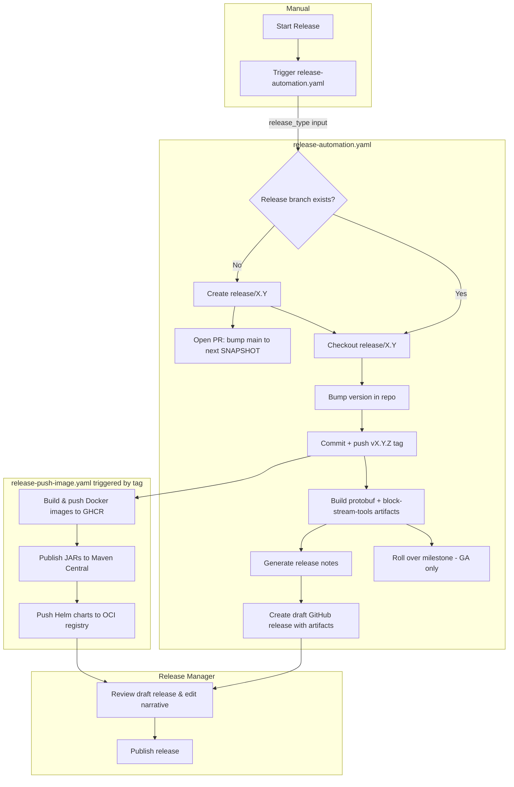
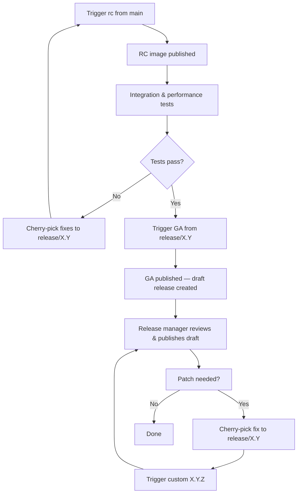

# Release Process Documentation

## Table of Contents

1. [Overview](#overview)
2. [Kickstart Release Process](#kickstart-release-process)
3. [Workflow Reference](#workflow-reference)
   1. [release-automation.yaml](#release-automationyaml)
   2. [release-notes-generator.yaml](#release-notes-generatoryaml)
   3. [milestone-rollover.yaml](#milestone-rolloveryaml)
   4. [release-push-image.yaml](#release-push-imageyaml)
4. [End-to-End Release Steps](#end-to-end-release-steps)
   1. [Release Candidate](#release-candidate)
   2. [General Availability](#general-availability)
   3. [Patch / Hotfix](#patch--hotfix)
   4. [Alpha (Preview Build)](#alpha-preview-build)
5. [Artifact Reference](#artifact-reference)
6. [Mutability Reference](#mutability-reference)
7. [Release Flow Diagram](#release-flow-diagram)
8. [Release Meta Process](#release-meta-process)
9. [Troubleshooting](#troubleshooting)

---

## Overview

Releases are fully automated via GitHub Actions. A release manager triggers a single workflow
(`release-automation.yaml`), and the rest — branch management, version bumping, tagging,
artifact building, release notes, and the draft GitHub release — happen automatically. Docker
images, JARs, and Helm charts are published by a separate workflow that fires on the tag push.

---

## Kickstart Release Process

Before triggering any workflow:

1. **Milestone and label check** — A CI check enforces labels and milestones on every PR.
   Moving any still-open issues/PRs out of the target milestone before closing it is now handled
   automatically by the `milestone-rollover.yaml` workflow (GA runs only) — no manual step needed.
2. **Cherry-picks** — Confirm all required fixes have been cherry-picked from `main` to
   `release/X.Y` (for RC2+, GA, and patch runs).
3. **Branch selection** — First RC for a new minor: dispatch from `main`. All subsequent runs
   (RC2+, GA, patch): dispatch from `release/X.Y`.
4. **Alpha/custom exception** — `alpha` and `custom` ignore the branch-selection guidance above:
   `alpha` always tags off `main` regardless of which branch you dispatch from, and `custom` tags
   off whichever branch you actually dispatch from. Neither ever creates a release branch or
   commits a version bump anywhere — only the resulting tag is pushed.

---

## Workflow Reference

### `release-automation.yaml`

**Trigger:** `workflow_dispatch` only — must be run manually by a release manager.

**Inputs:**

|      Input       |            Values             |                                                       Description                                                       |
|------------------|-------------------------------|-------------------------------------------------------------------------------------------------------------------------|
| `release_type`   | `rc`, `alpha`, `GA`, `custom` | No default — must be picked explicitly every run. The four types behave too differently to have a safe implicit choice. |
| `custom_version` | free text                     | Required only when `release_type` is `custom` (e.g. `0.39.1`). Ignored for all other types.                             |

`release_type` semantics:

|   Type   |                          Version source                          |                  Branch behavior                  |                   version.txt / branch mutation                   |
|----------|------------------------------------------------------------------|---------------------------------------------------|-------------------------------------------------------------------|
| `rc`     | `version.txt` on dispatching branch, RC counter incremented      | Uses/creates `release/X.Y`                        | Commits the bump to `release/X.Y`; opens SNAPSHOT PR on first cut |
| `GA`     | `version.txt` on dispatching branch, pre-release suffix stripped | Uses/creates `release/X.Y`                        | Commits the bump to `release/X.Y`                                 |
| `alpha`  | Highest existing `vX.Y.Z-alphaN` tag + 1, always off `main`      | **Never** — always tags off `main`                | **Never** — bump commit is local only; only the tag is pushed     |
| `custom` | `custom_version` input, verbatim                                 | **Never** — tags off the dispatching branch as-is | **Never** — bump commit is local only; only the tag is pushed     |

**What it does, in order:**

|               Step                |                                                                                                                                                                                                                                   Effect                                                                                                                                                                                                                                    |
|-----------------------------------|-----------------------------------------------------------------------------------------------------------------------------------------------------------------------------------------------------------------------------------------------------------------------------------------------------------------------------------------------------------------------------------------------------------------------------------------------------------------------------|
| Compute version                   | Derives the next semver. `rc` increments the RC counter (or starts at `rc1` from SNAPSHOT) from `version.txt` on the dispatching branch. `GA` strips the pre-release suffix, same source. `alpha` instead reads `version.txt` on `main` for the base version and scans existing `vX.Y.Z-alphaN` tags for the next counter. `custom` uses `custom_version` verbatim.                                                                                                         |
| Create / switch release branch    | `rc`/`GA` only: creates `release/X.Y` from `main` if it doesn't exist, or checks it out. **Skipped entirely for `alpha`/`custom`** — see the semantics table above. **GA only, if a prior rc exists:** checks out that exact tag as a detached HEAD instead of the branch, so drift on the branch since the last rc can't sneak into GA untested.                                                                                                                           |
| Bump version                      | Runs `./gradlew versionAsSpecified` to write the new version into `version.txt`, chart files, etc.                                                                                                                                                                                                                                                                                                                                                                          |
| Commit + tag                      | GPG-signs the bump commit and pushes the `vX.Y.Z` tag, triggering `release-push-image.yaml` — except for `alpha`/`custom`, where the commit is created locally but never pushed (`skip_push`); only the tag is pushed, so no branch is ever mutated. **GA only:** the commit and signed tag are likewise pushed as just the tag (HEAD may be detached) — the release branch is then separately fast-forwarded/merged up to the tag in a follow-up step, never force-pushed. |
| Build protobuf artifact           | Runs `:protobuf-sources:generateBlockNodeProtoArtifact` on the already-checked-out repo.                                                                                                                                                                                                                                                                                                                                                                                    |
| Build block-stream-tools artifact | Runs `:tools:shadowJar` and renames to `block-stream-tools-X.Y.Z.jar`.                                                                                                                                                                                                                                                                                                                                                                                                      |
| Upload artifacts                  | Both artifacts are uploaded as workflow artifacts within the same run so `create_release` can retrieve them without a separate racing job.                                                                                                                                                                                                                                                                                                                                  |
| Generate release notes            | Calls the reusable `release-notes-generator.yaml` (see below).                                                                                                                                                                                                                                                                                                                                                                                                              |
| Roll over milestone               | GA runs only: calls the reusable `milestone-rollover.yaml` (see below) — moves any still-open issues/PRs in the target milestone to the next one, then closes it.                                                                                                                                                                                                                                                                                                           |
| Create draft release              | Creates (or updates) a **draft** GitHub release with notes and artifacts attached. The release stays draft until the release manager manually publishes it.                                                                                                                                                                                                                                                                                                                 |
| Bump main snapshot                | When `release/X.Y` is newly created, opens a PR on `main` to advance `version.txt` to `X.(Y+1).0-SNAPSHOT`.                                                                                                                                                                                                                                                                                                                                                                 |

**Result:** GPG-signed tag, draft GitHub release with notes and artifacts, and (on first cut of
a minor) an open PR bumping `main` to the next snapshot.

---

### `release-notes-generator.yaml`

**Trigger:** Called automatically by `release-automation.yaml` (`workflow_call`), or manually
via `workflow_dispatch` to regenerate or preview notes.

**What it does:** Checks out the release branch, resolves the tag to generate notes for, installs
git-cliff, generates the changelog, and uploads it as a workflow artifact. `release-automation.yaml`
always passes the exact tag it just created (`release_tag`); a manual `workflow_dispatch` preview
without one falls back to auto-resolving the latest semver tag reachable from `release_branch` —
which only works for branches that actually contain that tag as a real commit. This matters for
`alpha`/`custom`: their tag is never merged into any branch, so `release_tag` is required for them
in practice, not just an optimization.

|        Release type         |                            Changelog range                            |
|-----------------------------|-----------------------------------------------------------------------|
| RC (`is_prerelease: true`)  | Incremental — commits since the previous tag (`--latest`).            |
| GA (`is_prerelease: false`) | Full cycle — all commits from the previous stable GA tag to this one. |

Notes are grouped by conventional-commit type (`feat`, `fix`, `docs`, …) rather than GitHub label,
and each entry includes `by @author in <PR link>` plus a Full Changelog compare link — release
managers shouldn't need to fall back to GitHub's manual "Generate release notes" button anymore.

The generated notes include a placeholder header asking the release manager to add a 2–4 sentence
narrative summary before publishing.

**Result:** Workflow artifact `release-notes-<tag>` containing `release_notes.md`.

---

### `milestone-rollover.yaml`

**Trigger:** Called automatically by `release-automation.yaml` (`workflow_call`, GA runs only),
or manually via `workflow_dispatch` to preview or re-run a rollover.

**What it does:** Given a milestone title (the released version, e.g. `0.40.0`):

1. Finds the milestone. If none exists (patch/custom releases don't get their own milestone), or
   it's already closed, logs and exits — not an error.
2. Resolves the next open milestone by version. If none exists, **creates one** (`X.(Y+1).0`, due
   14 days after the current milestone's due date).
3. Moves every still-open issue/PR in the current milestone to the next one, then closes it.
4. Sweeps any *other* open milestone whose version is `<=` the released one (a straggler from a
   prior release whose rollover was missed) the same way.
5. Writes a job summary listing every milestone closed and every issue/PR moved and where.

**Inputs:**

|       Input       |     Values     |                                                                              Description                                                                               |
|-------------------|----------------|------------------------------------------------------------------------------------------------------------------------------------------------------------------------|
| `release_version` | e.g. `0.40.0`  | Milestone title to roll over and close.                                                                                                                                |
| `dry_run`         | `true`/`false` | Preview only — logs what would happen, makes no changes. Defaults to `true` for manual dispatch (safe by default), `false` when called from `release-automation.yaml`. |

**Result:** Milestone(s) closed and issues/PRs reassigned (unless `dry_run: true`), plus a
formatted summary on the workflow run's Summary tab. See hiero-ledger/hiero-block-node#3331 for
the gap this replaced.

---

### `release-push-image.yaml`

**Trigger:** Automatically on `v*` tag push and `main` branch push; also `workflow_dispatch`.

**What it does:**

|              Job               |                                                                         Output                                                                         |
|--------------------------------|--------------------------------------------------------------------------------------------------------------------------------------------------------|
| `publish-app`                  | Builds the block-node server and solo-dev Docker images; pushes to GHCR (`ghcr.io/hiero-ledger/hiero-block-node:<version>` and `-solo-dev:<version>`). |
| `publish-jars`                 | Publishes all project JARs to Maven Central (release versions) or Maven Central Snapshots (SNAPSHOT versions). Requires GPG signing.                   |
| `publish-simulator`            | Builds and pushes the simulator Docker image to GHCR.                                                                                                  |
| `helm-chart-release-app`       | Packages and pushes the `block-node-server` Helm chart to the OCI registry on GHCR.                                                                    |
| `helm-chart-release-simulator` | Packages and pushes the `blockstream-simulator` Helm chart.                                                                                            |

**Mutable `main` tag:** A push to `main` (not a version tag) publishes images tagged with the
branch name, providing a rolling latest-snapshot image for integration environments.

**Result:** Docker images, JARs, and Helm charts published. This workflow does **not** create or
update the GitHub release — that is `release-automation.yaml`'s responsibility. The two
workflows run concurrently after the tag push.

---

## End-to-End Release Steps

### Release Candidate

1. Go to **Actions → Release Automation → Run workflow**.
2. Select the branch: `main` for the first RC of a new minor, or `release/X.Y` for RC2+.
3. Set `release_type` to `rc`. Leave `custom_version` empty.
4. Click **Run workflow** and wait (~10–15 min).
5. If this was the **first RC**, a PR bumping `main` to `X.(Y+1).0-SNAPSHOT` is opened
   automatically — review and merge it promptly.
6. `release-push-image.yaml` fires in parallel and publishes Docker images and JARs.
7. Open the draft release on GitHub. Add a 2–4 sentence narrative above the changelog (replace
   the placeholder line). Keep the release as **draft** — do not publish yet.
8. Share the draft image tag with the team for integration and performance testing.
9. For subsequent RCs: cherry-pick any fixes to `release/X.Y` and repeat from step 1 with
   `release/X.Y` as the branch.

### General Availability

1. Confirm all integration and performance tests pass on the latest RC image.
2. Cherry-pick any remaining fixes from `main` to `release/X.Y`.
3. Go to **Actions → Release Automation → Run workflow**.
4. Select branch `release/X.Y`. Set `release_type` to `GA`.
5. Click **Run workflow** and wait (~10–15 min). The workflow:
   - Strips the `-rcN` suffix (e.g. `0.39.0-rc3` → `0.39.0`).
   - Builds from the exact commit tagged as the last rc (a detached HEAD), not the release
     branch tip — any commit that landed on the branch after that rc is excluded. Falls back to
     the branch tip if no rc was ever cut for this version.
   - Rolls the milestone over: moves any still-open issues/PRs to the next milestone, then closes it.
   - Creates the GA tag and a new draft release with full-cycle notes and artifacts.
   - Syncs `release/X.Y` back up to the GA tag via a merge (never a force-push), so the branch
     doesn't silently fall behind its own latest tag.
6. `release-push-image.yaml` fires simultaneously and publishes GA images to GHCR and JARs
   to Maven Central.
7. Open the draft release. Review:
   - The full-cycle changelog (all commits since the previous GA tag).
   - Attached artifacts: `block-node-protobuf-X.Y.Z.tgz`, `block-stream-tools-X.Y.Z.jar`.
   - Helm charts (added by `release-push-image.yaml` — may take a few minutes longer).
8. Add or refine the narrative summary at the top.
9. Click **Publish release** to make it public and mark it as the latest release.

### Patch / Hotfix

1. Cherry-pick the fix commit(s) from `main` to `release/X.Y`.
2. Go to **Actions → Release Automation → Run workflow**.
3. Select branch `release/X.Y`. Set `release_type` to `custom`.
4. Enter the exact version string in `custom_version` (e.g. `0.39.1`).
5. Follow steps 6–9 from the GA flow above.

> `custom` isn't limited to `release/X.Y` — it tags off whichever branch you dispatch it from
> (`main`, a release branch, or anything else), and never creates a branch or commits a version
> bump anywhere; only the resulting tag is pushed. The steps above cover the most common case (a
> patch off `release/X.Y`); the branch you select in step 2/3 is simply whatever the tag should
> point at.

#### Cutting another GA on an already-released line

This is also how you back-patch an *older* line while a newer one is active — e.g. cutting
`0.39.2` off `release/0.39` while `main`/`release/0.40` is already on `0.40.0-rc1`. Nothing in
`custom`'s path reads `main` or any other branch's state, so the two dispatches don't interact —
run them in either order, or at the same time.

**`rc`/`GA` cannot be reused on a branch that's already had a GA — only `custom` can.** After a
GA, `version.txt` on the release branch is left at the exact plain released version (e.g.
`0.39.1`, no `-SNAPSHOT` suffix — nothing bumps it forward for the next patch). `rc`/`GA`'s
auto-increment logic treats any plain `X.Y.Z` it finds as "snapshot, no rc started yet" and would
recompute that *same* version instead of the next patch — dispatching `rc` here computes
`0.39.1-rc1` (not `0.39.2-rc1`), and dispatching `GA` recomputes `0.39.1` again, which fails
outright since that tag already exists. Always use `custom` with the explicit next version string
instead. If a patch needs its own rc step first, do that via `custom` too — type the full rc
string by hand (e.g. `custom_version: 0.39.2-rc1`), then dispatch `custom` again with `0.39.2` for
the actual patch release. Unlike the main rc→GA flow, this hand-rolled sequence has no
drift protection — the second dispatch builds from the branch's live tip, not the exact rc1 tag,
so a cherry-pick landing between the two would sneak in untested. Tracked for a proper fix in
hiero-ledger/hiero-block-node#3389.

### Alpha (Preview Build)

1. Go to **Actions → Release Automation → Run workflow**.
2. Branch selection doesn't matter — `alpha` always tags off `main` internally regardless of
   which branch is picked in the dispatch UI.
3. Set `release_type` to `alpha`. Leave `custom_version` empty.
4. Click **Run workflow** and wait (~10–15 min). The workflow:
   - Reads `version.txt` on `main` for the base version, then scans existing `vX.Y.Z-alphaN` tags
     to pick the next counter (e.g. `0.40.0-alpha3` → `0.40.0-alpha4`).
   - Bumps the version and commits **locally only** — the commit is never pushed, so `main`'s
     real history is untouched. Only the resulting `vX.Y.Z-alphaN` tag is pushed.
   - Builds artifacts and creates a draft release exactly like an RC.
5. `release-push-image.yaml` fires on the tag push and publishes Docker images and JARs tagged
   with the alpha version.
6. Open the draft release, add narrative if useful, and publish (or leave as draft for
   internal-only sharing).

Use this for ad-hoc preview builds off the tip of `main` between RC cuts. No release branch, no
`main` history changes, no milestone interaction — `alpha` is always `is_prerelease: true`, so
`milestone-rollover.yaml` never runs for it.

---

## Artifact Reference

|                  Artifact                   |                 Built by                  |                                 Published / attached by                                 |
|---------------------------------------------|-------------------------------------------|-----------------------------------------------------------------------------------------|
| `block-node-protobuf-X.Y.Z.tgz`             | `release-automation.yaml` (`release` job) | `release-automation.yaml` (`create_release` job) — attached to the GitHub draft release |
| `block-stream-tools-X.Y.Z.jar`              | `release-automation.yaml` (`release` job) | `release-automation.yaml` (`create_release` job) — attached to the GitHub draft release |
| Docker images (server, solo-dev, simulator) | `release-push-image.yaml`                 | GHCR (not attached to the GitHub release page)                                          |
| `block-node-server` Helm chart              | `release-push-image.yaml`                 | OCI registry on GHCR                                                                    |
| JARs                                        | `release-push-image.yaml`                 | Maven Central (release) / Maven Central Snapshots (SNAPSHOT)                            |

---

## Mutability Reference

Some of the above (plus a few things that aren't "artifacts" in the strict sense — tags, the
release object itself, the milestone) behave very differently once published, and mixing up
which is which has caused confusion. This table is the source of truth.

|                              Asset                               |                      Mutable?                       |                                                                                                                                                    Notes / transition point                                                                                                                                                     |
|------------------------------------------------------------------|-----------------------------------------------------|---------------------------------------------------------------------------------------------------------------------------------------------------------------------------------------------------------------------------------------------------------------------------------------------------------------------------------|
| Git tag `vX.Y.Z`                                                 | **Immutable**                                       | Created once by the `Commit + tag` step. This pipeline never force-moves a tag; treat any that needs to move as a mistake to fix by hand, not automate around.                                                                                                                                                                  |
| GitHub Release — **draft**                                       | Mutable                                             | Notes, narrative, and attachments can all be freely edited while in draft.                                                                                                                                                                                                                                                      |
| GitHub Release — **published**                                   | Mutable in theory, treated as immutable in practice | GitHub still technically allows editing a published release's title/body/assets, but once published it should be treated as the permanent record. Transition point: the manual **"Publish release"** click in the GA/patch flow.                                                                                                |
| `block-node-protobuf-X.Y.Z.tgz` / `block-stream-tools-X.Y.Z.jar` | **Immutable** once attached                         | Re-running `create_release` uses `allowUpdates: true`, so a re-run *can* overwrite these — only re-run if the original attachment is known-bad.                                                                                                                                                                                 |
| Docker images tagged `X.Y.Z` / `-solo-dev:X.Y.Z`                 | **Immutable**                                       | A version tag should always resolve to the same image content.                                                                                                                                                                                                                                                                  |
| Docker image tagged `main`                                       | **Mutable**                                         | Rolling tag — overwritten on every push to `main`, unrelated to any release. Never promote this tag as if it were a release artifact.                                                                                                                                                                                           |
| Helm chart (OCI, versioned)                                      | **Immutable**                                       | Pushed once per exact chart version by `release-push-image.yaml`.                                                                                                                                                                                                                                                               |
| JARs — release version                                           | **Immutable**                                       | Maven Central rejects re-uploads to the same GAV coordinate outright.                                                                                                                                                                                                                                                           |
| JARs — `-SNAPSHOT` version                                       | **Mutable**                                         | Maven Central Snapshots is designed to be overwritten; every `main` push with a `-SNAPSHOT` version republishes over the same coordinate.                                                                                                                                                                                       |
| GitHub Milestone                                                 | Mutable → **closed**                                | Open throughout development; transition point is the `milestone-rollover.yaml` workflow, GA runs only. Still-open issues/PRs are moved to the next milestone before it's closed — see [Troubleshooting](#troubleshooting). (Previously closed unconditionally, leaving open items behind — hiero-ledger/hiero-block-node#3331.) |
| `release_notes.md` (workflow artifact)                           | Mutable, then discarded                             | Intermediate hand-off from `release-notes-generator.yaml` to `create_release`; superseded by the GitHub Release body once created. Retained 30 days, then expires.                                                                                                                                                              |

---

## Release Flow Diagram

**Note:** `alpha` and `custom` skip the entire `E`/`F`/`H` branch-creation-or-switch logic above —
they tag directly off whatever ref is already checked out (`main` for `alpha`, the dispatching
branch for `custom`) and never commit a version bump to any branch. Only the resulting tag is
pushed; `release-push-image.yaml` still fires from it the same way.

---

## Release Meta Process

The typical lifecycle for a minor version:

1. **Release Candidates** — Trigger `rc` one or more times from `main` / `release/X.Y`.
   Perform integration and performance testing on each RC image. Cherry-pick fixes as needed.
2. **General Availability** — Once testing passes, trigger `GA` from `release/X.Y`. GA is built
   from the exact commit tagged as the last rc (not whatever the release branch currently points
   to), so any commit that landed on the branch after the last rc is excluded from GA. If no rc
   was ever released for this version, GA falls back to building from the release branch tip.
3. **Patch Versions** — Cherry-pick fixes from `main` to `release/X.Y` and trigger `custom`
   with the patch version string.
4. **Alpha builds** — Orthogonal to the lifecycle above: trigger `alpha` at any time for an
   ad-hoc preview tag off the tip of `main`. Never touches `release/X.Y` or the milestone.

---

## Troubleshooting

**Draft release has no artifacts attached.**
The `create_release` job runs with `continue-on-error: true` so a failed artifact download
does not block release creation. Check the `release` job logs to confirm both artifact upload
steps succeeded, then re-run the `create_release` job individually from the Actions UI.

**`release-push-image.yaml` failed after the tag was pushed.**
Re-run the failed jobs from the Actions UI. Docker publish and JAR publish are idempotent; re-running is safe.

**Release notes are missing or incorrect.**
Trigger `release-notes-generator.yaml` manually with the correct `release_branch`, `release_tag`,
and `is_prerelease` inputs. For an `alpha`/`custom` release, `release_tag` is required — its tag
was never merged into any branch, so auto-discovery without it will fail outright. Download the
`release-notes-<tag>` artifact and paste the content into the draft release body on GitHub.

**Milestone rollover failed on a GA run.**
Re-run `milestone-rollover.yaml` manually (`workflow_dispatch`) with `release_version` set to the
released version and `dry_run: false`. Run it once with `dry_run: true` first if you want to
preview what it will do before committing to it. The rest of the release is unaffected.

**"Sync Release Branch with GA Tag" failed on a GA run.**
The GA tag itself already succeeded by this point — only the release branch's catch-up merge
failed, which only happens on a genuine conflict (a commit drifted onto the branch after the last
rc and touches the same bumped files as the GA tag). Fetch `release/X.Y`, merge the GA tag in
manually, resolve the conflict, and push. The draft release and artifacts are unaffected.

**Version bump PR on `main` was not opened.**
This PR is only created when a new `release/X.Y` branch is first cut. If it was missed, manually
bump `version.txt` on `main` to `X.(Y+1).0-SNAPSHOT` and open a PR.
